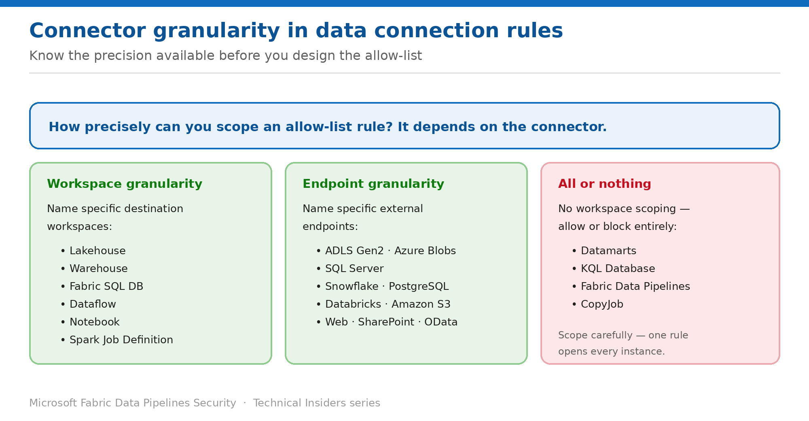

# Allow Approved Destinations with Data Connection Rules

> The exception mechanism for Data Factory — and how precisely you can scope each connector.

*Series: Network security · Layer 1 (2 of 4) · Audience: Fabric admins · Level 300*

With OAP enabled, pipelines reach nothing outside their own workspace. This entry shows you how to open the destinations your jobs legitimately need using **data connection rules**, and — critically — how precisely each connector can be scoped.

## Scenario — when to use this

Your pipeline needs to land data in a specific ADLS Gen2 account and read from a lakehouse in the curated workspace. Under OAP both fail. You need exceptions, but you don't want to open every storage account in Azure to do it.

Reach for this pattern immediately after enabling OAP. The design question is not *whether* to add rules but *how tightly each rule can be scoped* — and that varies by connector in ways that materially change your exposure.

For more detail on how this option works, see:

- [Microsoft Fabric security white paper — Microsoft Learn](https://learn.microsoft.com/en-us/fabric/security/white-paper-landing-page)
- [Workspace outbound access protection for Data Factory — Microsoft Learn](https://learn.microsoft.com/en-us/fabric/security/workspace-outbound-access-protection-data-factory)

## What you'll set up

- Data connection rules permitting exactly the destinations your pipelines need.
- Rules scoped to named endpoints or workspaces wherever the connector allows it.
- A documented list of connectors where scoping isn't possible.

*Figure 2 — Three tiers of granularity, and knowing which applies is the whole design.*

## Prerequisites

- **Outbound access protection is already enabled** on the workspace (entry 01).
- You are a **workspace admin**.
- You have the inventory of connectors and destinations from entry 01.
- If **private links** are enabled at workspace or tenant level, you'll need the **Outbound Gateway Rules REST API** — the portal can't configure these rules in that combination.

## Step 1 — Create a data connection rule

1. Open the workspace → **Workspace settings → Network security**.
2. Go to the outbound **data connection rules** section and add a rule.
3. Select the **connector type** for the destination you want to permit.
4. Set the scope — a named endpoint, a named workspace, or the whole connector, depending on what the connector supports.
5. Save, then re-run the pipeline and confirm the connection now succeeds while non-listed destinations remain blocked.

## Step 2 — Understand the three tiers of granularity

### Workspace granularity — name the destination workspace

These Fabric connectors let you specify which destination workspaces are permitted: **Lakehouse**, **Warehouse**, **Fabric SQL Database**, **Dataflow**, **Notebook**, and **Spark Job Definition**.

| Source WS | Destination WS | Connector setting | Result |
| --- | --- | --- | --- |
| A | A | Allowed or blocked | Allowed — same workspace is always permitted |
| A | B | Connector allowed | Allowed to B and every other lakehouse in the tenant |
| A | B | Blocked, workspace B excepted | Allowed only to lakehouses in workspace B |
| A | B | Blocked, only workspace C excepted | Connection to B is blocked |

> **Read row two carefully** — Allowing a connector *without* naming a workspace permits every instance of that item type in the entire tenant. That is almost never what you intend — always add the workspace exception.

### Endpoint granularity — name the external endpoint

External connectors such as **ADLS Gen2**, **SQL Server**, **Snowflake**, **PostgreSQL**, **Databricks**, **Amazon S3**, **Web**, **SharePoint** and **OData** support endpoint-level exceptions. Blocking at connector level with an exception for one endpoint permits exactly that endpoint and nothing else.

### No granularity — all or nothing

Connectors including **Datamarts**, **KQL Database**, **Fabric Data Pipelines** and **CopyJob** don't support workspace-level scoping. The allow-list applies to all item types of that connector — you either permit every instance or none.

## Step 3 — Handle gateways deliberately

Virtual network and on-premises data gateway connections are governed by the same rules, with one important property:

- Allowing gateways with **no exceptions** permits connections through **all** VNets and on-premises gateways.
- Blocking with an exception for a **named gateway** permits only sources reachable behind that gateway.
- **When you allow a gateway, every data source reachable through it is allowed.** The gateway is the security boundary, not the individual source.

## Validate

- A pipeline writing to the **allow-listed** ADLS Gen2 endpoint succeeds.
- The same pipeline pointed at a **different** storage account is blocked.
- A cross-workspace lakehouse read succeeds only for the workspace you named.
- A connector you deliberately left blocked remains unreachable.

## Limitations & gotchas

- **Managed private endpoints aren't supported** for Data Factory — don't look for them.
- Allowing a connector without a workspace exception opens **every instance in the tenant**.
- Datamarts, KQL Database, Fabric Data Pipelines and CopyJob **can't be scoped** to individual workspaces.
- Allowing a gateway allows everything behind it.
- The **portal can't configure data connection rules when private links are enabled** — use the Outbound Gateway Rules REST API.
- Data connection rules aren't yet available in the **Qatar Central** region.

## Rollback

1. Remove the rule from **Workspace settings → Network security**.
2. Outbound access to that destination returns to blocked immediately.
3. Re-test any pipeline that depended on it before considering the change complete.

## References

- [Workspace outbound access protection for Data Factory — Microsoft Learn](https://learn.microsoft.com/en-us/fabric/security/workspace-outbound-access-protection-data-factory)
- [Workspace outbound access protection overview — Microsoft Learn](https://learn.microsoft.com/en-us/fabric/security/workspace-outbound-access-protection-overview)
