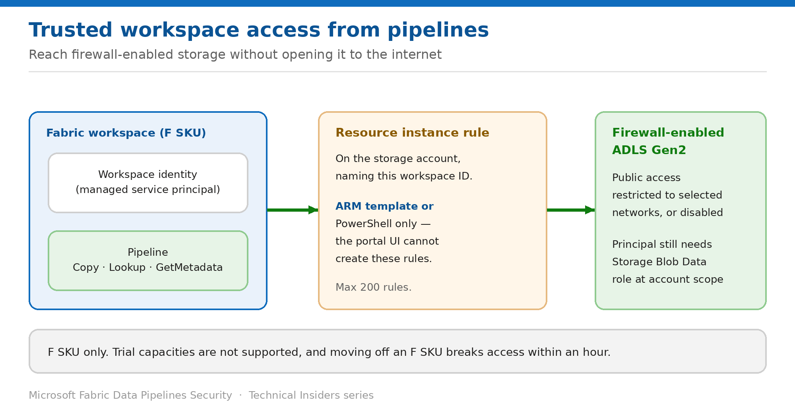

# Reach Firewall-Enabled Storage with Trusted Workspace Access

> Let a named workspace through a storage firewall without opening it to the internet.

*Series: Network security · Layer 1 (3 of 4) · Audience: Fabric admins & Azure admins · Level 300*

This entry shows you how to let a Fabric pipeline read a **firewall-enabled ADLS Gen2 account** — one with public access restricted to selected networks, or disabled entirely — using **trusted workspace access** and a **resource instance rule**.

## Scenario — when to use this

Your storage account is correctly locked down: public network access disabled, or restricted to a handful of corporate ranges. Your pipeline needs to read from it, and Fabric isn't on that list. The tempting fix — opening the firewall — undoes the control you put there deliberately.

Reach for this pattern when the source is Azure storage behind a firewall and you want to grant access to specific Fabric workspaces rather than to the internet. It is the supported alternative to widening the firewall.

For more detail on how this option works, see:

- [Microsoft Fabric security white paper — Microsoft Learn](https://learn.microsoft.com/en-us/fabric/security/white-paper-landing-page)
- [Trusted workspace access in Microsoft Fabric — Microsoft Learn](https://learn.microsoft.com/en-us/fabric/security/security-trusted-workspace-access)

## What you'll set up

- A **workspace identity** on the Fabric workspace.
- A **resource instance rule** on the storage account naming that workspace.
- A pipeline reading the firewall-enabled account with no firewall change.



*Figure 3 — A resource instance rule names your workspace; the workspace identity does the authenticating.*

## Prerequisites

- A Fabric workspace on a **purchased F SKU capacity** — trial capacities aren't supported.
- A **workspace identity** created for the workspace (entry 05).
- The workspace identity has **Contributor** access to the workspace itself, via **Manage access**.
- The authenticating principal holds **Storage Blob Data Contributor**, **Owner**, or **Reader** at the **storage account** scope.
- You are a **Contributor on the storage account** in Azure, to configure the rule.
- The storage account has public access **restricted to selected networks** or **disabled** — trusted workspace access only works in those states.

## Step 1 — Create the resource instance rule

Resource instance rules for Fabric workspaces **can only be created through ARM templates or PowerShell** — the Azure portal UI doesn't support it. The PowerShell path is usually quickest:

```text
$resourceId = "/subscriptions/00000000-0000-0000-0000-000000000000" +
              "/resourcegroups/Fabric/providers/Microsoft.Fabric/workspaces/<WORKSPACE_GUID>"
$tenantId          = "<YOUR_TENANT_ID>"
$resourceGroupName = "<RESOURCE_GROUP_OF_STORAGE_ACCOUNT>"
$accountName       = "<STORAGE_ACCOUNT_NAME>"

Add-AzStorageAccountNetworkRule -ResourceGroupName $resourceGroupName `
                                -Name $accountName `
                                -TenantId $tenantId `
                                -ResourceId $resourceId
```

- The subscription ID in the resource ID must be the literal **all-zeros GUID** — this is required, not a placeholder to replace.
- The **workspace GUID** comes from the workspace URL address bar.

> **The all-zeros subscription is intentional** — It looks like an unfilled template value. It isn't — Fabric workspace resource IDs use `00000000-0000-0000-0000-000000000000` as the subscription segment. Replacing it with your real subscription ID makes the rule fail.

## Step 2 — Create the pipeline connection

1. In a lakehouse, select **Get data → New pipeline**, name it, and select **Create**.
2. Choose **Azure Data Lake Gen2** as the data source.
3. Provide the storage account URL and name the connection.
4. For **Authentication kind**, choose **Organizational account**, **Service Principal**, or **Workspace identity**.
5. Select the file to copy, review, and choose **Save + Run**.
6. When the run status reaches **Succeeded**, confirm the data landed in the lakehouse.

## Step 3 — Understand the trusted service exception alternative

The storage account also offers a **trusted service exception** checkbox. It works, but it is much broader:

- With it enabled, **any workspace in your tenant's Fabric capacities that has a workspace identity** can access the storage account.
- Microsoft explicitly does not recommend this configuration, and notes support might be discontinued.
- **Use resource instance rules instead** to grant access to specific workspaces.

## Validate

- The pipeline run completes and data appears in the destination.
- The storage account firewall is **unchanged** — public access still restricted or disabled.
- A pipeline in a **different** workspace (with no rule) cannot reach the account.
- The connection shows status **Offline** in Manage connections and gateways — this is expected for firewall-enabled accounts, not a fault.

## Limitations & gotchas

- **F SKU only.** Moving the workspace to a non-F SKU or trial capacity breaks trusted workspace access **within an hour**.
- **Maximum 200 resource instance rules** per storage account.
- Rules must be created via **ARM template or PowerShell** — never the portal UI.
- **Pipelines can't write to OneLake table shortcuts** on storage accounts with trusted workspace access — a documented temporary limitation.
- **Test connection fails** if you use organizational account or service principal auth in Manage connections and gateways — only workspace identity passes the test there.
- A Conditional Access policy for workload identities covering **all** service principals will break this — exclude the Fabric workspace identities.
- Not compatible with **cross-tenant** requests.
- Shortcuts created before **October 10, 2023** don't support trusted workspace access.

## Rollback

1. Remove the resource instance rule from the storage account with `Remove-AzStorageAccountNetworkRule` or by editing the ARM template.
2. Access from that workspace stops immediately.
3. Deleting the workspace identity also revokes access, but affects every connection using it.

## References

- [Trusted workspace access in Microsoft Fabric — Microsoft Learn](https://learn.microsoft.com/en-us/fabric/security/security-trusted-workspace-access)
- [Authenticate with workspace identity — Microsoft Learn](https://learn.microsoft.com/en-us/fabric/security/workspace-identity-authenticate)
- [Workspace identity — Microsoft Learn](https://learn.microsoft.com/en-us/fabric/security/workspace-identity)
