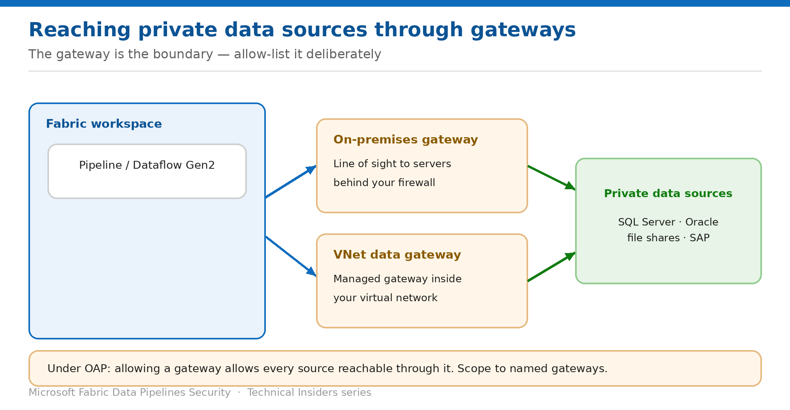

# Connect to Private Sources Through Gateways

> On-premises and VNet data gateways — and what allowing one actually permits.

*Series: Network security · Layer 1 (4 of 4) · Audience: Fabric admins & network teams · Level 300*

Pipelines reach on-premises databases and VNet-isolated services through **data gateways**. This entry covers how to use them under outbound access protection, and the property that makes gateway allow-listing a bigger decision than it first appears.

## Scenario — when to use this

Half your source systems are on-premises — SQL Server, Oracle, file shares — or sit inside a virtual network with no public endpoint. A pipeline can't reach them directly, so you deploy a gateway. Then you enable OAP and need to decide how to permit it.

Reach for this entry when pipelines must reach private data sources, and especially before you allow gateway connections in a data connection rule — because the scope of that permission is wider than most people expect.

For more detail on how this option works, see:

- [Microsoft Fabric security white paper — Microsoft Learn](https://learn.microsoft.com/en-us/fabric/security/white-paper-landing-page)
- [Workspace outbound access protection for Data Factory — Microsoft Learn](https://learn.microsoft.com/en-us/fabric/security/workspace-outbound-access-protection-data-factory)
- [Data source management — Microsoft Learn](https://learn.microsoft.com/en-us/fabric/data-factory/data-source-management)

## What you'll set up

- A gateway connection your pipelines can use.
- Data connection rules scoped to **named** gateways rather than all of them.
- A clear understanding of what the gateway permits downstream.

*Figure 4 — The gateway is the boundary; everything reachable behind it is reachable.*

## Prerequisites

- An **on-premises data gateway** installed with network line of sight to the source, or a **VNet data gateway** provisioned in your virtual network.
- You can create connections in **Manage connections and gateways**.
- If OAP is enabled, you are a **workspace admin** able to configure data connection rules.

## Step 1 — Create the gateway connection

1. Open **Settings → Manage connections and gateways**.
2. On the **Connections** tab, select **New**.
3. Choose the gateway (on-premises or VNet) rather than **Cloud**.
4. Enter a descriptive connection name and the source details.
5. Choose the authentication method and provide credentials.
6. Select **Create**, then use the connection in your pipeline.

## Step 2 — Allow the gateway deliberately under OAP

In a data connection rule, gateway permissions behave as follows:

| Setting | Result |
| --- | --- |
| Allowed, no exceptions | Pipelines connect through all VNets and on-premises gateways |
| Blocked, no exceptions | Pipelines can't connect through any gateway |
| Blocked, VNet V1 excepted | Pipelines connect only to sources behind VNet V1 |
| Blocked, OPDG O1 excepted | Pipelines connect only to sources behind gateway O1 |

> **Allowing a gateway allows everything behind it** — There is no per-source granularity once traffic goes through a gateway. If the gateway can see twelve servers, permitting it permits all twelve. Scope your gateways to the smallest useful network segment rather than relying on rules to narrow them later.

## Step 3 — Control the cloud-connection-on-gateway setting

When creating a cloud connection you'll see **This connection can be used with on-premise data gateways and VNet data gateways**. Be aware of how it currently behaves:

- **Unchecked** is intended to prevent the connection being used in gateway-based evaluations.
- **Checked** permits gateway-based evaluation.
- **The setting isn't currently enforced.** All shareable cloud connections work through a gateway if one is present.

> **Don't rely on it as a control** — Because the setting isn't enforced today, treat it as a statement of intent rather than a boundary. If a connection must not be usable through a gateway, control that through the connection's user list instead (entry 07).

## Validate

- A pipeline reads the on-premises source successfully through the gateway.
- With the gateway blocked in a data connection rule, the same pipeline fails.
- With only a named gateway excepted, sources behind **other** gateways remain unreachable.
- The gateway shows as online in Manage connections and gateways.

## Limitations & gotchas

- Allowing a gateway grants access to **every** source reachable through it.
- **Workspace identity authentication isn't supported for gateway connections** — cloud connections only.
- **Azure Key Vault references don't support VNet data gateway connections** (they do work with cloud and on-premises gateway connections) — see entry 06.
- The cloud-connection-on-gateway checkbox isn't enforced.
- Gateway availability is a single point of failure for every pipeline depending on it — plan clustering accordingly.

## Rollback

1. Remove the gateway exception from the data connection rule to block it again.
2. Or remove the connection from **Manage connections and gateways** — note that any item depending on it stops working immediately.

## References

- [Workspace outbound access protection for Data Factory — Microsoft Learn](https://learn.microsoft.com/en-us/fabric/security/workspace-outbound-access-protection-data-factory)
- [Data source management — Microsoft Learn](https://learn.microsoft.com/en-us/fabric/data-factory/data-source-management)
