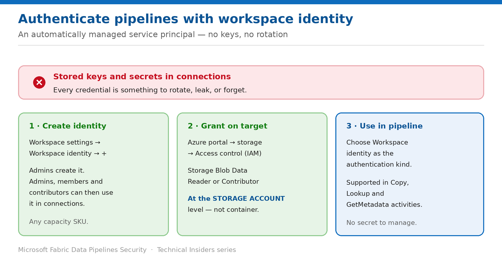

# Authenticate Pipelines with Workspace Identity

> A managed service principal for the workspace — no keys, secrets, or certificates to rotate.

*Series: Identity & credentials · Layer 2 (1 of 3) · Audience: Fabric admins & data engineers · Level 300*

This entry shows you how to replace stored credentials in pipeline connections with a **workspace identity** — an automatically managed service principal associated with the workspace, which Fabric uses to obtain Entra tokens on your behalf.

## Scenario — when to use this

Every connection your pipelines use holds a credential: an account key, a service principal secret, a password. Each one is something to rotate on a schedule, store somewhere safe, and revoke when someone leaves. Multiply by the number of connections and it becomes the largest credential-management burden in the platform.

Reach for this pattern for any connection to an Azure resource that supports Entra authentication. It removes the secret entirely rather than protecting it better — and it's the prerequisite for trusted workspace access (entry 03).

For more detail on how this option works, see:

- [Microsoft Fabric security white paper — Microsoft Learn](https://learn.microsoft.com/en-us/fabric/security/white-paper-landing-page)
- [Workspace identity — Microsoft Learn](https://learn.microsoft.com/en-us/fabric/security/workspace-identity)
- [Authenticate with workspace identity — Microsoft Learn](https://learn.microsoft.com/en-us/fabric/security/workspace-identity-authenticate)

## What you'll set up

- A workspace identity created on the workspace.
- Azure RBAC granted to that identity on the target resource.
- Pipeline connections authenticating with no stored secret.

*Figure 5 — Create the identity, grant it on the target, select it in the connection.*

## Prerequisites

- You are a **workspace admin** — only admins can create and delete a workspace identity.
- The workspace is **not** My workspace — identities can be created in any other workspace.
- You can assign **Azure RBAC roles** on the target resource.
- For **trusted workspace access** specifically, the workspace must be on a purchased **F SKU**.

## Step 1 — Create the workspace identity

1. Navigate to the workspace and open **Workspace settings**.
2. Select the **Workspace identity** tab.
3. Select **+ Workspace identity**.
4. Wait for creation to complete — the tab then shows the identity details and authorized users.

> **Who can use it afterwards** — Admins create and delete the identity. **Admins, members and contributors** can then configure it as the authentication method in connections used by pipelines, OneLake shortcuts, semantic models, and Dataflows Gen2.

## Step 2 — Grant the identity permissions on the target

1. Sign in to the **Azure portal** and open the target storage account.
2. Select **Access control (IAM)** → **Role assignments**.
3. Select **Add → Add role assignment**.
4. Choose the role — **Storage Blob Data Reader** for read, **Storage Blob Data Contributor** for write.
5. Choose **Assign access to → User, group, or service principal**.
6. Select **+ Select members**, and search for the workspace identity by name or app ID.
7. Select **Review + assign** and wait for the assignment to complete.

> **Account scope, not container** — The role must be provided at the **storage account** level. Granting at container scope alone does not work for this pattern.

## Step 3 — Use the identity in a pipeline

1. Create or edit a pipeline with a **Copy**, **Lookup**, or **GetMetadata** activity.
2. In the connection configuration, choose **Workspace identity** as the authentication method.
3. Save and run the pipeline.

- Workspace identity authentication is supported in pipelines for **Copy, Lookup, and GetMetadata** activities.
- It's also supported for **ADLS Gen2 OneLake shortcuts**, **semantic models** (import mode), and **Dataflows Gen2**.
- For Dataflows Gen2 it's supported only with **deployment pipelines and Public API**.

## Validate

- The pipeline run succeeds with no credential stored in the connection.
- Removing the RBAC assignment in Azure causes the run to fail — confirming the identity is genuinely authenticating.
- The **Workspace identity** option appears in connection experiences (it only appears after the identity exists).
- A semantic model refresh over the same connection succeeds, if you configured one.

## Limitations & gotchas

- **Not supported for gateway connections** — cloud connections only.
- **Checking connection status isn't supported** for workspace-identity connections.
- Connections using workspace identity **only work in** OneLake shortcuts, pipelines, semantic models and Dataflows Gen2 — reusing them elsewhere may fail.
- A Conditional Access policy for workload identities covering **all** service principals breaks workspace identities — exclude each one explicitly.
- **Not compatible with cross-tenant requests.**
- You may see a banner claiming the auth type is only supported in pipelines and shortcuts — a known documentation issue.
- Trusted workspace access to firewall-enabled storage requires an **F SKU**, even though creating the identity does not.

## Rollback

1. Change affected connections back to another authentication method before removing the identity.
2. Delete the workspace identity from **Workspace settings → Workspace identity** (admins only).
3. Remove the RBAC assignment on the target resource.
4. Note that deleting the identity breaks **every** connection using it, including trusted workspace access.

## References

- [Workspace identity — Microsoft Learn](https://learn.microsoft.com/en-us/fabric/security/workspace-identity)
- [Authenticate with workspace identity — Microsoft Learn](https://learn.microsoft.com/en-us/fabric/security/workspace-identity-authenticate)
- [Trusted workspace access in Microsoft Fabric — Microsoft Learn](https://learn.microsoft.com/en-us/fabric/security/security-trusted-workspace-access)
