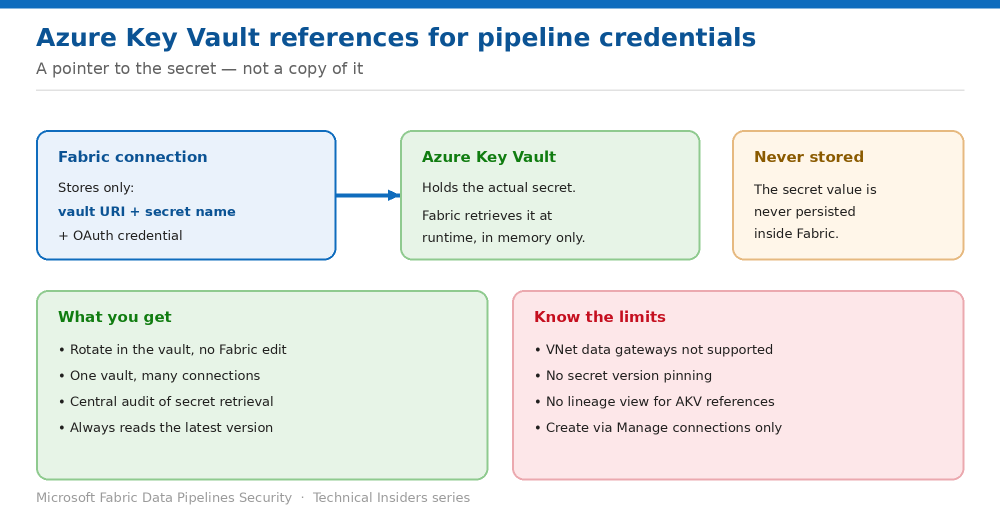

# Store Pipeline Credentials in Azure Key Vault References

> Point connections at a secret in your vault instead of pasting the value into Fabric.

*Series: Identity & credentials · Layer 2 (2 of 3) · Audience: Data engineers & platform teams · Level 300*

Not every connector supports workspace identity. Where a secret is genuinely required, this entry shows you how to use an **Azure Key Vault reference** so the credential lives in your vault and is retrieved at runtime — never stored inside Fabric.

## Scenario — when to use this

You have connectors that need an account key, a password, or a service principal secret. Today those values are pasted into Fabric connections, which means rotating one is a manual edit in several places and nobody is quite sure which connections hold which credential.

Reach for this pattern for any connector that can't use workspace identity. Rotation becomes a vault operation with no Fabric edit at all.

For more detail on how this option works, see:

- [Microsoft Fabric security white paper — Microsoft Learn](https://learn.microsoft.com/en-us/fabric/security/white-paper-landing-page)
- [Configure Azure Key Vault references — Microsoft Learn](https://learn.microsoft.com/en-us/fabric/data-factory/azure-key-vault-reference-configure)

## What you'll set up

- An Azure Key Vault reference registered in Fabric.
- Credentials stored as secrets in the vault.
- Connections authenticating through the reference with no secret stored in Fabric.

*Figure 6 — Fabric stores the pointer; the vault stores the secret.*

## Prerequisites

- An **Azure Key Vault**, either reachable from the public network or private with an on-premises data gateway having network line of sight to its private endpoint.
- The creator of the reference holds at least **Key Vault Certificate User** permissions on the vault.
- Your user identity has **Get** and **List** permissions on the vault for the secrets involved.
- The connector you intend to use appears in the supported list (see step 3).

## Step 1 — Create the Key Vault reference in Fabric

1. Go to **fabric.microsoft.com**, select the gear icon, and open **Manage connections and gateways**.
2. Select the **Azure Key Vault references** tab, then **New**.
3. Under **Reference alias**, enter a name for the reference.
4. Under **Account Name**, enter the name of the existing Azure Key Vault.
5. Use **OAuth 2.0** to authenticate, select **Edit credentials**, and sign in to grant Fabric access.
6. Optionally allow on-premises or virtual network gateways to use this reference.
7. Select **Create**, and confirm the status shows online and connected.

## Step 2 — Store the credential in the vault

1. Open the key vault in the **Azure portal**.
2. Select **Objects → Secrets → + Generate/Import**.
3. Set **Upload options** to **Manual**.
4. Give the secret a **name** — you'll reference this name in Fabric, and it must be unique within the vault.
5. Set the **value** to the credential: password, account key, token, or service principal secret.
6. Select **Create**.

## Step 3 — Use the reference in a connection

1. In **Manage connections and gateways**, go to the **Connections** tab and select **New**.
2. Select the **Cloud** tab, name the connection, and choose a supported connection type.
3. Provide the connection details and choose a supported authentication type — **Basic**, **Service Principal**, **SAS/PAT token**, or **Account Key**.
4. Select the **AKV reference** icon next to the secret or password field.
5. Choose the existing reference, enter the **secret name** from the vault, and select **Apply**.
6. Use the connection in your pipeline.

Supported connectors include **Azure Blob Storage**, **ADLS Gen2**, **Azure Table Storage**, **SQL Server (Cloud)**, **PostgreSQL**, **Snowflake**, **Databricks**, **Dataverse**, **OData**, **SharePoint Online list**, **Oracle Cloud Storage**, **Web API/Webpage**, and the **Azure DevOps** and **GitHub** source control providers.

> **What Fabric actually stores** — Only the **vault URI**, the **secret name**, and the OAuth credential used to reach the vault. The secret value is never stored within Fabric — it's retrieved at runtime, used to establish the connection, and held in memory only for that purpose.

## Validate

- A pipeline using the connection runs successfully.
- The connection in Fabric contains no secret value — only the reference.
- **Rotating the secret in the vault takes effect with no Fabric edit** — the reference always reads the latest version.
- Key Vault diagnostic logs show the retrieval at run time.

## Limitations & gotchas

- **Virtual network data gateway connections aren't supported** — cloud and on-premises data gateway connections are.
- **No version pinning.** References always retrieve the current version of a secret; Key Vault credential versioning isn't supported.
- **Fabric Lineage view isn't available** for AKV references.
- You **can't** create AKV references from the Modern Get Data pane — use Manage connections and gateways.
- Only the listed connectors and authentication types are supported.

## Rollback

1. Edit the connection and replace the reference with a directly entered credential, if you must revert.
2. Delete the AKV reference from **Manage connections and gateways** — connections depending on it stop working.
3. Rotate any secret that was previously stored directly in Fabric, since removing it doesn't undo prior exposure.

## References

- [Configure Azure Key Vault references — Microsoft Learn](https://learn.microsoft.com/en-us/fabric/data-factory/azure-key-vault-reference-configure)
- [Data source management — Microsoft Learn](https://learn.microsoft.com/en-us/fabric/data-factory/data-source-management)
