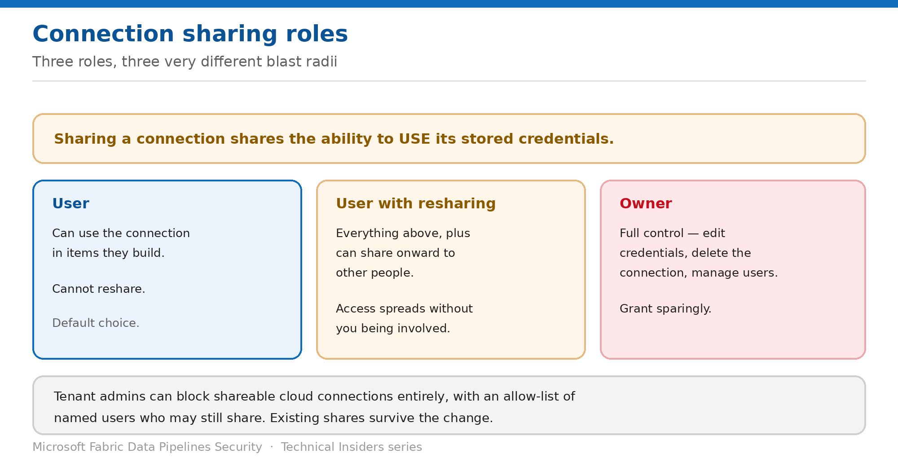

# Share Connections Without Losing Control

> Three connection roles with three very different blast radii — and how to restrict resharing.

*Series: Identity & credentials · Layer 2 (3 of 3) · Audience: Fabric admins & connection owners · Level 300*

Sharing a connection shares the ability to **use its stored credentials**. This entry covers the three roles, what each one actually permits, and the tenant control that stops connection access spreading without you.

## Scenario — when to use this

A colleague needs to build a pipeline against a source you already have a connection for. Sharing it is the obvious move — and depending on which role you pick, you may have just given them the ability to write to that source, or to hand the same access to anyone else in the organisation.

Reach for this entry before sharing any connection, and as a periodic review of connections already shared. This is the control that most commonly drifts.

For more detail on how this option works, see:

- [Microsoft Fabric security white paper — Microsoft Learn](https://learn.microsoft.com/en-us/fabric/security/white-paper-landing-page)
- [Data source management — Microsoft Learn](https://learn.microsoft.com/en-us/fabric/data-factory/data-source-management)
- [Permission model — Microsoft Fabric](https://learn.microsoft.com/en-us/fabric/security/permission-model)

## What you'll set up

- Connections shared with the lowest role that works.
- Resharing restricted where it isn't needed.
- A review process using connection recency metadata.

*Figure 7 — User, User with resharing, and Owner are not small distinctions.*

## Prerequisites

- You are a connection **Owner**, an admin, or hold sharing permissions.
- For tenant-level restriction, you hold **Power BI Service Administrator** privileges.
- You know which pipelines depend on the connection before you change anything.

## Step 1 — Understand what sharing grants

Users with access to the data source can **write** to it and connect based on the stored credentials or SSO configured when it was created. Three roles are available:

| Role | What it permits |
| --- | --- |
| User | Use the connection in items they build. Cannot reshare. |
| User with resharing | Use the connection, and share it onward to others. |
| Owner | Full control — edit credentials, delete the connection, manage its user list. |

> **Share to a trusted, narrowly-scoped identity** — Microsoft's guidance is explicit: before sharing, ensure the user or group is trusted and has only the privileges it needs — ideally a service account with narrowly scoped rights. Sharing risks unauthorized changes and potential data loss.

## Step 2 — Share deliberately

1. Select the gear icon and open **Manage connections and gateways**.
2. Find the connection — use filter or search to locate cloud connections quickly.
3. Select **Manage users** from the top ribbon.
4. Add the user or security group.
5. Choose the role: **User**, **User with resharing**, or **Owner**.
6. Select **Share**.

- Access lists are **per data source** — you add users to each connection separately.
- A user only sees connections they have access to, **even a tenant administrator with the Tenant administration toggle enabled**.
- Default to **User**. Reserve resharing for people who genuinely administer access.

## Step 3 — Restrict sharing tenant-wide

1. Open Power BI or Fabric settings and go to **Manage connections and gateways**.
2. Turn on the **tenant administration** toggle in the top right.
3. Select **Blocking shareable cloud connections** and turn it on.
4. Optionally add specific users to an allow-list who may still share.

- **Off (default)** — any user can share connections.
- **On** — sharing is blocked tenant-wide, except for allow-listed users.
- **Existing shared connections stay shared** when you enable the restriction — this limits future spread, it doesn't claw back current access.

> **Weigh the collaboration cost** — Blocking sharing tenant-wide does limit collaboration. The allow-list exists precisely so a small set of platform owners can continue to grant access while ad-hoc sharing stops.

## Step 4 — Review with connection recency

Connection metadata exposes two properties that make lifecycle decisions safer:

- **Last linked to items** — when the connection was last associated with a Fabric item. Reflects configuration activity.
- **Last credentials used** — when the credentials were last used at runtime. Reflects actual execution.

Together they distinguish a connection that is merely *defined* from one that is actively *used* — which is exactly what you need before rotating a credential or removing a connection.

## Validate

- A **User** can build a pipeline with the connection but sees no share option.
- A **User with resharing** can pass it on — confirm this is intended.
- With tenant blocking on, a non-allow-listed user cannot share.
- Connection recency shows plausible values for connections you know are scheduled.

## Limitations & gotchas

- Removing a data source **breaks every item that depends on it**, immediately.
- Shared connections only work **within Fabric**.
- **Guest users** may hit limitations if Entra B2B properties block user discoverability and sharing.
- Tenant blocking doesn't revoke existing shares.
- Connections aren't visible to admins who aren't on the access list — inventory needs the REST API rather than the portal.

## Rollback

1. Open **Manage users** on the connection and remove the user or group.
2. Turn the tenant blocking setting off to restore open sharing.
3. Rotate the underlying credential if a share was broader than intended — removing access doesn't invalidate what was already used.

## References

- [Data source management — Microsoft Learn](https://learn.microsoft.com/en-us/fabric/data-factory/data-source-management)
- [Permission model — Microsoft Fabric](https://learn.microsoft.com/en-us/fabric/security/permission-model)
