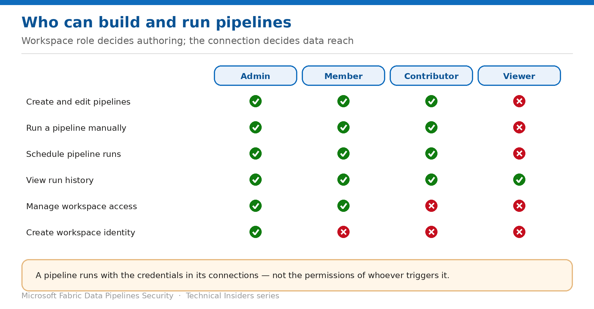

# Control Who Can Build and Run Pipelines

> Workspace roles decide authoring; the connection decides what a run can reach.

*Series: Access control · Layer 3 (1 of 2) · Audience: Fabric admins · Level 300*

This entry sets out which workspace roles can create, edit, run and schedule pipelines — and clarifies the point that causes the most confusion in reviews: **a pipeline run does not use the permissions of whoever triggered it**.

## Scenario — when to use this

You're asked to prove that a user who can trigger a pipeline can't reach data they're not entitled to. The answer isn't in their workspace role — it's in the connections the pipeline uses, which carry their own stored credentials and run with those regardless of who pressed the button.

Reach for this entry when granting workspace access, when reviewing who can move data, and whenever someone asks "what can this person actually reach?"

For more detail on how this option works, see:

- [Microsoft Fabric security white paper — Microsoft Learn](https://learn.microsoft.com/en-us/fabric/security/white-paper-landing-page)
- [Roles in workspaces in Microsoft Fabric — Microsoft Learn](https://learn.microsoft.com/en-us/fabric/fundamentals/roles-workspaces)
- [Permission model — Microsoft Fabric](https://learn.microsoft.com/en-us/fabric/security/permission-model)

## What you'll set up

- Workspace roles assigned at the lowest level that works.
- A clear statement of the identity each scheduled pipeline runs under.
- Access granted through security groups rather than individuals.

*Figure 8 — Capability by workspace role, and the identity a run actually uses.*

## Prerequisites

- You are a workspace **Admin**, or a Member able to add members.
- Entra **security groups** exist for the teams you're granting access to.
- You have the connection inventory from entry 01.

## Step 1 — Assign the right workspace role

| Capability | Admin | Member | Contributor | Viewer |
| --- | --- | --- | --- | --- |
| Create and edit pipelines | Yes | Yes | Yes | No |
| Run a pipeline manually | Yes | Yes | Yes | No |
| Schedule pipeline runs | Yes | Yes | Yes | No |
| View run history | Yes | Yes | Yes | Yes |
| Manage workspace access | Yes | Yes | No | No |
| Create workspace identity | Yes | No | No | No |

- **Contributor** is the working role for pipeline authors — it permits creating, editing, running and scheduling.
- **Viewer** is appropriate for people who need to see run outcomes but not move data.
- Only **Admins** can create or delete the workspace identity.

## Step 2 — Understand the identity a run uses

This is the part that surprises people during access reviews:

- A pipeline connects to data using the **credentials configured in its connections** — a stored secret, a service principal, or the workspace identity.
- It does **not** connect using the permissions of the person who triggered the run.
- So a Contributor who cannot personally read a storage account can still run a pipeline that reads it, if the connection is authorised.

> **The real control is the connection** — Restricting who can run pipelines limits *who can start a job*. It does not limit *what that job can reach*. If you need to constrain reach, that decision lives in the connection's credentials and the network rules from Layer 1 — not in the workspace role.

## Step 3 — Assign through groups

1. Create or identify an Entra **security group** per team and access level.
2. Open **Workspace → Manage access**.
3. Add the **group** and assign the role.
4. Manage ongoing access by changing group membership rather than the workspace ACL.

## Validate

- A Viewer cannot create or trigger a pipeline, but can see run history.
- A Contributor can author and schedule.
- A pipeline run succeeds for a user who has no direct access to the underlying source — demonstrating the connection-credential behaviour.
- **Manage access** lists groups rather than long lists of individuals.

## Limitations & gotchas

- **A pipeline run uses connection credentials, not the triggering user's permissions.** Document this in your access model.
- Workspace roles are workspace-wide — you can't scope them to individual pipelines.
- Group membership changes take effect on the next token refresh, not instantly.
- Someone removed from the workspace can still have their credentials embedded in a connection — audit connections separately when people leave.

## Rollback

1. Open **Workspace → Manage access** and remove or downgrade the assignment.
2. For group-based access, remove the user from the security group.
3. Rotate credentials on any connection the departing user owned or could edit.

## References

- [Roles in workspaces in Microsoft Fabric — Microsoft Learn](https://learn.microsoft.com/en-us/fabric/fundamentals/roles-workspaces)
- [Permission model — Microsoft Fabric](https://learn.microsoft.com/en-us/fabric/security/permission-model)
- [Data source management — Microsoft Learn](https://learn.microsoft.com/en-us/fabric/data-factory/data-source-management)
