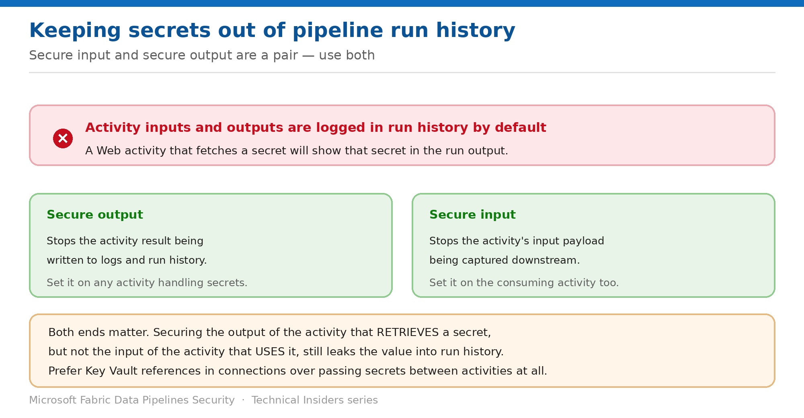

# Keep Secrets Out of Pipeline Run History

> Secure input and secure output are a pair — setting only one still leaks the value.

*Series: Access control · Layer 3 (2 of 2) · Audience: Data engineers · Level 300*

Pipeline run history records activity inputs and outputs. That's invaluable for debugging and a liability the moment an activity handles a credential. This entry shows you how to stop secrets being written to logs — and why the obvious half-measure doesn't work.

## Scenario — when to use this

A pipeline uses a Web activity to fetch a secret from Key Vault, then passes it to a downstream activity. It works. It also writes that secret in clear text into run history, where anyone with Viewer access to the workspace can read it — long after the run finished.

Reach for this entry whenever an activity handles a credential, token, or connection string, and as an audit of existing pipelines that fetch secrets at runtime.

For more detail on how this option works, see:

- [Microsoft Fabric security white paper — Microsoft Learn](https://learn.microsoft.com/en-us/fabric/security/white-paper-landing-page)
- [Configure Azure Key Vault references — Microsoft Learn](https://learn.microsoft.com/en-us/fabric/data-factory/azure-key-vault-reference-configure)
- [Permission model — Microsoft Fabric](https://learn.microsoft.com/en-us/fabric/security/permission-model)

## What you'll set up

- Secure output set on activities that retrieve secrets.
- Secure input set on activities that consume them.
- Where possible, secrets removed from the pipeline body entirely.

*Figure 9 — Secure the activity that retrieves the secret and the one that consumes it.*

## Prerequisites

- You can edit the pipeline.
- You know which activities handle credentials, tokens, or connection strings.
- You have reviewed who holds **Viewer** or higher on the workspace — they can read run history.

## Step 1 — Prefer removing the secret entirely

Before configuring logging controls, ask whether the secret needs to be in the pipeline at all. In most cases it doesn't:

- Use a **workspace identity** on the connection (entry 05) — there is no secret to leak.
- Use an **Azure Key Vault reference** on the connection (entry 06) — Fabric retrieves it at connection time, outside activity input and output.
- Only fall back to fetching a secret inside the pipeline when neither option supports your connector.

> **This is the real fix** — Secure input and secure output stop a secret being *logged*. Moving the credential into the connection stops it being *in the pipeline* at all. Prefer the second wherever the connector allows it.

## Step 2 — Set secure output on the retrieving activity

1. Open the activity that retrieves the secret — typically a **Web** activity calling Key Vault.
2. Open its **General** settings.
3. Enable **Secure output**.
4. Save the pipeline.

This prevents the activity's result being written to logs and run history.

## Step 3 — Set secure input on the consuming activity

1. Open the downstream activity that **uses** the secret.
2. Open its **General** settings.
3. Enable **Secure input**.
4. Save and re-run the pipeline.

> **Both ends, every time** — Securing the output of the activity that retrieves a secret, but not the input of the activity that consumes it, still writes the value into run history at the second activity. The two settings are a pair — configuring one is not partial protection, it is no protection.

## Step 4 — Audit existing pipelines

1. List pipelines containing **Web** activities pointing at a vault or token endpoint.
2. For each, confirm secure output on the retriever and secure input on every consumer.
3. Open a recent run and inspect the activity input and output panes — the value should be masked.
4. Where a secret was previously exposed in run history, **rotate it** — the historic runs already recorded it.

## Validate

- Run the pipeline, open run history, and inspect the retrieving activity's **output** — the value is not shown.
- Inspect the consuming activity's **input** — the value is not shown there either.
- The pipeline still completes successfully, confirming the settings didn't break the data flow.
- A colleague with Viewer access confirms they can't read the value.

## Limitations & gotchas

- **Setting only one of the pair leaves the secret exposed** at the other end.
- Secure input and output suppress logging — they don't encrypt anything or restrict who can run the pipeline.
- Historic runs from before you enabled the settings **still contain the value**; rotate the secret.
- Passing secrets as pipeline **parameters** exposes them in the run's parameter list — avoid it.
- Debug and monitoring integrations that export run detail may capture values independently; check anything forwarding run history off-platform.

## Rollback

1. Disable secure input or output on an activity if you need full run detail for debugging.
2. Re-enable it immediately afterwards — and rotate the secret if a debug run captured it.

## References

- [Configure Azure Key Vault references — Microsoft Learn](https://learn.microsoft.com/en-us/fabric/data-factory/azure-key-vault-reference-configure)
- [Data source management — Microsoft Learn](https://learn.microsoft.com/en-us/fabric/data-factory/data-source-management)
