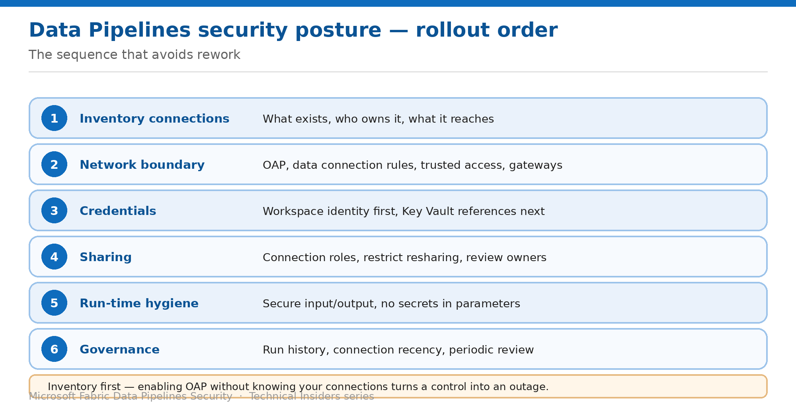

# Assemble a Data Pipelines Security Posture

> The order to apply these controls in, and how to keep the picture current.

*Series: Governance & monitoring · Layer 4 (1 of 1) · Audience: Fabric admins & architects · Level 300*

The preceding nine entries each solve one problem. This capstone puts them in order, and adds the governance layer that keeps the result from drifting.

Pipelines differ from every other Fabric workload in one respect: **inventory genuinely comes first**. A network control applied without knowing your connections doesn't degrade gracefully — it stops every scheduled job at once.

## Scenario — when to use this

You've inherited a workspace with dozens of pipelines and connections of unknown provenance, or you're standing up a new one and want to get the order right. Applying these controls in the wrong sequence means outages and rework.

Reach for this entry when planning a rollout, onboarding a workspace, or reviewing an existing estate against a target posture.

For more detail on how this option works, see:

- [Microsoft Fabric security white paper — Microsoft Learn](https://learn.microsoft.com/en-us/fabric/security/white-paper-landing-page)
- [Workspace outbound access protection for Data Factory — Microsoft Learn](https://learn.microsoft.com/en-us/fabric/security/workspace-outbound-access-protection-data-factory)
- [Data source management — Microsoft Learn](https://learn.microsoft.com/en-us/fabric/data-factory/data-source-management)

## What you'll set up

- A sequenced rollout plan across all four layers.
- A connection inventory you can review against.
- A review cadence that keeps it accurate.



*Figure 10 — Rollout order: inventory first, because pipelines fail loudly.*

## The rollout order

| # | Step | What you do | Entries |
| --- | --- | --- | --- |
| 1 | Inventory connections | What exists, who owns it, what it reaches, when last used | 01, 07 |
| 2 | Network boundary | OAP, data connection rules, trusted access, gateways | 01–04 |
| 3 | Credentials | Workspace identity first, Key Vault references next | 05, 06 |
| 4 | Sharing | Connection roles, restrict resharing, review owners | 07 |
| 5 | Run-time hygiene | Secure input/output, no secrets in parameters | 09 |
| 6 | Access control | Workspace roles, run identity documented | 08 |
| 7 | Governance | Run history, connection recency, periodic review | 10 |

> **Why inventory is step one here** — In Data Engineering you can enable outbound protection and fix breakages iteratively. In Data Factory, every scheduled pipeline hits the new boundary on its next run — often overnight, unattended. The inventory is what turns that from an incident into a plan.

## Step 1 — Build the connection inventory

The portal only shows connections you personally have access to — **even for tenant administrators with the Tenant administration toggle enabled**. Use the REST API for a complete picture:

```text
curl -X GET https://api.fabric.microsoft.com/v1/connections \
  -H "Authorization: Bearer <token>"
```

Each object's `id` under the `value` array is the connection ID. With more than 100 connections, page through using the `continuationToken` query parameter.

1. Retrieve the full connection list via the API.
2. For each connection record the connector type, authentication method, and owner.
3. Capture **Last linked to items** and **Last credentials used** to separate live connections from abandoned ones.
4. Flag every connection still using a stored secret — those are your entry 05 and 06 backlog.
5. Flag every connection shared with resharing rights or multiple owners.

## Step 2 — Apply the layers in order

1. **Network:** enable OAP (01), add data connection rules (02), configure trusted workspace access for firewall-enabled storage (03), scope gateways (04).
2. **Credentials:** move every eligible connection to workspace identity (05); move the rest to Key Vault references (06).
3. **Sharing:** right-size connection roles and restrict tenant-wide resharing (07).
4. **Run-time:** audit pipelines for exposed secrets and set secure input/output (09).
5. **Access:** right-size workspace roles and document the run identity model (08).

## Step 3 — Monitor what runs

- Review **pipeline run history** for failures clustering after a control change — the first signal an allow-list rule is missing.
- Track **connection recency** to spot credentials that are configured but never used, and retire them.
- Use **Track user activities in Fabric** for tenant-level audit of item creation, sharing and permission changes.
- Watch for pipelines that begin failing overnight after an OAP change — the classic unattended-job symptom.
- Re-check the **200 resource instance rule** limit on storage accounts as you add workspaces.

## End-to-end validation

- **Network:** a pipeline to an unlisted endpoint fails; an allow-listed one succeeds; firewall-enabled storage is reachable with the firewall unchanged.
- **Credentials:** connections carry no stored secrets; rotating a vault secret needs no Fabric edit.
- **Sharing:** a User role holder cannot reshare; tenant blocking is set as intended.
- **Run-time:** run history shows masked values for every secret-handling activity.
- **Access:** roles are group-based, and your access model documents the connection-credential behaviour.
- **Governance:** the connection inventory matches the API output, and stale connections have owners assigned.

## Limitations & gotchas

- **Managed private endpoints don't apply to Data Factory** — data connection rules only.
- **Teams and Outlook activities don't support OAP** — rework notifications before you enable it.
- **Workspace staging fails under OAP** — switch pipelines to external staging.
- **Lakehouses with default semantic models block OAP** — enable protection before creating the lakehouse.
- **Trusted workspace access dies within an hour** if the workspace moves off an F SKU.
- **The portal hides connections you don't have access to**, including from tenant admins — inventory via API.
- Preview and recently-GA capabilities change; re-verify before each publication or audit cycle.

## Review cadence

1. Re-run the connection inventory quarterly, or after any significant platform change.
2. Review connection sharing and owners on the same cycle.
3. Re-validate network rules after any Fabric release touching networking.
4. Re-check trusted workspace access after any capacity change.
5. Re-audit pipelines for exposed secrets whenever a new pipeline pattern is adopted.

## References

- [Workspace outbound access protection for Data Factory — Microsoft Learn](https://learn.microsoft.com/en-us/fabric/security/workspace-outbound-access-protection-data-factory)
- [Data source management — Microsoft Learn](https://learn.microsoft.com/en-us/fabric/data-factory/data-source-management)
- [Trusted workspace access in Microsoft Fabric — Microsoft Learn](https://learn.microsoft.com/en-us/fabric/security/security-trusted-workspace-access)
- [Track user activities in Microsoft Fabric — Microsoft Learn](https://learn.microsoft.com/en-us/fabric/admin/track-user-activities)
- [Microsoft Fabric security white paper — Microsoft Learn](https://learn.microsoft.com/en-us/fabric/security/white-paper-landing-page)
