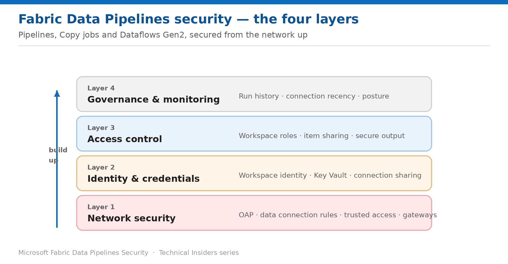

# Security for Fabric Data Pipelines

*A 10-part, prescriptive how-to series for pipelines, Copy jobs, and Dataflows Gen2 — built from the network up.*

Each entry is a self-contained how-to (prerequisites → steps → validation → limitations → rollback) with its own architecture diagram, scoped to Data Factory items. Start at Layer 1 and work up.

## Contents

### Layer 1 — Network security

- [Block Outbound Connections from Pipelines](Fabric-DP-Security-01-Network-Outbound-Access-Protection.md) — Enable outbound access protection for Data Factory items — and know exactly what stops working.
- [Allow Approved Destinations with Data Connection Rules](Fabric-DP-Security-02-Network-Data-Connection-Rules.md) — The exception mechanism for Data Factory — and how precisely you can scope each connector.
- [Reach Firewall-Enabled Storage with Trusted Workspace Access](Fabric-DP-Security-03-Network-Trusted-Workspace-Access.md) — Let a named workspace through a storage firewall without opening it to the internet.
- [Connect to Private Sources Through Gateways](Fabric-DP-Security-04-Network-Gateways.md) — On-premises and VNet data gateways — and what allowing one actually permits.

### Layer 2 — Identity & credentials

- [Authenticate Pipelines with Workspace Identity](Fabric-DP-Security-05-Identity-Workspace-Identity.md) — A managed service principal for the workspace — no keys, secrets, or certificates to rotate.
- [Store Pipeline Credentials in Azure Key Vault References](Fabric-DP-Security-06-Identity-Key-Vault-References.md) — Point connections at a secret in your vault instead of pasting the value into Fabric.
- [Share Connections Without Losing Control](Fabric-DP-Security-07-Identity-Connection-Sharing.md) — Three connection roles with three very different blast radii — and how to restrict resharing.

### Layer 3 — Access control

- [Control Who Can Build and Run Pipelines](Fabric-DP-Security-08-Access-Roles-And-Runs.md) — Workspace roles decide authoring; the connection decides what a run can reach.
- [Keep Secrets Out of Pipeline Run History](Fabric-DP-Security-09-Access-Secure-Input-Output.md) — Secure input and secure output are a pair — setting only one still leaks the value.

### Layer 4 — Governance & monitoring

- [Assemble a Data Pipelines Security Posture](Fabric-DP-Security-10-Governance-Posture.md) — The order to apply these controls in, and how to keep the picture current.

---

*See the [series overview](Fabric-DP-Security-00-Series-Overview.md) for the complete entry list and where to start.*
