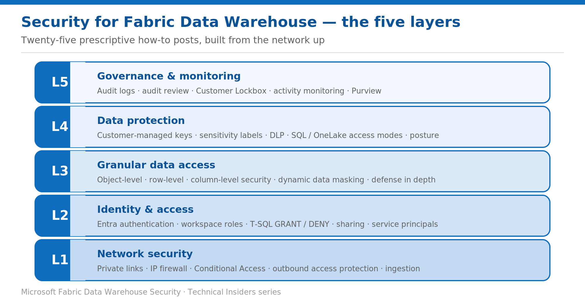

# Security for Fabric Data Warehouse — Series Overview

> A prescriptive, 25-part how-to series across five security layers, built from the network up.

*Fabric Data Warehouse Technical Insiders · 25-part how-to series · Level 300 · Start here*

Securing a Fabric Data Warehouse means making decisions at five different layers — and the guidance for each of them lives in a different place. This series pulls all of it into one prescriptive set: **25 how-to entries**, organized into five layers, built from the network up.

Every entry is a self-contained runbook — **prerequisites → numbered steps → validation → limitations → rollback** — with its own architecture diagram, scoped specifically to the **Warehouse** and the **SQL analytics endpoint**. No conceptual detours: just the steps, in the order you perform them.

This overview is the entry point. Use it to find the layer you need, then work through that layer's entries in order.

*Figure — The five security layers of the series, built from the network up.*

## How to use this series

- **Work from the bottom up.** The layers build on one another — network access first, then identity, then what data is visible, then how the data itself is protected, then how you govern and watch it.
- **Each entry stands alone.** Land on any single entry and act on it without reading the others — useful when you need one control in a hurry.
- **Every step is grounded in Microsoft Learn** (pages current through mid-2026) and scoped to the Warehouse and SQL analytics endpoint.
- **Validate as you go.** Each entry ends with a validation step so you can prove the control actually works — and a rollback if you need to undo it.

## Layer 1 — Network security

| # | Post | Focus |
| --- | --- | --- |
| 01 | **Lock the Warehouse SQL Endpoint Behind Workspace-Level Private Links** | Route SQL connections over Azure Private Link; deny public access |
| 02 | **Restrict the Warehouse to Approved IPs with Workspace Firewall Rules** | IP allow-lists (single IP, range, CIDR) on the workspace |
| 03 | **Gate Warehouse Sign-ins with Microsoft Entra Conditional Access** | MFA, compliant device, and location on SQL-endpoint sign-ins |
| 04 | **Stop Warehouse Data Exfiltration with Outbound Access Protection** | Enable OAP; block unapproved outbound connections |
| 05 | **Load Data into a Protected Warehouse with the OneLake Ingestion Pattern** | OneLake-sourced COPY INTO under outbound access protection |

## Layer 2 — Identity & access

| # | Post | Focus |
| --- | --- | --- |
| 06 | **Connect to the Warehouse with Microsoft Entra ID** | Entra-only authentication; the Read floor; access via groups |
| 07 | **Control Warehouse Access with Fabric Workspace Roles** | Admin / Member / Contributor / Viewer capabilities |
| 08 | **Grant Granular Warehouse Permissions with T-SQL** | GRANT / DENY / REVOKE and database roles |
| 09 | **Share the Warehouse and SQL Analytics Endpoint with Least Privilege** | Read / ReadData / ReadAll; least-privilege sharing |
| 10 | **Automate Warehouse Access with Service Principals** | SPN via workspace role or Entra group; scoped in T-SQL |

## Layer 3 — Granular data access

| # | Post | Focus |
| --- | --- | --- |
| 11 | **Restrict Tables, Views, and Procedures with Object-Level Security** | GRANT / DENY on specific objects by role |
| 12 | **Filter Rows per User with Row-Level Security** | Security policy + inline predicate on USER_NAME() |
| 13 | **Hide Sensitive Columns with Column-Level Security** | GRANT SELECT on a column subset; SELECT * fails |
| 14 | **Obfuscate Sensitive Values with Dynamic Data Masking** | MASKED WITH functions; UNMASK / CONTROL |
| 15 | **Layer OLS, RLS, CLS, and Masking for Defense in Depth** | Combine and validate the four granular controls |

## Layer 4 — Data protection

| # | Post | Focus |
| --- | --- | --- |
| 16 | **Encrypt the Warehouse with Customer-Managed Keys** | CMK + Azure Key Vault; envelope encryption, rotate/revoke |
| 17 | **Classify and Protect Warehouse Data with Sensitivity Labels** | Purview labels that travel with exports |
| 18 | **Detect Sensitive Data in the Warehouse with DLP Policies** | Purview DLP now covers Fabric warehouses |
| 19 | **Choose the SQL Endpoint Access Mode: OneLake or SQL** | User-identity (OneLake) vs delegated (SQL) modes |
| 20 | **Assemble a Data-Protection Posture for the Warehouse** | Rollout order and control map (capstone) |

## Layer 5 — Governance & monitoring

| # | Post | Focus |
| --- | --- | --- |
| 21 | **Configure SQL Audit Logs for the Warehouse** | Enable, scope event categories, retention |
| 22 | **Review and Investigate Warehouse Audit Activity** | In-warehouse T-SQL + tenant unified audit log |
| 23 | **Control Microsoft Access with Customer Lockbox** | Approve/deny Microsoft-engineer access requests |
| 24 | **Monitor Warehouse Activity with Query Insights and DMVs** | queryinsights views + dynamic management views |
| 25 | **Govern the Warehouse with Microsoft Purview** | Unified Catalog, lineage, endorsement |

## Where to start

If you're securing a warehouse from scratch, start at **Layer 1** and work up — the network boundary is the control that makes every layer above it meaningful.

- **Facing an audit or a compliance mandate?** Start at Layer 1 (network isolation) and Layer 5 (audit and monitoring).
- **Onboarding a new team onto an existing warehouse?** Start at Layer 2 (identity and access) and Layer 3 (what they can see).
- **Handling regulated or personal data?** Layer 3 (row, column, and masking controls) and Layer 4 (encryption, labels, DLP) are the priority.
- **Already locked down and proving it?** Layer 5 covers audit logs, forensic investigation, and Purview governance.

> **A note on currency** — Fabric security ships quickly. Every step here reflects the product and documentation as of publication — verify current behavior in your own tenant before standardizing on it, particularly for capabilities that recently reached GA.
