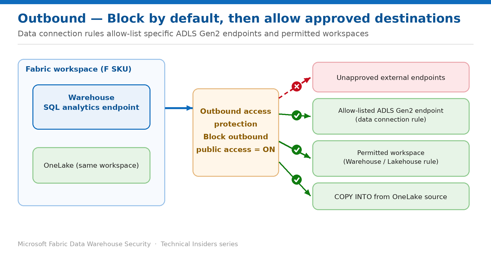

# Stop Warehouse Data Exfiltration with Outbound Access Protection

> Block the Warehouse and SQL analytics endpoint by default, then allow only approved destinations.

*Series: Network security · Layer: Outbound (1 of 2) · Audience: Fabric DW admins · Level 300*

This post shows you how to turn on **workspace outbound access protection (OAP)** for a workspace that hosts a Fabric Warehouse, so the warehouse and **SQL analytics endpoint** can no longer push or pull data to unapproved external endpoints — closing off ingestion-based exfiltration paths.

It then shows the other half of the design: using **data connection rules** to allow-list the destinations your workloads genuinely need — a named **ADLS Gen2** endpoint or another **workspace** — so protection doesn't come at the cost of a broken pipeline.

## Scenario — when to use this

Inbound is locked down, but a compromised credential or a malicious insider could still use the Warehouse to *push* data out — to an attacker-controlled storage account or an unapproved external endpoint. Your security team wants those data-exfiltration paths closed by default.

Reach for this pattern when you need to guarantee the Warehouse and its **SQL analytics endpoint** cannot reach arbitrary external destinations, and you're ready to standardize ingestion on approved, in-tenant sources. Post 5 shows how to keep loading data once this is on.

For more detail on how this option works, see:

- [Microsoft Fabric security white paper — Microsoft Learn](https://learn.microsoft.com/en-us/fabric/security/white-paper-landing-page)
- [Outbound access protection for Data Warehouse — Microsoft Learn](https://learn.microsoft.com/en-us/fabric/security/workspace-outbound-access-protection-data-warehouse)

## What you'll set up

- OAP enabled on the workspace so **all** outbound public access is blocked by default.
- **Data connection rules** that allow-list approved destinations — a specific ADLS Gen2 endpoint, or a named workspace.
- A clear understanding of what still works for the Warehouse (OneLake-sourced ingestion) and what stops.

*Figure 4 — With OAP on, unapproved destinations are blocked; allow-listed ADLS Gen2 endpoints, permitted workspaces, and OneLake loads still work.*

## Prerequisites

- You have the **Admin** role in the workspace.
- The workspace resides on a **Fabric capacity (F SKU)**. No other capacity types are supported.
- A Fabric tenant administrator has enabled the tenant setting **Configure workspace-level outbound network rules**.
- Re-register the **Microsoft.Network** resource provider — Azure portal → **Subscriptions → Resource providers → Microsoft.Network → Re-register**.

## Step 1 — Enable outbound access protection

1. Sign in to Fabric with an account that has the **Admin** role on the target workspace.
2. Open the workspace → **Workspace settings → Network Security**.
3. Under **Outbound access protection**, switch **Block outbound public access** to **On**.
4. If you rely on source control, switch **Allow Git integration** to **On** — Git sync is blocked by default under OAP.

> **Note** — The block-outbound setting can take **up to 15 minutes** to take effect.

## What changes for the Warehouse

Once OAP is on, outbound connections from warehouses and SQL analytics endpoints are restricted to the workspace's administrator-allowed endpoints. Specifically:

- **Warehouses** restrict ingestion to trusted sources. Loads via `COPY INTO`, `OPENROWSET`, and `BULK INSERT` from **unapproved endpoints are blocked**, reducing accidental or unauthorized access.
- **SQL analytics endpoints** limit all queries and data retrieval to resources within the **current workspace**.
- **Exception:** you can still use `COPY INTO` to ingest directly from **OneLake** as a source.

Blocking everything is the starting point, not the finished design. The next step is to open the specific destinations your workloads legitimately need — that's what data connection rules do.

## Step 2 — Allow approved destinations with data connection rules

With OAP generally available, you no longer have to choose between *fully blocked* and *fully open*. **Data connection rules** let you define an allow-list of approved destinations — a specific **ADLS Gen2** storage endpoint, or another **workspace** — while everything else stays blocked.

1. Open the workspace → **Workspace settings → Network Security**, and confirm **Block outbound public access** is **On**.
2. Go to the **outbound data connection rules** section and choose to add a rule.
3. Select the **connection type** for the destination you want to allow (for example, **Azure Data Lake Storage Gen2** for external storage, or **Warehouse** / **Lakehouse** for another Fabric workspace).
4. Specify the **exception scope** — the exact endpoint for external connectors, or the target workspace for Fabric connectors (see the granularity rules below).
5. Save the rule, then re-run the workload and confirm the connection now succeeds while non-listed destinations remain blocked.

### Know your granularity before you design the allow-list

Not every connector allows the same precision. This distinction drives how tightly you can scope a rule:

- **Endpoint granularity** — you allow a *specific* external endpoint. Applies to **Azure Data Lake Storage Gen2**, Azure Blobs, SQL Server, Snowflake, PostgreSQL, Databricks, **Amazon S3**, Web, SharePoint, OData, and REST-style connectors.
- **Workspace granularity** — you allow *named workspaces* as destinations. Applies to the Fabric connection types **Warehouse**, **Lakehouse**, **Fabric SQL Database**, **Dataflow**, **Notebook**, and **Spark Job Definition**.
- **No workspace-level scoping** — Datamarts, KQL Database, Fabric Data Pipelines, and **CopyJob** don't support naming individual workspaces in the allow-list.

> **Prefer endpoint scope** — When allowing external storage, always scope to the **specific ADLS Gen2 endpoint** rather than the broadest option available. An allow-list that names one storage account is a control; one that opens a whole connector class is barely better than disabling OAP.

### If you enabled private links, the portal won't do this

This catches teams who followed Post 1. The Fabric portal **cannot configure data connection rules when private links are enabled** at either the workspace or tenant level. In that combination you must configure the rules through the **Outbound Gateway Rules REST API** instead — the capability is fully supported, only the portal UI is unavailable.

> **Documentation note** — The public OAP overview currently lists Data Warehouse's exception mechanism as *not applicable*, and the Data Warehouse article states exceptions can't be configured through managed private endpoints — which remains true, since managed private endpoints and data connection rules are **different mechanisms**. Allow-listing for Warehouse and SQL analytics endpoint destinations is handled by data connection rules, with **ADLS Gen2** supported today. The product documentation is being updated to clarify this; verify current behavior in your own tenant before you standardize on it.

## Validate

- Run a `COPY INTO` from an **external ADLS URL that is not allow-listed** — the load is blocked.
- Add a data connection rule for that **specific ADLS Gen2 endpoint**, then re-run — the load now succeeds.
- Run a `COPY INTO` from a **OneLake** source in the same workspace — the load succeeds regardless of rules.
- Confirm the toggle state and the rule list under **Workspace settings → Network Security**.

## Limitations & gotchas

- For Data Warehouse, exceptions **can't** be configured through **managed private endpoints** — use **data connection rules** instead.
- Data-import commands are otherwise restricted to sources **within the current workspace**, except `COPY INTO` from OneLake.
- **Cross-tenant allow lists aren't supported** — you can't allow-list a destination in another tenant.
- The **portal can't configure data connection rules when private links are enabled** — use the Outbound Gateway Rules REST API.
- Data connection rules aren't yet available in the **Qatar Central** region.
- **Git integration** is blocked unless you explicitly allow it.
- Allow **up to 15 minutes** for the setting to apply.

## Rollback

1. Open **Workspace settings → Network Security**.
2. Switch **Block outbound public access** to **Off** to restore outbound connectivity.

## References

- [Enable workspace outbound access protection — Microsoft Learn](https://learn.microsoft.com/en-us/fabric/security/workspace-outbound-access-protection-set-up)
- [Outbound access protection for Data Warehouse — Microsoft Learn](https://learn.microsoft.com/en-us/fabric/security/workspace-outbound-access-protection-data-warehouse)
- [Workspace outbound access protection overview — Microsoft Learn](https://learn.microsoft.com/en-us/fabric/security/workspace-outbound-access-protection-overview)
