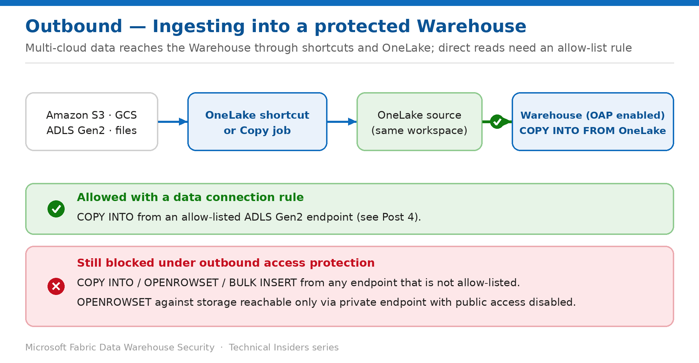

# Load Data into a Protected Warehouse with the OneLake Ingestion Pattern

> Keep ingesting after outbound access protection is on — using OneLake as the supported source.

*Series: Network security · Layer: Outbound (2 of 2) · Audience: Fabric DW admins · Level 300*

With outbound access protection enabled, direct external ingestion into the Warehouse is blocked. This post shows you how to keep loading data using **OneLake as the supported source**, then walks three real ingestion designs: **multi-cloud loads from S3 or GCS via shortcuts**, **scheduled and incremental loads with Copy job**, and **running OAP together with private links** for a locked-down workspace.

## Scenario — when to use this

You've enabled outbound access protection (Post 4), and now the existing `COPY INTO` jobs that pulled from external Blob / ADLS or third-party endpoints fail by design. You still need to load data on a schedule without weakening that protection.

Reach for these patterns when you must keep ingesting into a **protected Warehouse**: stage external data into **OneLake** first, then load from OneLake — the supported source under OAP — or allow-list a specific ADLS Gen2 endpoint with a data connection rule (Post 4) when a direct read is unavoidable.

For more detail on how this option works, see:

- [Microsoft Fabric security white paper — Microsoft Learn](https://learn.microsoft.com/en-us/fabric/security/white-paper-landing-page)
- [Outbound access protection for Data Warehouse — Microsoft Learn](https://learn.microsoft.com/en-us/fabric/security/workspace-outbound-access-protection-data-warehouse)

## What you'll set up

- A working ingestion path into a protected Warehouse via **OneLake-sourced** `COPY INTO`.
- A **multi-cloud** load from Amazon S3 or Google Cloud Storage using a OneLake shortcut — with no extra connection to configure.
- A scheduled, **incremental** load into the Warehouse using **Copy job**.
- A combined **OAP + workspace private links** design that locks both inbound and outbound.
- A clear map of which allow-list mechanisms apply to which workloads today.



*Figure 5 — External and multi-cloud data reaches the protected Warehouse through OneLake and shortcuts; unapproved direct ingestion stays blocked.*

## Prerequisites

- **Outbound access protection is already enabled** on the workspace (see Post 4).
- You are a **workspace admin**.
- Source data can be staged into **OneLake** in the same workspace (a lakehouse Files area, or a shortcut/pipeline that writes to OneLake).

## Step 1 — Stage the source data into OneLake

1. Land the external data into **OneLake** in the same workspace — for example, into a lakehouse **Files** area via a pipeline, dataflow, or a shortcut.
2. Confirm the files are visible in the lakehouse explorer and note the OneLake path.

> **Why this works** — OAP limits the Warehouse to sources **inside the current workspace**, and OneLake is explicitly allowed as a `COPY INTO` source — so staging first into OneLake keeps ingestion flowing without opening external outbound access.

## Step 2 — Load with COPY INTO from OneLake

Run `COPY INTO` from the warehouse, pointing at the OneLake path (replace the workspace, lakehouse, and file path with your values):

```sql
COPY INTO dbo.Sales
FROM 'https://onelake.dfs.fabric.microsoft.com/<workspace>/<lakehouse>.Lakehouse/Files/sales/*.parquet'
WITH (
    FILE_TYPE = 'PARQUET'
);
```

1. Execute the statement against the Warehouse.
2. Validate the row count and spot-check a few records against the source.

## How allow-listing works across workloads (context)

Exception mechanisms differ by workload. Know which applies before you design an ingestion path:

- **Data Engineering / OneLake** workloads allow exceptions through **managed private endpoints** — created in **Workspace settings → Network Security → Managed Private Endpoints → Create**, then approved by a tenant admin in the Azure portal under **Private Link Services → Pending connections → Approve** (about 15 minutes).
- **Data Factory** workloads (including **Copy jobs** and pipelines) and **mirrored databases** allow exceptions through **data connection rules**.
- **Data Warehouse** doesn't use managed private endpoints for exceptions — it uses **data connection rules**, which today support allow-listing **ADLS Gen2** endpoints for warehouse and SQL analytics endpoint connections (see Post 4 for the configuration steps).

> **Design guidance** — Even with allow-listing available, staging external data into **OneLake** first remains the most portable pattern: it works across clouds, needs no per-endpoint rule, and keeps OAP fully enabled.

## Scenario A — Multi-cloud ingestion with OneLake shortcuts

This is the pattern that surprises people. You have data in **Amazon S3** or **Google Cloud Storage** and a Warehouse locked down by OAP. Rather than allow-listing foreign endpoints or building a copy pipeline, you point a **OneLake shortcut** at the bucket and load straight from it — the Warehouse only ever reads from OneLake, so no additional connection or artifact is required.

1. In a lakehouse in the same workspace, choose **Get data → New shortcut**.
2. Select **Amazon S3** or **Google Cloud Storage** as the shortcut type and supply the bucket URL and credentials.
3. Confirm the shortcut appears under the lakehouse **Files** area and browse to the target folder.
4. Run `COPY INTO` from the warehouse against the **shortcut path** — the same OneLake URI form used above.

```sql
COPY INTO dbo.Sales_S3
FROM 'https://onelake.dfs.fabric.microsoft.com/<workspace>/<lakehouse>.Lakehouse/Files/<s3-shortcut>/2026/*.parquet'
WITH (
    FILE_TYPE = 'PARQUET'
);
```

> **Why this is the elegant option** — The cross-cloud hop is resolved by the OneLake shortcut, not by the Warehouse. To the SQL engine this is simply a OneLake read — which OAP permits — so you get multi-cloud ingestion into a fully protected warehouse without opening outbound access, creating managed private endpoints, or maintaining a copy pipeline.

## Scenario B — Scheduled and incremental loads with Copy job

`COPY INTO` is ideal for a file-drop load, but most teams need something scheduled, incremental, and monitorable. **Copy job** covers that: it writes natively to **Fabric Warehouse** and requires no pipeline authoring.

1. Create a **Copy job** in the same workspace (**New item → Copy job**).
2. Choose the source; select **Fabric Warehouse** as the destination and map the target tables.
3. Choose the copy mode — **Full copy**, or **Incremental copy** using a watermark column or **CDC** where the source supports it.
4. Pick the update method: **Append**, **Merge**, **Overwrite**, or **SCD Type 2**.
5. Optionally enable **audit columns** to stamp each row with extraction time, source file path, and job/run IDs.
6. Set a schedule, run the job, and confirm rows land in the warehouse.

- Copy job can **create destination tables automatically** and optionally truncate before a full load.
- **Auto-partitioning** (preview) is supported for watermark-based incremental copy into Fabric Data Warehouse for higher throughput on large tables.
- Under OAP, a Copy job is a **Data Factory** item governed by **data connection rules** — allow-list the source connection it needs.

> **Granularity caveat** — The **CopyJob** connection type does **not** support workspace-level granularity in the allow-list, so you can't scope it to individual workspaces the way you can for Warehouse or Lakehouse connections. Factor this in when you design rules for a locked-down workspace.

## Scenario C — Locking both ends: OAP together with private links

OAP and **workspace-level private links (WSPL)** solve opposite halves of the same problem, and the strongest posture runs both: inbound reaches the SQL analytics endpoint only through a private endpoint (Post 1), while outbound leaves only to allow-listed destinations (Post 4). Nothing arrives from the internet, and nothing leaves to it.

1. Configure workspace-level private links and set public access to **deny**, as described in Post 1.
2. Enable **Block outbound public access** on the same workspace, as described in Post 4.
3. Define outbound exceptions for the destinations you genuinely need — noting the portal restriction below.
4. Validate both directions: connect from inside the VNet (succeeds) and from the public internet (blocked); load from an approved source (succeeds) and an unapproved one (blocked).

> **Plan for this before you start** — Once private links are enabled at the workspace or tenant level, the Fabric portal **can't configure data connection rules** — you must use the **Outbound Gateway Rules REST API**. Establish your outbound allow-list strategy before you turn on private links, or be ready to work through the API.

- Copying from **OneLake sources within a WSPL-protected workspace** is supported.
- Combining both controls doesn't change the DW ingestion rules — OneLake-sourced `COPY INTO` remains the most reliable path.

## Validate

- `COPY INTO` from a OneLake source **succeeds**.
- `COPY INTO` from an **S3 / GCS shortcut path** succeeds — proving multi-cloud ingestion without external outbound access.
- A direct `COPY INTO` / `OPENROWSET` against a **non-allow-listed** external endpoint remains **blocked**, confirming OAP is intact.
- A scheduled **Copy job** into the warehouse completes and rows land as expected.

## Limitations & gotchas

- The Warehouse doesn't support direct `OPENROWSET` access to storage accounts reachable **only** through private endpoints with public network access disabled. The supported direct-access shape is a storage account with **public network access enabled and restricted by firewall rules** — otherwise create a **shortcut** and read through OneLake.
- The staging pipeline/shortcut that writes into OneLake must itself run on a path permitted by your network policy.
- The **CopyJob** connection type can't be scoped to individual workspaces in a data connection rule.
- **Cross-tenant allow lists aren't supported**, so a shortcut or rule can't reach a destination in another tenant.

## Rollback / adjust

- To restore direct external ingestion, disable OAP (**Workspace settings → Network Security → Block outbound public access → Off**) — at the cost of reduced protection.
- Prefer narrowing instead: add a **data connection rule** for the specific ADLS Gen2 endpoint you need, and leave OAP on.
- Otherwise keep OAP on and standardize on the OneLake / shortcut staging patterns above.

## References

- [Outbound access protection for Data Warehouse — Microsoft Learn](https://learn.microsoft.com/en-us/fabric/security/workspace-outbound-access-protection-data-warehouse)
- [Workspace outbound access protection overview — Microsoft Learn](https://learn.microsoft.com/en-us/fabric/security/workspace-outbound-access-protection-overview)
- [What is Copy job in Data Factory — Microsoft Learn](https://learn.microsoft.com/en-us/fabric/data-factory/what-is-copy-job)
- [Create a OneLake shortcut — Microsoft Learn](https://learn.microsoft.com/en-us/fabric/onelake/onelake-shortcuts)
- [COPY INTO (Transact-SQL) — Microsoft Learn](https://learn.microsoft.com/en-us/sql/t-sql/statements/copy-into-transact-sql)
