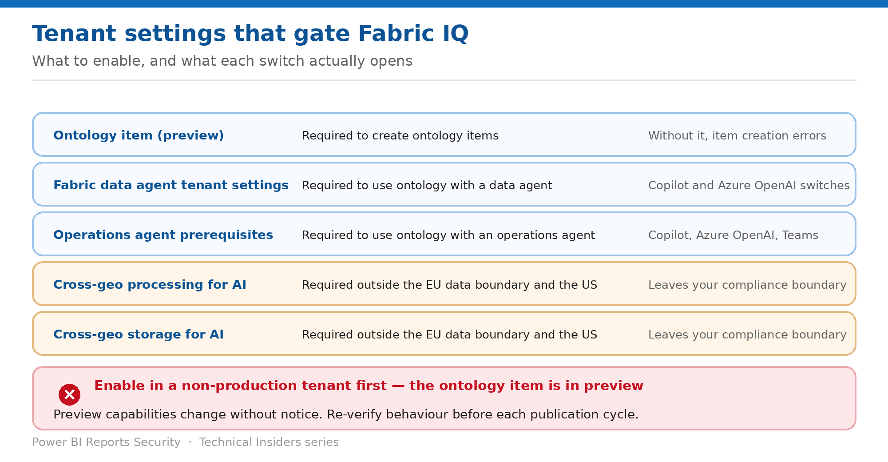

# Enable Fabric IQ Deliberately

> Five tenant settings — and two of them move data outside your compliance boundary.

*Series: Foundation · Layer 1 (1 of 2) · Audience: Fabric administrators · Level 300*

Nothing in Fabric IQ works until the right tenant settings are on, and the set you need depends on which agents will consume the ontology. This entry covers each switch, what it opens, and the preview posture to adopt before any of it reaches production.

## How to read this series

This is the first of six entries on securing Fabric IQ and the ontology item — the tenant foundation first, then the ontology and its bindings, then the graph and query surface, then the agents that act on it. Every entry is written as a **prescriptive, step-by-step runbook**, not a conceptual overview: exact prerequisites, the portal actions, a validation step to prove the control works, the current limitations, and a rollback.

The *why* behind each control is kept deliberately short so the steps stay front and centre. For deeper technical rationale, use the **Microsoft Fabric security white paper** as the companion reference; each entry also links the specific product documentation in its **References** section.

> **Preview capability** — The ontology item and the Fabric IQ workload are in **public preview**. Behaviour, limitations and tenant settings change between releases. Verify every step in your own tenant before you rely on it, and re-verify after each Fabric release.

- [Microsoft Fabric security white paper — Microsoft Learn](https://learn.microsoft.com/en-us/fabric/security/white-paper-landing-page)

## Scenario — when to use this

A team tries to create an ontology item and gets an error. Then the data agent they connect to it fails. Each failure has a different tenant setting behind it, and none of the error messages says so.

Reach for this entry before the first Fabric IQ item is created in your tenant, and as the diagnostic when creation or agent connection fails.

For more detail on how this option works, see:

- [Microsoft Fabric security white paper — Microsoft Learn](https://learn.microsoft.com/en-us/fabric/security/white-paper-landing-page)
- [Required tenant settings for ontology (preview) — Microsoft Learn](https://learn.microsoft.com/en-us/fabric/iq/ontology/overview-tenant-settings)

## What you'll set up

- Every required setting enabled deliberately.
- A documented position on cross-geo processing and storage.
- A preview-appropriate rollout posture.

*Figure 1 — What to enable, and what each switch actually opens.*

## Prerequisites

- **Fabric administrator** access to the admin portal.
- A Fabric-enabled capacity. **Trial capacities aren't supported** for operations agents.
- Knowledge of your capacity's region relative to the **EU data boundary** and the **US**.
- A compliance position on data leaving that boundary.

## Step 1 — Enable the ontology item

1. Sign in to Fabric as an administrator and open the **Admin portal**.
2. Select **Tenant settings**.
3. Enable **Ontology item (preview)** — this is required to create ontology items.
4. Confirm the setting has applied before asking a team to create their first item.

## Step 2 — Enable the agent settings you actually need

| If you will use… | Enable |
| --- | --- |
| Ontology with a Fabric data agent | The required Fabric data agent tenant settings — Copilot and Azure OpenAI switches. Without them, you may see errors creating a new data agent item. |
| Ontology with a Fabric operations agent | The settings listed in the operations agent prerequisites — Fabric admin permissions for the operations agent, Microsoft Copilot, and Azure OpenAI. Without them, you may see errors creating a new operations agent item. |

An operations agent also requires **an eventhouse or ontology in the workspace**, a **KQL database** in that eventhouse if you're using one, and a **Microsoft Teams account** for the default notification path.

## Step 3 — Decide the cross-geo position

- **Enable Azure OpenAI and cross-geo processing and storage for AI** as described in the data agent tenant settings.
- This applies **only if your Fabric capacity isn't provisioned in US or EU regions**.
- Treat it as a compliance decision recorded with a business justification, not a configuration checkbox.

> **Allow an hour** — Tenant settings **might take up to one hour to take effect** after you enable them. A capability that doesn't appear immediately after a settings change may simply need time.

## Step 4 — Adopt a preview rollout posture

1. Enable the settings in a **non-production tenant or workspace** first.
2. Exercise the ontology creation, binding and agent paths you intend to use.
3. Record the behaviour you observed and the date — preview behaviour changes between releases.
4. Only then enable in production, scoped to specific security groups where the setting supports it.
5. Re-verify after each Fabric release that touches IQ, Copilot or AI.

## Validate

- A user in the permitted group can create an ontology item without error.
- A data agent connected to that ontology responds.
- An operations agent can be created and started.
- Your compliance record matches the settings actually enabled.

## Limitations & gotchas

- **Up to one hour** for settings to take effect.
- **Trial capacities aren't supported** for operations agents.
- The ontology item is in **preview** — capabilities and limitations change.
- Error messages on creation rarely name the missing setting.
- Data agent and operations agent settings are **separate** — enabling one does not enable the other.

## Rollback

1. Disable **Ontology item (preview)** to prevent new ontology items being created.
2. Note that disabling does not remove ontology items that already exist.
3. Disable the agent settings separately if agents should also stop.

## References

- [Required tenant settings for ontology (preview) — Microsoft Learn](https://learn.microsoft.com/en-us/fabric/iq/ontology/overview-tenant-settings)
- [Configure Fabric data agent tenant settings — Microsoft Learn](https://learn.microsoft.com/en-us/fabric/data-science/data-agent-tenant-settings)
- [Create and configure operations agents — Microsoft Learn](https://learn.microsoft.com/en-us/fabric/real-time-intelligence/operations-agent)
