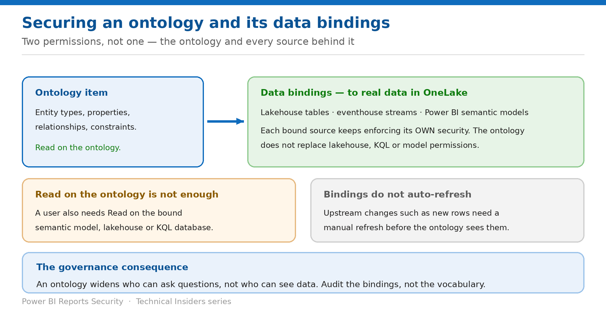

# Secure an Ontology and Its Data Bindings

> Two permissions, not one — the ontology item and every source behind it.

*Series: Foundation · Layer 1 (2 of 2) · Audience: Data owners & ontology authors · Level 300*

An ontology binds a shared vocabulary to concrete data in OneLake. Access to the vocabulary and access to the data are **separate grants**, and the failure mode when they diverge is silent. This entry covers both, plus the refresh behaviour that surprises most teams.

## Scenario — when to use this

You grant a business analyst access to the ontology so they can explore the business model. They can see every entity type and relationship — and get nothing back when they query, because nobody granted them the lakehouse behind it.

Reach for this entry when granting anyone access to an ontology, and as the audit when ontology queries return nothing for some users.

For more detail on how this option works, see:

- [Microsoft Fabric security white paper — Microsoft Learn](https://learn.microsoft.com/en-us/fabric/security/white-paper-landing-page)
- [What is ontology (preview)? — Microsoft Learn](https://learn.microsoft.com/en-us/fabric/iq/ontology/overview)
- [Fabric data agent sharing and permission management — Microsoft Learn](https://learn.microsoft.com/en-us/fabric/data-science/data-agent-sharing)

## What you'll set up

- Both permission surfaces granted deliberately.
- An audited list of bound sources per ontology.
- Correct expectations about refresh.

*Figure 2 — Read on the ontology is never enough on its own.*

## Prerequisites

- **Ontology item (preview)** enabled on the tenant (entry 01).
- The data you intend to bind already in OneLake — lakehouse tables, eventhouse streams, or Power BI semantic models.
- The ability to grant permissions on each of those sources, or a data owner who can.

> **Preview capability** — The ontology item and the Fabric IQ workload are in **public preview**. Behaviour, limitations and tenant settings change between releases. Verify every step in your own tenant before you rely on it, and re-verify after each Fabric release.

## Step 1 — Understand the two surfaces

**Data binding** connects your ontology's definitions — entity types, properties and relationships — to concrete data living in OneLake, including lakehouse tables, eventhouse streams and Power BI semantic models. A binding describes data types, identity keys, how columns map to properties, and how keys map to relationships across multiple sources.

- The **ontology item** carries the vocabulary: entity types, properties, relationships and constraints.
- The **bound sources** carry the data, and keep enforcing their own security exactly as they always did.
- An ontology does not replace lakehouse, KQL or semantic model permissions — it sits above them.

> **The grant that is always forgotten** — Microsoft's own data agent permission table makes the requirement explicit for ontology sources: **Read on the ontology item, and Read on the underlying semantic model, lakehouse, or KQL database bound to the ontology.** Two grants, every time.

## Step 2 — Bind and grant in the right order

1. Confirm the source's own security is correct **before** binding — RLS on the semantic model, table access on the lakehouse, database roles on the KQL database.
2. Create the data binding from the ontology's entity types and properties to that source.
3. Record the binding in an inventory: ontology name, entity type, source item, source workspace.
4. Grant **Read on the ontology item** to the intended audience.
5. Grant **Read on each bound source** to the same audience — or deliberately withhold it where they should not see that domain.

## Step 3 — Set refresh expectations

> **Bindings do not auto-refresh** — Microsoft states it twice in the ontology documentation: **any updates in upstream data sources (like new rows) need to be manually refreshed before they're visible in the ontology item.**

- This matters for security reviews: an ontology can present a stale view of data that has already changed.
- It also matters for incident response — removing a row upstream does not remove it from the ontology until a refresh runs.
- Each graph node and edge keeps **data source lineage** and follows a scheduled data refresh — use that lineage when auditing where a value came from.

## Validate

- A user with Read on the ontology but not on a bound source can see the vocabulary and gets no data from that source.
- The same user, granted Read on the source, now gets results.
- A user subject to RLS on a bound semantic model sees filtered results through the ontology.
- Your binding inventory matches what the ontology actually contains.

## Limitations & gotchas

- **Read on the ontology alone returns nothing** from an unbound-to-the-user source.
- **Upstream changes need a manual refresh** before the ontology sees them.
- An ontology spanning several domains multiplies the number of separate grants to audit.
- Binding is where cross-domain exposure is introduced — see entry 03 for relationships as access paths.
- The item is in **preview**; binding behaviour may change.

## Rollback

1. Remove the data binding for the affected entity type or property.
2. Revoke Read on the bound source to stop that domain reaching the user, keeping the vocabulary visible.
3. Revoke Read on the ontology item to remove the vocabulary as well.

## References

- [What is ontology (preview)? — Microsoft Learn](https://learn.microsoft.com/en-us/fabric/iq/ontology/overview)
- [Fabric data agent sharing and permission management — Microsoft Learn](https://learn.microsoft.com/en-us/fabric/data-science/data-agent-sharing)
- [What is Fabric IQ? — Microsoft Learn](https://learn.microsoft.com/en-us/fabric/iq/overview)
