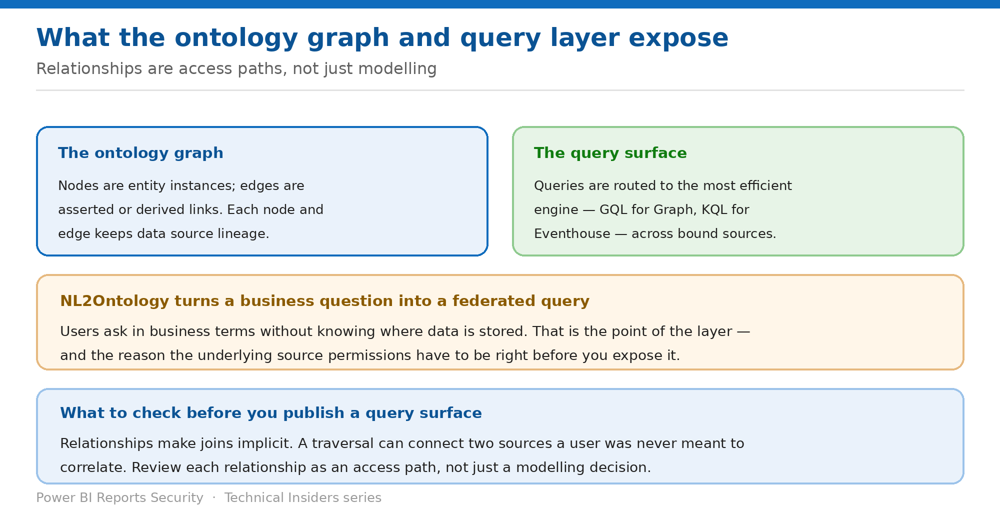

# Control What the Graph and Query Layer Expose

> Relationships are access paths, not just modelling decisions.

*Series: Graph & query surface · Layer 2 (1 of 1) · Audience: Ontology authors & security reviewers · Level 300*

Once bound, an ontology becomes a **queryable instance graph** with a natural-language front end that federates across sources. This entry covers what that surface exposes, and the review to run before you open it to a business audience.

## Scenario — when to use this

Two datasets were deliberately kept apart — a customer list and a support-incident feed. Neither team can see the other's data. Then a relationship in the ontology connects them, and a single traversal correlates the two for anyone holding both grants.

Reach for this entry before publishing an ontology to a wide audience, and as the review step whenever a relationship is added across domains.

For more detail on how this option works, see:

- [Microsoft Fabric security white paper — Microsoft Learn](https://learn.microsoft.com/en-us/fabric/security/white-paper-landing-page)
- [What is ontology (preview)? — Microsoft Learn](https://learn.microsoft.com/en-us/fabric/iq/ontology/overview)

## What you'll set up

- Every relationship reviewed as an access path.
- A correct understanding of where queries execute.
- A query surface you can defend in a review.

*Figure 3 — The graph, the query router, and the review that matters.*

## Prerequisites

- An ontology with data bindings in place (entry 02).
- The binding inventory from entry 02.
- Knowledge of which domains are deliberately kept separate in your estate.

> **Preview capability** — The ontology item and the Fabric IQ workload are in **public preview**. Behaviour, limitations and tenant settings change between releases. Verify every step in your own tenant before you rely on it, and re-verify after each Fabric release.

## Step 1 — Understand what the graph is

- The **ontology graph** is a queryable instance graph built from your data bindings and relationship definitions, provided within ontology by **Graph in Microsoft Fabric**.
- **Nodes are entity instances; edges are links** — either **asserted or derived** — with metadata attributes.
- **Each node or edge keeps data source lineage** and follows a scheduled data refresh.
- The graph enables visual exploration, graph algorithms such as paths, centrality and communities, and **rule-driven inferences**.

> **Derived edges are the ones to scrutinise** — An asserted edge reflects a key relationship you declared. A **derived** edge and a rule-driven inference produce connections that were not explicit in any single source. Review what your rules infer, not just what you bound.

## Step 2 — Understand where queries run

- Queries **start with entity types** and allow filtering by properties, traversing relationships, aggregating by time, and other constraints.
- The ontology layer **automatically sends your queries to the most efficient system** — for example **GQL** for Graph in Microsoft Fabric and **KQL** for Eventhouse.
- **NL2Ontology** converts natural-language questions into structured queries, so users ask in business terms without knowing where data is stored.
- NL2Ontology queries **ensure that filters, joins, units and validity windows align with the definitions published in your ontology**.

The security consequence: the ontology does not execute in one place you can put a single control in front of. Each bound source enforces its own security at execution time, which is exactly why entry 02's grants are the real boundary.

## Step 3 — Review relationships as access paths

1. List every relationship in the ontology, with the source entity type and the target entity type.
2. For each, note which bound source backs each end.
3. Flag any relationship whose two ends are backed by sources that are deliberately access-separated in your estate.
4. For each flagged relationship, confirm that a user holding both grants is *meant* to be able to correlate the two.
5. Where they are not, either remove the relationship or split the ontology by domain.
6. Repeat the review whenever a relationship or binding is added.

## Step 4 — Constrain what business users can traverse

- The narrowest control available is **the grant on each bound source** — a traversal fails at the end the user cannot read.
- Where a domain must never be correlated, keep it in a **separate ontology** rather than relying on relationship design.
- Use **cardinality rules and relationship attributes** to keep the model honest, but do not treat them as security.
- Use **data source lineage** on nodes and edges to trace any surprising result back to its origin.

## Validate

- A user without access to one end of a cross-domain relationship cannot traverse it.
- A natural-language question spanning two domains returns only the side the user may read.
- Lineage on a node correctly identifies its source item.
- Your relationship review is documented and dated.

## Limitations & gotchas

- **Relationships make joins implicit** — the correlation risk is not visible in any single query.
- **Derived edges and rule-based inference** create connections nobody explicitly bound.
- Query federation means there is **no single execution point** to place a control at.
- **Manual refresh** applies to the graph too — it can present a stale view.
- The item is in **preview**; graph and query behaviour may change.

## Rollback

1. Remove the relationship type from the ontology.
2. Remove the binding on one end if the entity type should remain but the data should not.
3. Revoke the source grant to close the path immediately while you redesign.

## References

- [What is ontology (preview)? — Microsoft Learn](https://learn.microsoft.com/en-us/fabric/iq/ontology/overview)
- [What is Fabric IQ? — Microsoft Learn](https://learn.microsoft.com/en-us/fabric/iq/overview)
