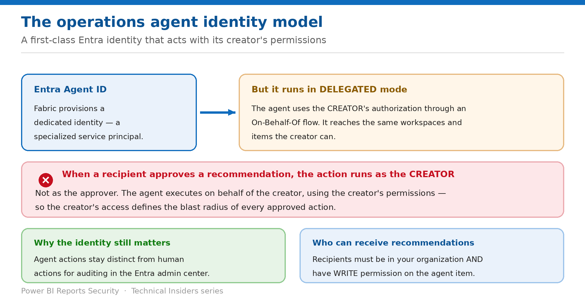

# Govern the Operations Agent Identity

> A first-class Entra identity that acts with its creator's permissions — including when someone else approves.

*Series: Agents on the ontology · Layer 3 (1 of 2) · Audience: Fabric admins & agent creators · Level 300*

Every operations agent gets its own **Microsoft Entra Agent ID**. That is a genuine governance improvement — and it does not mean the agent runs with its own permissions. This entry covers the identity model, the delegated-authorization behaviour, and what it means for who can approve an action.

## Scenario — when to use this

An operations agent recommends an action. A team member approves it from Teams. The action succeeds — using permissions the approver does not have, because it ran as the agent's creator.

Reach for this entry before any operations agent is created in a production workspace, and when deciding who should create agents.

For more detail on how this option works, see:

- [Microsoft Fabric security white paper — Microsoft Learn](https://learn.microsoft.com/en-us/fabric/security/white-paper-landing-page)
- [Create and configure operations agents — Microsoft Learn](https://learn.microsoft.com/en-us/fabric/real-time-intelligence/operations-agent)
- [Operations agent actions — Microsoft Learn](https://learn.microsoft.com/en-us/fabric/real-time-intelligence/operations-agent-actions)

## What you'll set up

- A deliberate choice of who creates each agent.
- A correct understanding of whose permissions actions run under.
- A recipient list that matches the intended approval authority.

*Figure 4 — Agent identity, delegated authorization, and the approval trap.*

## Prerequisites

- A workspace with a Fabric-enabled capacity. **Trial capacities aren't supported.**
- An **eventhouse or ontology** in the workspace, and a **KQL database** in that eventhouse if you're using one.
- A **Microsoft Teams account**.
- **Fabric admin permissions** enabled for the operations agent, Microsoft Copilot and Azure OpenAI (entry 01).

> **Preview capability** — The ontology item and the Fabric IQ workload are in **public preview**. Behaviour, limitations and tenant settings change between releases. Verify every step in your own tenant before you rely on it, and re-verify after each Fabric release.

## Step 1 — Understand the identity model

- When you create an agent, Fabric **provisions a dedicated agent identity — a specialized service principal** — powered by **Microsoft Entra Agent ID**.
- The agent appears as a **first-class, governable entity in the Entra admin center**, not as an anonymous user session.
- This gives tenant-wide visibility into which agents exist, keeps **agent actions distinct from human actions for auditing**, and **decouples the agent from the lifecycle of the account that created it**.
- You can view the Entra Agent ID in the **status bar of the operations agent item**.

## Step 2 — Understand delegated authorization

> **The line that determines your blast radius** — **Operations agents run in delegated mode: they use the creator's authorization through an On-Behalf-Of (OBO) flow, so they can access the same workspaces and items the creator can, while actions are attributed to the agent identity.** And: **when a recipient approves a recommendation, the agent runs the action on behalf of the creator, using the creator's permissions.**

- The identity is the agent's; the **authorization is the creator's**.
- An approver does not need — and does not use — their own permission for the action.
- Therefore the correct question is not "who may approve this?" but **"whose permissions do I want this agent to carry?"**
- Create production agents under an account whose access is scoped to what the agent legitimately needs.

## Step 3 — Set the recipient list deliberately

1. Install the **Fabric Operations Agent** Teams app so the agent can message proactively; search the Teams app store if it isn't installed automatically.
2. Open the agent item settings and find **Agent behavior**.
3. Select **Edit** and choose a direct message to an individual, or a post in a Teams channel.
4. Confirm every recipient **belongs to your organization and has write permissions for the agent item in Fabric** — that is the documented requirement.
5. Treat that write-permission list as your effective approval roster, and review it as such.

## Step 4 — Validate the rules before you start the agent

1. For each rule, view the query the agent runs against your data source.
2. Use **Copy code** and paste it into a **KQL Queryset** item, or the **Ontology graph query editor**, to test it.
3. For KQL, replace the `startTime` and `endTime` parameters with recent timestamps or `now()`.
4. Confirm the rule evaluates the right property, applies the intended condition and reads the correct data.
5. Only then select **Start**.

## Understand state versus transition conditions

The agent runs each rule's query **every 5 minutes**. How often a rule signals depends on its condition type — which matters when an action has real-world effect:

| Condition | Type | When it's met |
| --- | --- | --- |
| Is above | State | Met any time the property is above the value — signals repeatedly while it stays there. |
| Crosses above | Transition | Met when the property changes from below to above the value, or from null to above. |
| Is below | State | Met any time the property is below the value. |
| Crosses below | Transition | Met when the property changes from above to below the value, or from null to below. |
| Enters range | Transition | Met any time the property changes from outside to inside the range. |
| Exits range | Transition | Met any time the property changes from inside to outside the range. |
| Is | State | Met any time the property matches the value. |
| Becomes | Transition | Met when the property changes to the value from a different value, or from null. |

> **Choose the type before you attach an action** — A **state** condition can fire on every evaluation while the value persists. Attached to a notification that is noise; attached to an action that changes something, it is a repeated action. Use a **transition** condition when you care about the change.

## Validate

- The Entra Agent ID is visible in the agent item's status bar and in the Entra admin center.
- An approved action's effect matches the **creator's** permissions, not the approver's.
- Every recipient holds write permission on the agent item.
- A rule's query, run manually, returns what you expect.

## Limitations & gotchas

- **The agent operates with the delegated identity and permissions of its creator** — the central point of this entry.
- **Recipients must have write permissions on the agent item**, which makes the recipient list a privilege decision.
- **Trial capacities aren't supported.**
- State conditions can signal repeatedly; transition conditions signal once per transition.
- Rules evaluate on a **5-minute** cycle — not continuously.

## Rollback

1. Select **Stop** in the toolbar to stop the agent immediately.
2. Remove recipients from **Agent behavior** to cut the approval path.
3. Recreate the agent under a correctly-scoped account if the creator's access is too broad — the delegated permissions follow the creator, not the item.

## References

- [Create and configure operations agents — Microsoft Learn](https://learn.microsoft.com/en-us/fabric/real-time-intelligence/operations-agent)
- [Operations agent actions — Microsoft Learn](https://learn.microsoft.com/en-us/fabric/real-time-intelligence/operations-agent-actions)
