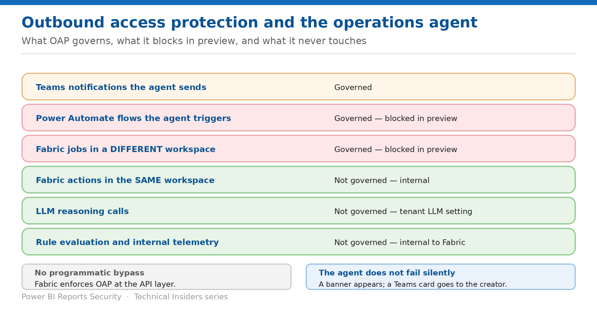

# Constrain Operations Agent Actions with OAP

> What outbound access protection governs, what it blocks in preview, and what it never touches.

*Series: Agents on the ontology · Layer 3 (2 of 2) · Audience: Workspace & Fabric admins · Level 300*

**Workspace outbound access protection (OAP)** lets workspace admins control which outbound connections items in the workspace can make. When the workspace contains an operations agent, that policy governs the agent's outbound actions. This entry covers exactly what it covers, what preview blocks outright, and how blocks surface.

## Scenario — when to use this

Your security team wants OAP on every workspace. Your operations agent depends on a Power Automate flow. Turning OAP on will block that flow, and there is currently no per-workspace toggle to allow it.

Reach for this entry before enabling OAP on a workspace containing an operations agent, and when an agent stops taking actions after a workspace policy change.

For more detail on how this option works, see:

- [Microsoft Fabric security white paper — Microsoft Learn](https://learn.microsoft.com/en-us/fabric/security/white-paper-landing-page)
- [Workspace outbound access protection for operations agent (preview) — Microsoft Learn](https://learn.microsoft.com/en-us/fabric/security/workspace-outbound-access-protection-operations-agent)

## What you'll set up

- A clear map of which agent actions OAP governs.
- A design that survives the current preview limitations.
- A monitoring path for blocked actions.

*Figure 5 — Governed, blocked, and out of scope.*

## Prerequisites

- **Workspace admin** rights to configure the OAP policy.
- An operations agent already created and configured (entry 04).
- A non-production workspace to test in first.
- Knowledge of the **tenant-level Teams setting**, which changes how blocks are surfaced.

> **Preview scope** — **Operations agent is generally available. Support for operations agent with workspace OAP is in preview.** The capabilities and limitations here apply while that support is in preview.

## Step 1 — Map what OAP governs

| Capability | Governed by OAP? | Notes |
| --- | --- | --- |
| Teams notifications the agent sends | Yes | The agent checks the workspace OAP policy before sending. |
| Power Automate flows the agent triggers | Yes | Enforced when the Activator action runs. Not available during preview. |
| Fabric jobs in a different workspace | Yes | Enforced when the Activator action runs. Not available during preview. |
| Fabric actions in the same workspace as the agent | No | Internal to the workspace. |
| Large language model (LLM) reasoning calls | No | The tenant-level LLM setting governs these calls. |
| Agent rule evaluation and internal telemetry | No | Internal to Fabric. |

> **OAP only touches the final step** — **OAP affects only the final outbound execution step. The agent's reasoning, rules, and internal logging continue to operate normally.** Enabling OAP does not stop the agent working — it stops specific outbound actions leaving.

## Step 2 — Design around the preview limitations

- **Cross-workspace actions aren't supported.** Preview supports only in-workspace scenarios; OAP blocks outbound actions targeting a different workspace. **Keep the agent and its action targets — Activator items and other Fabric items — in the same workspace.**
- **Power Automate actions are blocked.** There is currently no per-workspace toggle. If your agent depends on Power Automate, **keep OAP off on that workspace until the toggle ships**, or replace the action with a Teams notification or an in-workspace Fabric job.
- **Other Fabric item outbound actions are blocked** where you don't explicitly allow the required connection policies.
- **Connectors without an OAP toggle are blocked.** Workspace rules can allow only connectors that explicitly support workspace OAP policy.

> **No programmatic bypass** — **Fabric enforces OAP at the API layer. There's no supported way to bypass workspace OAP from code, scripts, or external API calls** — and there is no appeal or override. To allow a blocked path, the workspace admin must add the connection to the allowlist.

## Step 3 — Know how a block surfaces

- **In the agent UI** — a banner appears at the top of the agent window: *Limited agent functionality — This workspace has outbound access restrictions that may block some agent actions or notifications.*
- **In Microsoft Teams, when Teams is allowed in tenant settings** — **the agent creator** receives a Teams card explaining the block.
- **When Teams is not allowed in tenant settings** — no card is sent; the agent falls back to the in-app banner only.

Note the recipient: the blocked-action card goes to the **agent creator**, not to the person who approved or expected the action.

## Step 4 — Test before production

1. Enable OAP in a **non-production workspace** containing a copy of the agent.
2. Exercise **each** agent action in turn.
3. Confirm both the banner and the Teams card render the way you expect **for your tenant's Teams configuration**.
4. Record which actions were blocked and what you substituted.
5. Only then enable OAP on the production workspace.

## Step 5 — Monitor with the Activity Log

1. Open the operations agent in Fabric.
2. In the left navigation pane, under the agent name, select **Activity Log**.
3. Look for **blocked outbound requests** — entries showing operations that OAP policies blocked.
4. Check whether **failed actions** correlate with OAP restrictions.
5. Use **timestamps** to correlate agent activity with expected behaviour.

## Validate

- With OAP on, a same-workspace Fabric action still succeeds.
- A cross-workspace action is blocked, and the block appears in the Activity Log.
- The agent's rules continue evaluating — reasoning and logging are unaffected.
- The creator receives the expected notification for your Teams configuration.

## Limitations & gotchas

- **Power Automate is blocked outright** while OAP is on — there is no toggle yet.
- **Cross-workspace actions are blocked** during preview.
- **No programmatic bypass, no override, no appeal.**
- The blocked-action card goes to the **creator** only.
- OAP does **not** affect what data the agent reasons over or sends to the LLM — that is the tenant-level LLM setting.
- Actions in flight are evaluated against the **current** policy when attempted.

## Rollback

1. Ask the workspace admin to disable OAP on that workspace, or add the required connection to the allowlist.
2. Substitute a blocked action with a Teams notification or an in-workspace Fabric job.
3. Move the agent's action targets into the agent's own workspace to remove the cross-workspace dependency.

## References

- [Workspace outbound access protection for operations agent (preview) — Microsoft Learn](https://learn.microsoft.com/en-us/fabric/security/workspace-outbound-access-protection-operations-agent)
- [Create and configure operations agents — Microsoft Learn](https://learn.microsoft.com/en-us/fabric/real-time-intelligence/operations-agent)
- [Operations agent actions — Microsoft Learn](https://learn.microsoft.com/en-us/fabric/real-time-intelligence/operations-agent-actions)
