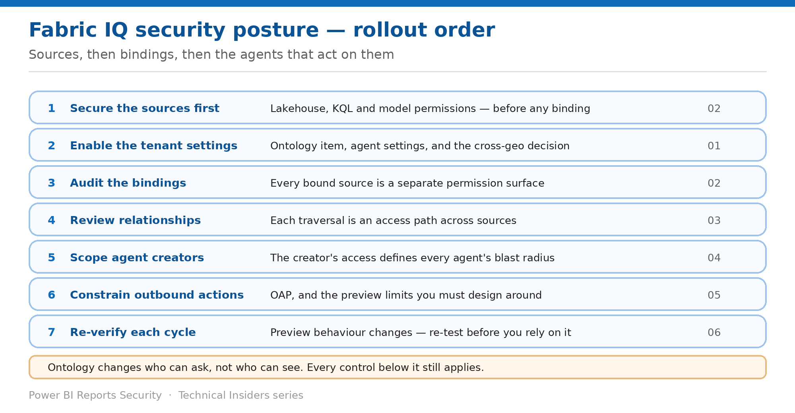

# Assemble a Fabric IQ Security Posture

> The order to apply these controls in — starting well below the ontology.

*Series: Governance · Layer 4 (1 of 1) · Audience: Fabric admins & architects · Level 300*

The preceding five entries each solve one problem. This capstone puts them in order and adds the review cadence a preview workload needs.

Fabric IQ has one sequencing rule above all others: **an ontology changes who can ask, not who can see**. Every control below it still applies, and none of them can be replaced by the ontology layer.

## Scenario — when to use this

You're standing up Fabric IQ, or reviewing an ontology someone else built. Starting with the ontology's own permissions feels natural and leaves the actual data boundary untouched.

Reach for this entry when planning a rollout, onboarding a new ontology, or reviewing an existing Fabric IQ estate against a target posture.

For more detail on how this option works, see:

- [Microsoft Fabric security white paper — Microsoft Learn](https://learn.microsoft.com/en-us/fabric/security/white-paper-landing-page)
- [What is Fabric IQ? — Microsoft Learn](https://learn.microsoft.com/en-us/fabric/iq/overview)
- [What is ontology (preview)? — Microsoft Learn](https://learn.microsoft.com/en-us/fabric/iq/ontology/overview)

## What you'll set up

- A sequenced rollout plan across all four layers.
- A control map you can review an estate against.
- A review cadence appropriate to a preview workload.

*Figure 6 — Sources, then bindings, then the agents that act on them.*

## The rollout order

| # | Step | What you do | Entries |
| --- | --- | --- | --- |
| 1 | Secure the sources first | Lakehouse, KQL and model permissions — before any binding | 02 |
| 2 | Enable the tenant settings | Ontology item, agent settings, and the cross-geo decision | 01 |
| 3 | Audit the bindings | Every bound source is a separate permission surface | 02 |
| 4 | Review relationships | Each traversal is an access path across sources | 03 |
| 5 | Scope agent creators | The creator's access defines every agent's blast radius | 04 |
| 6 | Constrain outbound actions | OAP, and the preview limits to design around | 05 |
| 7 | Re-verify each cycle | Preview behaviour changes — re-test before you rely on it | 06 |

> **Step 1 is not optional** — The ontology presents a business vocabulary over sources that keep enforcing their own security. If a source is over-shared, the ontology makes it easier to find — not harder to reach.

## Step 1 — Baseline the estate

1. List every ontology item and the workspace it lives in.
2. For each, list every **data binding** — entity type, property, source item, source workspace.
3. For each bound source, record whether **RLS, table access or database roles** are configured.
4. List every **relationship**, and which bound source backs each end.
5. List every **operations agent**, its **creator**, and its recipient list.
6. Record which workspaces have **OAP** enabled, and which agent actions each agent depends on.

## Step 2 — Apply the layers in order

1. **Sources:** confirm each bound source enforces the security you expect, independently of the ontology (02).
2. **Tenant:** enable only the settings you need, and record the cross-geo position (01).
3. **Bindings:** grant Read on the ontology *and* on each source the audience should reach (02).
4. **Relationships:** review every cross-domain traversal as an access path (03).
5. **Agents:** create production agents under correctly-scoped accounts, and set recipient lists as approval rosters (04).
6. **Outbound:** decide OAP per workspace with the preview limits in mind (05).

## Step 3 — Watch the interactions

- **Read on the ontology returns nothing** without Read on the bound source — two grants, always.
- **Bindings do not auto-refresh** — the ontology can present a stale view.
- **Relationships make joins implicit**, and derived edges connect what nobody explicitly bound.
- **Operations agents act with their creator's permissions**, including when someone else approves.
- **Recipients need write permission on the agent item** — the recipient list is a privilege decision.
- **OAP only governs the final outbound step** — reasoning, rules and logging continue regardless.
- **Power Automate and cross-workspace actions are blocked** while OAP support is in preview.

## End-to-end validation

- **Sources:** a restricted user gets filtered results through the ontology.
- **Tenant:** ontology and agent creation succeed for the intended groups only.
- **Bindings:** a user with ontology access but no source access sees vocabulary and no data.
- **Relationships:** a cross-domain traversal fails at the end the user cannot read.
- **Agents:** an approved action's effect matches the creator's permissions.
- **Outbound:** blocked actions appear in the Activity Log and surface to the creator.
- **Governance:** the baseline is documented and dated.

## Limitations & gotchas

- **The ontology is not a permission boundary** — the whole series rests on this.
- **Trial capacities aren't supported** for operations agents.
- **No programmatic bypass of OAP**, and no override.
- Manual refresh means the ontology and graph can lag the source.
- Ontology and the Fabric IQ workload are in **public preview** — treat every finding here as dated.

## Review cadence

1. Re-run the **binding audit** whenever a binding is added or a source's security changes.
2. Re-run the **relationship review** whenever a relationship is added across domains.
3. Review **agent creators and recipient lists** quarterly, and whenever an agent owner changes role.
4. Re-test **OAP behaviour** after each Fabric release while the support remains in preview.
5. Re-verify the whole posture after each Fabric release that touches IQ, Copilot or AI — this is a preview workload, and that cadence is not optional.

## References

- [What is Fabric IQ? — Microsoft Learn](https://learn.microsoft.com/en-us/fabric/iq/overview)
- [What is ontology (preview)? — Microsoft Learn](https://learn.microsoft.com/en-us/fabric/iq/ontology/overview)
- [Required tenant settings for ontology (preview) — Microsoft Learn](https://learn.microsoft.com/en-us/fabric/iq/ontology/overview-tenant-settings)
- [Create and configure operations agents — Microsoft Learn](https://learn.microsoft.com/en-us/fabric/real-time-intelligence/operations-agent)
- [Workspace outbound access protection for operations agent (preview) — Microsoft Learn](https://learn.microsoft.com/en-us/fabric/security/workspace-outbound-access-protection-operations-agent)
- [Track user activities in Microsoft Fabric — Microsoft Learn](https://learn.microsoft.com/en-us/fabric/admin/track-user-activities)
- [Microsoft Fabric security white paper — Microsoft Learn](https://learn.microsoft.com/en-us/fabric/security/white-paper-landing-page)
