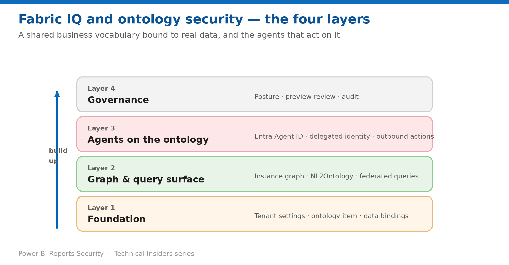

# Security for Fabric IQ and Ontology

*A 6-part, prescriptive how-to series for the ontology item, its bindings, its graph, and the agents that act on it.*

Each entry is a self-contained how-to (prerequisites → steps → validation → limitations → rollback) with its own architecture diagram, scoped to semantic models. Start at Layer 1 and work up.

## Contents

### Layer 1 — Foundation

- [Enable Fabric IQ Deliberately](Fabric-IQ-Security-01-Foundation-Tenant-Settings.md) — Five tenant settings — and two of them move data outside your compliance boundary.
- [Secure an Ontology and Its Data Bindings](Fabric-IQ-Security-02-Foundation-Ontology-Bindings.md) — Two permissions, not one — the ontology item and every source behind it.

### Layer 2 — Graph & query surface

- [Control What the Graph and Query Layer Expose](Fabric-IQ-Security-03-Graph-Query-Surface.md) — Relationships are access paths, not just modelling decisions.

### Layer 3 — Agents on the ontology

- [Govern the Operations Agent Identity](Fabric-IQ-Security-04-Agents-Operations-Agent-Identity.md) — A first-class Entra identity that acts with its creator's permissions — including when someone else approves.
- [Constrain Operations Agent Actions with OAP](Fabric-IQ-Security-05-Agents-Outbound-Access-Protection.md) — What outbound access protection governs, what it blocks in preview, and what it never touches.

### Layer 4 — Governance

- [Assemble a Fabric IQ Security Posture](Fabric-IQ-Security-06-Governance-Posture.md) — The order to apply these controls in — starting well below the ontology.

---

*See the [series overview](Fabric-IQ-Security-00-Series-Overview.md) for the complete entry list and where to start.*
