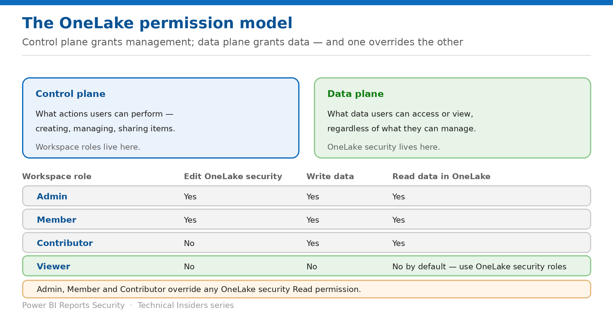

# Map the OneLake Permission Model

> Control plane grants management, data plane grants data — and three roles override everything you write.

*Series: Permission model · Layer 1 (1 of 2) · Audience: Fabric admins & data owners · Level 300*

Everything in this series depends on one distinction: **control plane permissions govern what actions users can perform; data plane permissions govern what data they can access**. OneLake security is the data plane. This entry maps both, and identifies the roles your rules cannot constrain.

## How to read this series

This is the first of nine entries on securing OneLake — the permission model first, then granular data access, then engine and shortcut behaviour, then the reference architecture. Every entry is written as a **prescriptive, step-by-step runbook**, not a conceptual overview: exact prerequisites, the portal actions, a validation step to prove the control works, the current limitations, and a rollback.

The *why* behind each control is kept deliberately short so the steps stay front and centre. For deeper technical rationale, use the **Microsoft Fabric security white paper** as the companion reference; each entry also links the specific product documentation in its **References** section.

- [Microsoft Fabric security white paper — Microsoft Learn](https://learn.microsoft.com/en-us/fabric/security/white-paper-landing-page)

## Scenario — when to use this

You write a careful OneLake security role that grants one team access to three tables. It has no effect on half the people you were worried about — because they hold Contributor, and Contributor overrides OneLake security Read permissions entirely.

Reach for this entry before designing any OneLake security model, and as the diagnostic when a role appears to be ignored.

For more detail on how this option works, see:

- [Microsoft Fabric security white paper — Microsoft Learn](https://learn.microsoft.com/en-us/fabric/security/white-paper-landing-page)
- [Data security overview — Microsoft Learn](https://learn.microsoft.com/en-us/fabric/onelake/security/get-started-security)
- [OneLake security access control model — Microsoft Learn](https://learn.microsoft.com/en-us/fabric/onelake/security/data-access-control-model)

## What you'll set up

- A correct mental model of the two planes.
- Workspace roles assigned so your data-plane rules can take effect.
- An accurate answer to "who can read this data today?"

*Figure 1 — Workspace roles, and what each can actually reach.*

## Prerequisites

- Access to the workspace whose permissions you want to map.
- The ability to view workspace role membership and item permissions.
- A list of the data items in scope — lakehouses, mirrored databases, mirrored catalogs.

## Step 1 — Separate the two planes

- **Control plane permissions** govern what actions users can perform within the environment — creating, managing, or sharing items. **Control plane permissions often provide data plane permissions by default.**
- **Data plane permissions** govern what data users can access or view, **regardless of their ability to manage resources**. For OneLake, this is OneLake security.
- Permissions can be set at three levels: **workspace**, **item**, and **folders** within an item such as `Tables/` or `Files/`.
- Items always live within workspaces, and workspaces always live directly under the OneLake namespace.

> **Deny by default** — **OneLake security uses a deny-by-default model — all users start with no access to data unless explicitly granted by a OneLake security role.** The exceptions are the workspace roles below, and the default roles covered in entry 02.

## Step 2 — Map the workspace roles

| Permission | Admin | Member | Contributor | Viewer |
| --- | --- | --- | --- | --- |
| View files in OneLake | Yes | Yes | Yes | No by default |
| Write files in OneLake | Yes | Yes | Yes | No by default |
| Can edit OneLake security roles | Yes | Yes | No | No |
| Can add members | Yes | Yes | No | No |
| Can update and delete the workspace | Yes | No | No | No |

> **The line that decides whether your work matters** — **Because Workspace Admin, Member and Contributor roles automatically grant Write permissions to OneLake, they override any OneLake security Read permissions.** Workspace Admins, Members and Contributors are not affected by OneLake security roles and can read and write all data in an item regardless of role membership.

The practical consequence: **OneLake security roles grant access to data for users in the Viewer workspace role, or with Read permission on the item.** If the audience you are trying to constrain holds Contributor, the first fix is the workspace role — not the OneLake role.

## Step 3 — Map the item permissions

Item permissions, granted by sharing or via **Manage permissions**, let a user see one item without being a member of any workspace role:

| Permission | See item metadata? | See data in SQL? | See data in OneLake? |
| --- | --- | --- | --- |
| Write | Yes | Yes | Yes |
| Read | Yes | No | No by default — use OneLake security to grant access |
| ReadData | No | Only in Delegated mode | No |
| ReadAll | No | No | Only through the DefaultReader role |

**ReadAll is the permission that quietly grants data access**, because it makes the holder a virtual member of the DefaultReader role — see entry 02.

## Step 4 — Know the four components of a role

- **Data** — the tables or folders that users can access.
- **Permission** — Read, or ReadWrite on supported items.
- **Members** — any Microsoft Entra identity: users, groups, or non-user identities. The role is granted to all members of a group.
- **Constraints** — the components of the data excluded from role access, such as specific rows or columns.
- **Type** — GRANT or DENY. **Only GRANT type roles are supported.**

## Validate

- A Viewer with no OneLake security role sees **no data** in the item.
- The same Viewer, added to a role, sees exactly the scoped data.
- A Contributor sees **everything**, regardless of any role — confirming the override.
- A user with only Read on the item sees metadata but no data until a role grants it.

## Limitations & gotchas

- **Admin, Member and Contributor override OneLake security** — the single most important limitation.
- **Only GRANT roles are supported** — you cannot deny access that another role grants.
- OneLake security applies to a limited item set: **lakehouse, Azure Databricks mirrored catalog, mirrored databases, mirrored catalogs**.
- Only lakehouse supports **ReadWrite**; the others support **Read** only.
- Assigning workspace roles to **security groups** is the supported way to keep this manageable at scale.

## Rollback

1. Move the affected users from Contributor to **Viewer** so data-plane rules apply to them.
2. Remove item-level ReadAll where DefaultReader access is not intended.
3. Delete the OneLake security role to return those users to deny-by-default.

## References

- [Data security overview — Microsoft Learn](https://learn.microsoft.com/en-us/fabric/onelake/security/get-started-security)
- [OneLake security access control model — Microsoft Learn](https://learn.microsoft.com/en-us/fabric/onelake/security/data-access-control-model)
- [Roles in workspaces in Microsoft Fabric — Microsoft Learn](https://learn.microsoft.com/en-us/fabric/fundamentals/roles-workspaces)
