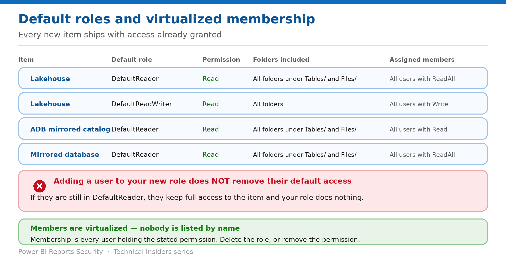

# Handle Default Roles Before They Undo Your Work

> Every new item ships with access already granted — to a membership list nobody is named on.

*Series: Permission model · Layer 1 (2 of 2) · Audience: Data owners · Level 300*

**A default role is a normal OneLake security role that is created automatically with every new item.** Its membership is virtualized — computed from Fabric permissions rather than listed by name. This entry covers what ships by default, and the removal step that makes every subsequent role in this series actually work.

## Scenario — when to use this

You create a role granting one team access to two tables, add them, and test. They see everything. Nothing is broken — they are still virtual members of DefaultReader, and roles combine as a union.

Reach for this entry immediately after creating your first OneLake security role, and whenever a scoped role appears to grant more than it should.

For more detail on how this option works, see:

- [Microsoft Fabric security white paper — Microsoft Learn](https://learn.microsoft.com/en-us/fabric/security/white-paper-landing-page)
- [Get started with OneLake security — Microsoft Learn](https://learn.microsoft.com/en-us/fabric/onelake/security/get-started-onelake-security)
- [OneLake security access control model — Microsoft Learn](https://learn.microsoft.com/en-us/fabric/onelake/security/data-access-control-model)

## What you'll set up

- Default roles inventoried on every item in scope.
- Users removed from DefaultReader when added to a scoped role.
- A deliberate decision on whether DefaultReader should exist at all.

*Figure 2 — The default roles, and who is silently in them.*

## Prerequisites

- **Fabric Write or Reshare permissions** — generally Admin or Member workspace roles.
- A list of the data items in scope.
- Knowledge of who currently holds **ReadAll** and **Write** on each item.

## Step 1 — Know what ships by default

| Fabric item | Role name | Permission | Folders included | Assigned members |
| --- | --- | --- | --- | --- |
| Lakehouse | DefaultReader | Read | All folders under Tables/ and Files/ | All users with ReadAll permission |
| Lakehouse | DefaultReadWriter | Read | All folders | All users with Write permission |
| Azure Databricks mirrored catalog | DefaultReader | Read | All folders under Tables/ and Files/ | All users with Read permission |
| Mirrored database | DefaultReader | Read | All folders under Tables/ and Files/ | All users with ReadAll permission |

Default roles ensure users accessing a newly created item have a basic level of access. **They only apply to Viewers** — Admin, Member and Contributor already have elevated access through Write.

## Step 2 — Understand virtualized membership

- **All default roles use a member virtualization feature**, so the members are any user in that workspace with the required permission — for example, all users with **ReadAll** on the lakehouse.
- Nobody appears in the members list by name. You cannot remove an individual from a virtualized group.
- The **Added using** column on the **Members in role** tab shows how each user became a member — directly by email, or through a permission group.
- **To remove a member added through a permission group, remove the permission group from the role** — not the member.

> **The instruction Microsoft repeats twice** — **When you add a user to a OneLake security role, make sure that you remove them from the DefaultReader role. Otherwise, they maintain full access to the data.** Roles combine as a union, so the broadest one wins.

## Step 3 — Close the default access

1. Open the item and select **Manage OneLake security** from the item menu.
2. Review every role listed, including the defaults.
3. Decide per item: **modify the default role** to narrow its scope, or **delete it** and create custom roles.
4. If you keep DefaultReader, remove the **ReadAll** permission from users who should be governed by a scoped role instead.
5. Verify the **Members in role** tab shows only who you expect, via the **Added using** column.

## Step 4 — Use virtual membership deliberately where it helps

Virtualized membership is a feature, not only a hazard. You can build your own:

1. Open the role and select the **Members in role** tab, then **Add members**.
2. Select **Advanced configuration**.
3. In the **Permission groups** box, check each permission to include users for — **Read, Write, Reshare, Execute, ReadAll**.
4. Note that selecting multiple permission groups includes only users holding **all** of the selected permissions.
5. Select **Add** to include the groups and save the role.

This keeps membership current automatically as item permissions change, rather than drifting from a hand-maintained list.

## Validate

- A user in your scoped role, removed from DefaultReader, sees **only** the scoped data.
- The same user before removal sees everything — reproduce this once so the team understands why.
- The **Added using** column correctly attributes each member.
- A newly created item is checked for its default roles **before** it is shared.

## Limitations & gotchas

- **Every new item ships with a default role** — this is a recurring task, not a one-off.
- **Virtualized members cannot be removed individually** — remove the permission or the permission group.
- **Role creation and membership assignment take effect as soon as you save** — grant deliberately.
- Newly created items with a SQL analytics endpoint start in **Delegated identity mode**; see entry 07.
- Role names must be alphanumeric, start with a letter, be unique, and are capped at **128 characters**.

## Rollback

1. Recreate the DefaultReader role if you deleted it and need to restore baseline access.
2. Re-add the ReadAll permission to users who should have broad access.
3. Remember role changes are immediate — a notification confirms success or failure.

## References

- [Get started with OneLake security — Microsoft Learn](https://learn.microsoft.com/en-us/fabric/onelake/security/get-started-onelake-security)
- [OneLake security roles: create and manage — Microsoft Learn](https://learn.microsoft.com/en-us/fabric/onelake/security/create-manage-roles)
- [OneLake security access control model — Microsoft Learn](https://learn.microsoft.com/en-us/fabric/onelake/security/data-access-control-model)
