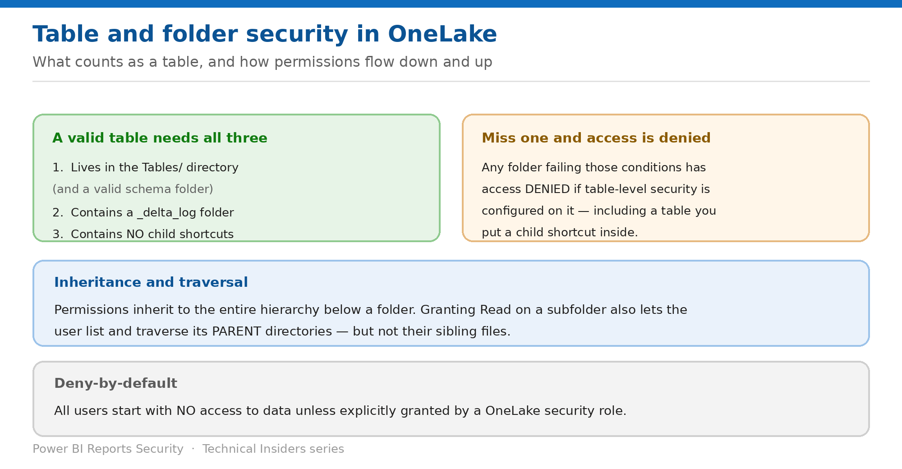

# Secure Tables and Folders

> Object-level security — and the three conditions a folder must meet to count as a table.

*Series: Granular data access · Layer 2 (1 of 4) · Audience: Data owners · Level 300*

**Because Delta Parquet tables in OneLake are represented as folders, you can secure tables the same way you secure folders.** This entry covers creating the role, the conditions that make a folder a valid table, and how permissions flow both down and up the hierarchy.

## Scenario — when to use this

You configure table-level security on a table and users get access denied — on a table that plainly exists. Someone added a shortcut inside it, and a folder containing child shortcuts is no longer a valid table.

Reach for this entry when creating your first scoped role, and as the diagnostic when a table you secured returns denied instead of filtered.

For more detail on how this option works, see:

- [Microsoft Fabric security white paper — Microsoft Learn](https://learn.microsoft.com/en-us/fabric/security/white-paper-landing-page)
- [OneLake security roles: create and manage — Microsoft Learn](https://learn.microsoft.com/en-us/fabric/onelake/security/create-manage-roles)
- [Table, column, and row-level security in OneLake — Microsoft Learn](https://learn.microsoft.com/en-us/fabric/onelake/security/table-column-row-security)

## What you'll set up

- A role scoped to exactly the tables and folders intended.
- Confidence that each secured object is a valid table.
- Correct expectations about inheritance and traversal.

*Figure 3 — Valid tables, inheritance, and traversal.*

## Prerequisites

- **Fabric Write or Reshare permissions** — generally Admin or Member workspace users.
- A supported item: **lakehouse** (Read, ReadWrite), **Azure Databricks mirrored catalog**, **mirrored database**, or **mirrored catalog** (Read).
- Default roles already handled (entry 02).

## Step 1 — Create the role

1. Open the Fabric item and select **Manage OneLake security** from the item menu.
2. On the OneLake security pane, select **New**.
3. Enter a **role name** — alphanumeric, starting with a letter, unique, maximum 128 characters.
4. Leave **Type of role** as **Grant** — it is the only supported type.
5. Choose the permissions. **Read** is selected at a minimum; add **ReadWrite** for supported item types.
6. Select **Next**.

## Step 2 — Scope the data

1. Choose **All data** to grant access to every table and file in the item — **including any folders added in the future**.
2. Or choose **Selected data** for a specific group of tables and folders.
3. For selected data, choose **Edit**, expand the **Tables** and **Files** directories, and check the boxes.
4. Select **Add data**, then **Next**.
5. Add members by name or email, or use **Advanced configuration** for virtual membership (entry 02).
6. Select **Create**.

> **All data is a forward-looking grant** — Choosing **All data** also grants access to folders added later. That is convenient for a genuinely open role and dangerous for a scoped one — a table added next quarter inherits the grant with no review.

## Step 3 — Confirm each object is a valid table

All OneLake tables are folders, but **not all folders are tables** from the perspective of OneLake security and the Fabric query engines. To be a valid table, **all** of the following must be true:

- The folder exists in the **`Tables/`** directory of the item. For schema-enabled items, it must also be in a valid **schema folder**.
- The folder contains a **`_delta_log`** folder with the corresponding JSON files for table metadata.
- The folder **does not contain any child shortcuts**.

> **The failure mode is denial, not degradation** — **Any tables that do not meet those criteria will have access denied if table-level security is configured on them.** A child shortcut added to a secured table silently converts a working grant into a block.

## Step 4 — Understand inheritance and traversal

- **For any given folder, OneLake security permissions always inherit to the entire hierarchy of the folder's files and subfolders.**
- **Granting a user Read permissions to a subfolder grants the ability to list and traverse the parent directory** — similar to Windows folder permissions.
- **The list and traversal granted to the parent doesn't extend to other items outside of the direct parents** — sibling files stay hidden.
- Schemas are folders too, so you can secure them the same way.

Shortcuts list differently: **when listing a directory, all internal shortcuts are returned regardless of a user's access to the target.** The access check happens when the user opens the shortcut — see entry 08.

## Validate

- A role member sees exactly the checked tables and folders, and nothing else.
- Granting a subfolder lets the user traverse the parent but **not** read the parent's own files.
- A folder without a `_delta_log` returns denied when table security is applied — reproduce this once.
- A table containing a child shortcut is denied, confirming the third condition.

## Limitations & gotchas

- **A child shortcut inside a table invalidates it** for table-level security.
- **All data** silently covers folders created later.
- **Metadata is not guaranteed hidden** — certain error messages and experiences may show column names even where data is never exposed.
- Rules that mismatch the table — for example referencing a column that isn't there — cause the query to fail and return no data.
- Role creation and membership take effect **immediately** on save.

## Rollback

1. Open the role, select **Edit data**, and uncheck the tables or folders to remove.
2. Select **Add data** to confirm the narrowed selection.
3. Delete the role entirely from the OneLake security pane to return members to deny-by-default.

## References

- [OneLake security roles: create and manage — Microsoft Learn](https://learn.microsoft.com/en-us/fabric/onelake/security/create-manage-roles)
- [Table, column, and row-level security in OneLake — Microsoft Learn](https://learn.microsoft.com/en-us/fabric/onelake/security/table-column-row-security)
- [OneLake security access control model — Microsoft Learn](https://learn.microsoft.com/en-us/fabric/onelake/security/data-access-control-model)
