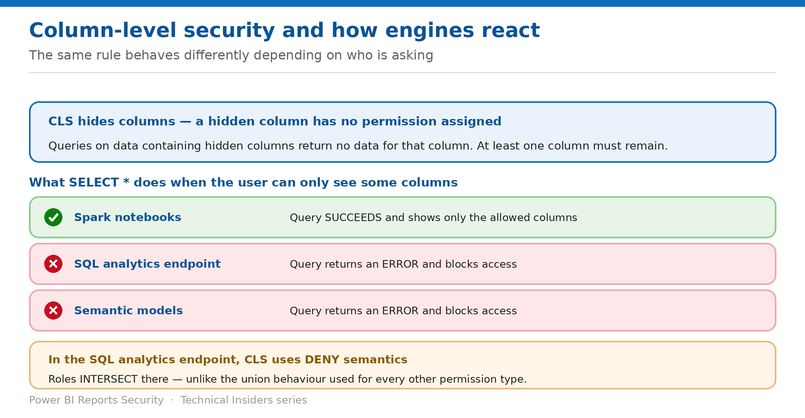

# Apply Column-Level Security

> Hide a column once — and watch three engines respond to SELECT * three different ways.

*Series: Granular data access · Layer 2 (2 of 4) · Audience: Data owners · Level 300*

**Column-level security (CLS) grants access to selected columns in a table instead of the full table.** This entry covers authoring it, the per-engine behaviour that surprises teams during rollout, and the deny semantics that make CLS the exception to OneLake's union model.

## Scenario — when to use this

You hide a salary column and test in a Spark notebook — the query succeeds without it, exactly as intended. The same query in the SQL analytics endpoint errors out, and a report on the model fails outright.

Reach for this entry before applying CLS to a table any report or endpoint consumes, and when a CLS rule that tests fine in notebooks breaks a downstream consumer.

For more detail on how this option works, see:

- [Microsoft Fabric security white paper — Microsoft Learn](https://learn.microsoft.com/en-us/fabric/security/white-paper-landing-page)
- [Table, column, and row-level security in OneLake — Microsoft Learn](https://learn.microsoft.com/en-us/fabric/onelake/security/table-column-row-security)
- [OneLake security roles: create and manage — Microsoft Learn](https://learn.microsoft.com/en-us/fabric/onelake/security/create-manage-roles)

## What you'll set up

- Sensitive columns hidden from the right audience.
- Downstream consumers tested against the real engine they use.
- An understanding of why CLS intersects where everything else unions.

*Figure 4 — Filter or error, depending on the engine.*

## Prerequisites

- A **Delta Parquet** table — CLS applies to Delta Parquet tables or virtualized Iceberg tables.
- An existing OneLake security role, or Write/Reshare permission to create one.
- Knowledge of which engine each downstream consumer actually uses.

## Step 1 — Apply the rule

1. Go to the data item and select **Manage OneLake security**.
2. Select an existing role, or **New** to create one.
3. On the role details page, select **more options (...)** next to the table you want to secure, then **Column security**.
4. To remove access to a column, set that column's **Permission** to **Hide**.
5. Use the checkboxes to select multiple columns and set permissions in bulk; use **Filter** to view columns by permission.
6. Select **Save**.

## Step 2 — Know the per-engine behaviour

If a user runs a `select *` on a table where they have access to only some columns, the behaviour differs by engine:

| Engine | Behaviour on SELECT * |
| --- | --- |
| Spark notebooks | The query succeeds and shows only the allowed columns. |
| SQL analytics endpoint | The query returns an error and blocks access to the columns the user can't access. |
| Semantic models | The query returns an error and blocks access to the columns the user can't access. |

> **Test where your users actually are** — A CLS rule validated only in a notebook will look correct and still break every report built on the same table. Test in the engine each audience uses, not the one that is convenient.

## Step 3 — Understand the deny semantics

- **A hidden column is treated as having no permissions assigned to it**, resulting in the default policy of no access.
- **Removing access to a column doesn't deny access to that column if another role grants access to it** — in the general case, roles union.
- **But CLS in the SQL analytics endpoint follows a stricter deny semantic.** Deny on a column there ensures all access to the column is blocked, **even if multiple roles would combine to give access to it**.
- As a result, **CLS in the SQL endpoint operates using an intersection between all roles a user is part of**, instead of the union behaviour in place for all other permission types.

The practical rule: in the SQL analytics endpoint, a column hidden by *any* of a user's roles is hidden. Everywhere else, a column granted by *any* role is visible.

## Step 4 — Accept the metadata caveat

- **The name of a secured column might be visible in certain experiences, but the data values never appear.**
- OneLake security's Read permission grants full access to the data **and metadata** of a table.
- **OneLake security doesn't guarantee that the metadata for a table won't be accessible** — certain error messages and experiences may show column names.
- If a column *name* is itself sensitive, CLS is not sufficient — separate the data instead.

## Validate

- In a Spark notebook, `select *` returns only the allowed columns.
- In the SQL analytics endpoint, the same query errors — confirming the documented difference.
- A user in two roles, one hiding a column, cannot see it via the SQL endpoint.
- A rule referencing a non-existent column causes the query to fail and return no data.

## Limitations & gotchas

- **At least one column must remain** in the list of allowed columns.
- **CLS applies to Delta Parquet or virtualized Iceberg tables**; rules on other table types **block access to the entire table** for members of the role.
- **SQL endpoint CLS intersects; everything else unions.**
- Column names may still surface in error messages and certain experiences.
- A role with **ReadWrite** access cannot contain CLS constraints at all.

## Rollback

1. Reopen **Column security** on the table and set the hidden columns back to allowed.
2. Select **Save** — the change is immediate.
3. Remove the role entirely if the whole constraint should be lifted.

## References

- [Table, column, and row-level security in OneLake — Microsoft Learn](https://learn.microsoft.com/en-us/fabric/onelake/security/table-column-row-security)
- [OneLake security roles: create and manage — Microsoft Learn](https://learn.microsoft.com/en-us/fabric/onelake/security/create-manage-roles)
- [OneLake security access control model — Microsoft Learn](https://learn.microsoft.com/en-us/fabric/onelake/security/data-access-control-model)
