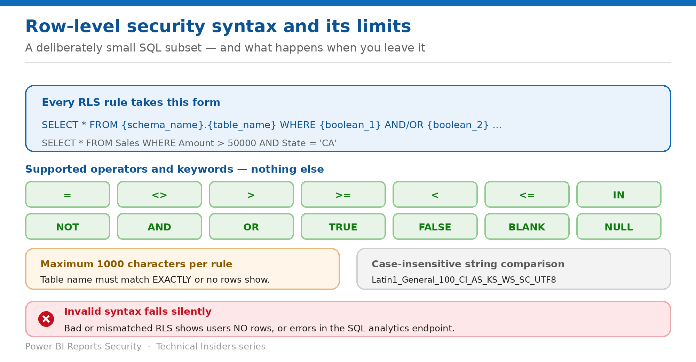

# Apply Row-Level Security

> A deliberately small SQL subset — and a failure mode that shows no rows rather than an error.

*Series: Granular data access · Layer 2 (3 of 4) · Audience: Data owners · Level 300*

**Row-level security (RLS) defines row-level data restrictions for tabular data stored in OneLake.** Rules are SQL predicates, but only a documented subset of SQL is supported. This entry covers the exact syntax, the operators available, and the reasons a valid-looking rule returns nothing.

## Scenario — when to use this

Your RLS rule saves without complaint and the user sees zero rows. There is no error to search for — the table name didn't match exactly, and a mismatched rule shows no rows rather than failing loudly.

Reach for this entry when authoring any RLS rule, and as the checklist when a role returns an empty result set instead of filtered data.

For more detail on how this option works, see:

- [Microsoft Fabric security white paper — Microsoft Learn](https://learn.microsoft.com/en-us/fabric/security/white-paper-landing-page)
- [Row-level security syntax reference — Microsoft Learn](https://learn.microsoft.com/en-us/fabric/onelake/security/row-level-security-syntax)
- [Table, column, and row-level security in OneLake — Microsoft Learn](https://learn.microsoft.com/en-us/fabric/onelake/security/table-column-row-security)

## What you'll set up

- Rules written in the supported subset.
- Predicates that are strongly typed and reviewable.
- A diagnostic for the silent no-rows failure.



*Figure 5 — The rule form, the operators, and the limits.*

## Prerequisites

- A OneLake security role granting access to table data in **Delta Parquet** format.
- The **exact** table name and, for schema-enabled items, the schema name.
- Column names as they appear **in the Delta log schema**.
- **Rows are relevant only to tabular data** — you can't define RLS for non-table folders or unstructured data.

## Step 1 — Author the rule

1. Go to the item and select **Manage OneLake security**.
2. Select an existing role, or **New** to create one.
3. On the role details page, select **more options (...)** next to the table, then **Row security**.
4. In the code editor, type the SQL statement defining which rows users can see.
5. Select **Save** to confirm the row security rules.

Every rule takes this form. **RLS operates by showing rows where the predicate evaluates to true.**

```sql
SELECT * FROM {schema_name}.{table_name}
WHERE {column_level_boolean_1} AND {column_level_boolean_2} ... {column_level_boolean_N}

-- Example
SELECT * FROM Sales WHERE Amount > 50000 AND State = 'CA'

-- Escaping names with special characters
SELECT * FROM [dbo].[Secret.Table] WHERE Region IN ('EMEA', 'APAC')
```

## Step 2 — Stay inside the supported operators

| Operator | Description |
| --- | --- |
| = (equals) | True if the two values are the same data type and exact matches. |
| <> (not equals) | True if the two values aren't the same data type and not exact matches. |
| > / >= | True if the column value is greater than (or equal to) the evaluation value. For strings, uses bitwise comparison. |
| < / <= | True if the column value is less than (or equal to) the evaluation value. For strings, uses bitwise comparison. |
| IN | True if any of the evaluation values are the same data type and exactly match the column value. |
| NOT | True if any of the evaluation values aren't the same data type or not an exact match. |
| AND / OR | Combine the previous and subsequent statements. AND requires both true; OR requires one. |
| TRUE / FALSE | The Boolean expressions for true and false. |
| BLANK / NULL | Data types used with the IS operator — for example, row IS BLANK or row IS NULL. |

**RLS rules support only the subset of SQL defined here.** Anything else is invalid syntax, with the consequences in step 4.

## Step 3 — Follow the authoring guidance

- **Avoid vague or overly complex RLS expressions.** Strongly typed expressions with integer or string lookups using `=` are the most secure and easiest to understand.
- **Use integer columns for sorting and greater-than or less-than operations.**
- **Avoid string equivalencies if you don't know the format of the input data** — especially for Unicode characters or accent sensitivity.
- Column names can be formatted as `{column_name}` or `{table_name}.{column_name}`.

> **Case and collation** — **Row-level security evaluates string data as case insensitive**, using the collation `Latin1_General_100_CI_AS_KS_WS_SC_UTF8` for sorting and comparisons. Do not rely on case to separate values.

## Step 4 — Know the failure modes

- **Queries with invalid RLS syntax, or syntax that doesn't match the underlying table, result in no rows being shown to users, or query errors in the SQL analytics endpoint.**
- **The table name must exactly match**, or the RLS shows no rows. Use square brackets to escape names with special characters.
- **Access to a table might be blocked if the RLS statement contains syntax errors** that prevent it from being evaluated.
- **The maximum number of characters in a rule is 1000.**
- **If a rule has a mismatch with the table it's defined on, the query fails and returns no data** — for example, referencing a column that isn't in the table.

## Validate

- A role member sees only rows where the predicate evaluates to true.
- A deliberately mistyped table name returns **zero rows** — reproduce this once so the team recognises the symptom.
- A rule near the 1000-character limit is refactored rather than trimmed.
- String comparisons behave case-insensitively, as documented.

## Limitations & gotchas

- **Silent failure** — no rows, not an error, is the default symptom of a broken rule.
- **RLS roles don't support dynamic and multitable queries.**
- **1000-character maximum** per rule.
- **No RLS on non-table folders or unstructured data.**
- A role with **ReadWrite** access cannot contain RLS constraints.
- Rules on non-Delta-Parquet table types **block access to the entire table** for members of the role.

## Rollback

1. Reopen **Row security** on the table and clear or correct the predicate.
2. Select **Save** — the change is immediate.
3. Delete the role to remove the constraint and the grant together.

## References

- [Row-level security syntax reference — Microsoft Learn](https://learn.microsoft.com/en-us/fabric/onelake/security/row-level-security-syntax)
- [Table, column, and row-level security in OneLake — Microsoft Learn](https://learn.microsoft.com/en-us/fabric/onelake/security/table-column-row-security)
- [OneLake security roles: create and manage — Microsoft Learn](https://learn.microsoft.com/en-us/fabric/onelake/security/create-manage-roles)
