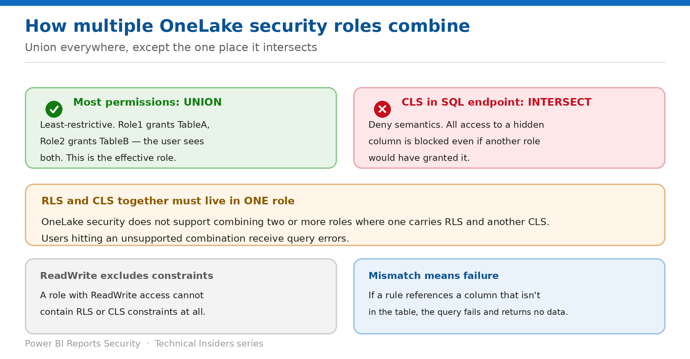

# Combine RLS, CLS and Multiple Roles

> Union everywhere, except the one place it intersects — and one combination that isn't supported at all.

*Series: Granular data access · Layer 2 (4 of 4) · Audience: Data owners & security reviewers · Level 300*

Users are rarely in one role. **The combination of these roles together is called the effective role**, and how it resolves determines what a user actually sees. This entry covers the union model, the intersection exception, and the combination that produces query errors.

## Scenario — when to use this

One role gives a team RLS on a sales table. Another gives them CLS on the same table. Neither is wrong, and together they produce query errors — because OneLake does not support splitting RLS and CLS across roles.

Reach for this entry when a user belongs to more than one role, and before adding a second role to a table that already carries constraints.

For more detail on how this option works, see:

- [Microsoft Fabric security white paper — Microsoft Learn](https://learn.microsoft.com/en-us/fabric/security/white-paper-landing-page)
- [OneLake security access control model — Microsoft Learn](https://learn.microsoft.com/en-us/fabric/onelake/security/data-access-control-model)
- [Table, column, and row-level security in OneLake — Microsoft Learn](https://learn.microsoft.com/en-us/fabric/onelake/security/table-column-row-security)

## What you'll set up

- A predictable effective role for every user.
- RLS and CLS combined in a supported way.
- No user in a combination that errors.

*Figure 6 — How the effective role is computed.*

## Prerequisites

- An inventory of the roles defined on the item and their members.
- Knowledge of which roles carry RLS or CLS constraints.
- A test account that belongs to more than one role.

## Step 1 — Apply the union rule

- **Roles combine in OneLake security using a UNION or least-restrictive model.**
- If Role1 gives access to TableA and Role2 gives access to TableB, **the user sees both TableA and TableB**.
- This is why leaving a user in **DefaultReader** defeats a scoped role (entry 02) — the union includes everything.
- **You can't deny access that is granted through a different role or permission model** — only GRANT roles exist.

> **Design consequence** — Because the model is additive, the review question is never "does this role restrict enough?" It is "what is the union of every role this person is in?"

## Step 2 — Know the one intersection

**Column-level security in the SQL analytics endpoint follows a more strict behaviour by operating through a deny semantic.**

- **Deny on a column in the SQL endpoint ensures that all access to the column is blocked, even if multiple roles would combine to give access to it.**
- **As a result, CLS in the SQL endpoint operates using an intersection between all roles a user is part of** — instead of the union behaviour in place for all other permission types.
- Everywhere else, including Spark, CLS unions like everything else: a column granted by any role is visible.

Plan for both behaviours. A column you intend to hide must be hidden in **every** role a user holds if you want it hidden outside the SQL endpoint.

## Step 3 — Keep RLS and CLS in one role

> **The unsupported combination** — **Row-level and column-level security can be used together to restrict user access to a table. However, the two policies have to be applied using a single OneLake security role. OneLake security doesn't support the combination of two or more roles where one contains RLS rules and another contains CLS rules.** Users who try to access tables that are part of an unsupported role combination receive query errors.

1. Identify every table carrying both RLS and CLS.
2. For each, confirm both constraints live in the **same** role.
3. Where they are split, consolidate them into one role and reassign members.
4. Remove the now-redundant role so the split cannot reappear.
5. Re-test with a user who was in both.

## Step 4 — Watch the ReadWrite exclusion

- **OneLake security roles with ReadWrite access cannot contain RLS or CLS constraints.**
- ReadWrite is only applicable for **Viewers or users with the Read permission** on an item — assigning it to an Admin, Member or Contributor has no effect, as those roles already have it implicitly.
- **Because Fabric only supports single-engine writes, users with ReadWrite on an object can only write to that data through OneLake.** Read operations are enforced consistently through all querying engines.
- If a scenario needs both write access and row filtering, they must be separate objects — not separate roles on the same object.

## Validate

- A user in two roles sees the **union** of both scopes.
- A column hidden in one role is still hidden for that user in the **SQL endpoint**, and visible in Spark.
- A user in a split RLS/CLS combination receives query errors — then works correctly once consolidated.
- A ReadWrite role rejects an attempt to add RLS or CLS.

## Limitations & gotchas

- **Union is the default; SQL-endpoint CLS is the only intersection.**
- **RLS in one role plus CLS in another is unsupported** and errors at query time.
- **ReadWrite roles cannot carry RLS or CLS.**
- **Only GRANT roles exist** — you cannot write a role that takes access away.
- Workspace Admin, Member and Contributor sit outside all of this (entry 01).

## Rollback

1. Remove the user from the additional role to restore the narrower effective role.
2. Split a consolidated role back out only if you are certain it carries no RLS/CLS conflict.
3. Delete the conflicting role to clear query errors immediately.

## References

- [OneLake security access control model — Microsoft Learn](https://learn.microsoft.com/en-us/fabric/onelake/security/data-access-control-model)
- [Table, column, and row-level security in OneLake — Microsoft Learn](https://learn.microsoft.com/en-us/fabric/onelake/security/table-column-row-security)
- [OneLake security roles: create and manage — Microsoft Learn](https://learn.microsoft.com/en-us/fabric/onelake/security/create-manage-roles)
