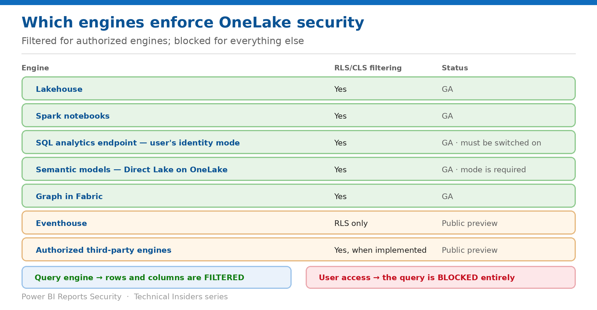

# Make Every Engine Enforce Your Policy

> Filtered for authorized engines, blocked for everything else — and two modes you must switch by hand.

*Series: Engines & shortcuts · Layer 3 (1 of 2) · Audience: Fabric admins & data owners · Level 300*

OneLake security is authored once and **enforced consistently across all compute engines in Fabric** — but two engines need a configuration change before that promise holds, and everything outside the authorized set is blocked rather than filtered. This entry covers both.

## Scenario — when to use this

Your RLS works perfectly in Spark. The same table through the SQL analytics endpoint returns unfiltered rows, because the endpoint is still in Delegated identity mode — the default for every newly created item.

Reach for this entry immediately after defining your first RLS or CLS rule, and whenever enforcement differs between two engines reading the same table.

For more detail on how this option works, see:

- [Microsoft Fabric security white paper — Microsoft Learn](https://learn.microsoft.com/en-us/fabric/security/white-paper-landing-page)
- [Read data secured with OneLake security — Microsoft Learn](https://learn.microsoft.com/en-us/fabric/onelake/security/read-secured-data)
- [Get started with OneLake security — Microsoft Learn](https://learn.microsoft.com/en-us/fabric/onelake/security/get-started-onelake-security)

## What you'll set up

- Every engine your users touch enforcing the policy.
- SQL analytics endpoints switched to user's identity mode.
- A correct expectation of filtered versus blocked.

*Figure 7 — Which engines filter, and which are blocked.*

## Prerequisites

- RLS or CLS already defined on at least one table (entries 04 and 05).
- **Admin or Member** on the workspace to switch the SQL analytics endpoint mode.
- A list of the engines each audience actually uses.

## Step 1 — Know which engines filter

| Engine | RLS/CLS filtering | Status |
| --- | --- | --- |
| Lakehouse | Yes | GA |
| Spark notebooks | Yes | GA |
| SQL analytics endpoint in user's identity access mode | Yes | GA |
| Semantic models using Direct Lake on OneLake mode | Yes | GA |
| Graph in Fabric | Yes | GA |
| Eventhouse | RLS only | Public preview |
| Authorized third-party engines | Yes, when the engine implements it | Public preview |

## Step 2 — Understand filtered versus blocked

- **Through a query engine** — Fabric engines and authorized third-party engines apply RLS and CLS filtering, so the user sees only the rows and columns they're allowed to see.
- **Through user access** — queries from **nonauthorized external engines are treated as user access**. If the user isn't permitted to see all the rows or columns in a table, **the query is blocked**.
- This is deliberate: **because certain OneLake security features like row and column level security aren't supported by storage level operations, not all types of access to row or column level secured data can be permitted.** Blocking guarantees users can't see rows or columns they aren't permitted to.

> **Blocked is the safe default, not a bug** — A tool that reads OneLake over the ADLS APIs is not an authorized engine. It will be denied the whole table rather than served a filtered one. Plan tooling around the authorized set.

## Step 3 — Switch the SQL analytics endpoint

> **The default is not what you want** — **Newly created items that have a corresponding SQL analytics endpoint start in Delegated identity mode by default.** Endpoints not switched continue to use a delegated identity to evaluate permissions — so OneLake security is not applied per user.

1. Go to the **SQL analytics endpoint**.
2. Select the **Security** tab.
3. Select **View data access mode → Data access mode settings**.
4. Select **Use OneLake security for tables (User's identity access mode)**, then **Apply**.
5. Select **Continue** to confirm.

**You only need to switch to User's identity access mode once per SQL analytics endpoint** — but you must do it for every endpoint, including downstream ones (entry 09).

## Step 4 — Put semantic models in the right mode

- **The semantic model must use Direct Lake on OneLake** for OneLake security to be enforced.
- **Direct Lake over SQL** does not pass the calling user's identity to a shortcut target — see entry 08.
- The companion Semantic Models series covers the model-side rules; this entry covers only the OneLake enforcement requirement.
- Re-test any report built on a model whose storage mode you change.

## Step 5 — Consider authorized third-party engines

- **External query engines can register as authorized engines**, retrieve security policy definitions and precomputed effective access through OneLake APIs, and **enforce table permissions, RLS and CLS at query time** in their own compute layer.
- **OneLake remains the single source of truth for security policies** — policies are authored once and enforced consistently across Fabric engines and authorized external engines.
- **OneLake returns engine-agnostic, precomputed effective access** for the requesting user.
- This capability is in **public preview** — verify behaviour with your engine vendor before relying on it.

## Validate

- The same secured table returns identically filtered results in Spark and in the SQL analytics endpoint after the switch.
- Before the switch, the endpoint returns unfiltered rows — reproduce this once to prove the mode matters.
- A non-authorized external tool is **blocked** from the secured table, not served partial data.
- A Direct Lake on OneLake model filters correctly; a Direct Lake over SQL model does not.

## Limitations & gotchas

- **Delegated identity mode is the default for new items** — the most common cause of "RLS isn't working."
- **Eventhouse supports RLS only**, and is in public preview.
- **Authorized third-party engine enforcement is in public preview.**
- Nonauthorized engines are **blocked**, which can look like an outage to a team using an unsupported tool.
- Switching endpoint modes is per endpoint — downstream workspaces need it too.

## Rollback

1. Switch the SQL analytics endpoint back to Delegated identity mode if a downstream dependency breaks — accepting that OneLake security is no longer evaluated per user there.
2. Revert a semantic model's storage mode and re-test the reports built on it.
3. Remove the RLS or CLS rule if the enforcement gap cannot be closed in time.

## References

- [Read data secured with OneLake security — Microsoft Learn](https://learn.microsoft.com/en-us/fabric/onelake/security/read-secured-data)
- [Get started with OneLake security — Microsoft Learn](https://learn.microsoft.com/en-us/fabric/onelake/security/get-started-onelake-security)
- [OneLake security access control model — Microsoft Learn](https://learn.microsoft.com/en-us/fabric/onelake/security/data-access-control-model)
