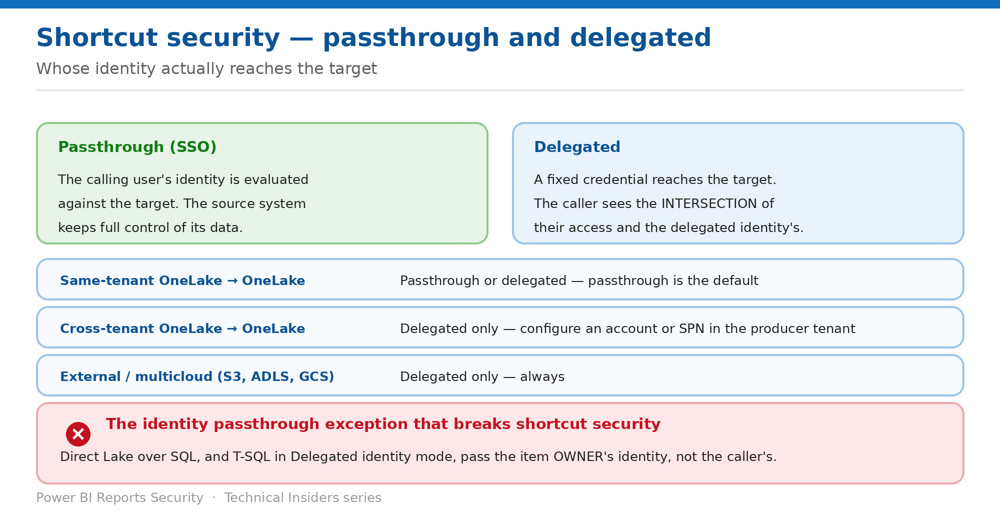

# Secure Shortcuts

> Passthrough or delegated — and the engine combination where neither passes the identity you expect.

*Series: Engines & shortcuts · Layer 3 (2 of 2) · Audience: Data owners & architects · Level 300*

Shortcuts let data be consumed where it isn't stored, and **a combination of the permissions in the shortcut path and the target path governs access**. This entry covers both authentication models, the exact permission matrix, and the documented exception that bypasses target-path permissions entirely.

## Scenario — when to use this

A downstream lakehouse shortcuts to your secured tables. Users see correctly filtered data through Spark — and unfiltered data through a report, because Direct Lake over SQL passes the item owner's identity to the target instead of theirs.

Reach for this entry before building any shortcut-based architecture, and when access through a shortcut differs from access to the source.

For more detail on how this option works, see:

- [Microsoft Fabric security white paper — Microsoft Learn](https://learn.microsoft.com/en-us/fabric/security/white-paper-landing-page)
- [Secure and manage OneLake shortcuts — Microsoft Learn](https://learn.microsoft.com/en-us/fabric/onelake/onelake-shortcut-security)
- [OneLake security access control model — Microsoft Learn](https://learn.microsoft.com/en-us/fabric/onelake/security/data-access-control-model)

## What you'll set up

- The right authentication model per shortcut.
- Permissions correct on both the shortcut path and the target path.
- The identity-passthrough exception designed around.

*Figure 8 — Whose identity actually reaches the target.*

## Prerequisites

- **Write permission on the Fabric item** where you create the shortcut, plus **Read access to the data the shortcut points to**.
- OneLake security already defined on the **target** — you cannot define it on an internal shortcut.
- For external shortcuts, the relevant credentials in the external system.

## Step 1 — Choose the authentication model

| Shortcut type | Authentication model |
| --- | --- |
| Same-tenant OneLake to OneLake | Passthrough or delegated. Passthrough is the default; choose Delegated identity at creation to change it. |
| Cross-tenant OneLake to OneLake | Delegated only. Configure an organizational account or service principal in the producer's tenant. |
| External / multicloud (S3, ADLS, GCS, Dataverse) | Delegated only, always. |

- **Passthrough (SSO)** — the credential of the querying user is evaluated against the shortcut target. **The source system retains full control over its data, and there's no need to replicate or redefine access controls.**
- **Delegated** — the shortcut uses a fixed credential, and **the calling user sees the intersection of their security and the security that applies to the delegated identity**.

> **You cannot switch in place** — **To switch an existing shortcut between passthrough and delegated authentication, delete and recreate the shortcut with the desired authentication method.**

## Step 2 — Get both sides of the permission matrix right

**When a user accesses a shortcut, the most restrictive permission of the two locations is applied.**

| Shortcut operation | Permission on shortcut path | Permission on target path |
| --- | --- | --- |
| Create | Fabric Read plus OneLake security ReadWrite | OneLake security Read |
| Read (GET/LIST shortcuts) | Fabric Read plus OneLake security Read | N/A |
| Update | Fabric Read plus OneLake security ReadWrite | OneLake security Read on the new target |
| Delete | Fabric Read plus OneLake security ReadWrite | N/A |

- For items that don't yet support OneLake security, the equivalent permission is the item **ReadAll**.
- **Users don't need Fabric Read permission on an item in order to access it through a shortcut** — with one exception below.
- **A user accessing an external shortcut requires Fabric Read permission on the data item where the external shortcut resides**, to securely resolve the connection to the external system.
- **Defining OneLake security permissions for an internal shortcut isn't allowed** — security must be defined on the target folder in the target item.

## Step 3 — Design around the identity exception

> **The exception that bypasses the target's permissions** — **When accessing shortcut data through Power BI semantic models using Direct Lake over SQL, or T-SQL engines configured for Delegated identity mode, these engines don't pass through the calling user's identity to the shortcut target. Instead, they use the item owner's identity**, and then apply OneLake security roles to filter what the calling user can see. **Any permissions configured directly at the shortcut target path for the end user are bypassed.**

1. Identify every semantic model reading shortcut data.
2. Move each to **Direct Lake on OneLake** mode rather than Direct Lake over SQL.
3. Move every T-SQL endpoint to **User's identity mode** (entry 07).
4. Re-test with a user whose access at the target path differs from the item owner's.
5. Where the mode cannot change, treat target-path permissions as ineffective and enforce entirely through OneLake security roles.

## Step 4 — Handle delegated shortcut constraints

For a delegated external shortcut — say an S3 shortcut created by user1 and accessed by user2 — **both** checks must pass:

| S3 connection authorizes user1? | OneLake security authorizes user2? | Can user2 access the data? |
| --- | --- | --- |
| Yes | Yes | Yes |
| Yes | No | No |
| No | Yes | No |
| No | No | No |

- **CLS is supported for both the producer and consumer of a delegated shortcut.**
- **RLS is supported for the producer side of a delegated shortcut, but you can't set it on the consumer side.**
- **A user can only be in a single OneLake security role with CLS on the consumer side, if the producer side also has RLS.**
- **Another internal shortcut pointing to an external shortcut still requires the user to have access to the original external shortcut.**
- Permissions set on a folder **inherit recursively to all subfolders, even if the subfolder is within the shortcut**.

## Validate

- A passthrough shortcut returns exactly what the user can read at the target.
- A delegated shortcut returns the **intersection** of the caller's and the delegated identity's access.
- A Direct Lake on OneLake model filters correctly; a Direct Lake over SQL model on the same shortcut does not.
- Listing a directory shows internal shortcuts the user cannot open — confirming the documented listing behaviour.

## Limitations & gotchas

- **Direct Lake over SQL and delegated-mode T-SQL bypass target-path permissions** — the headline gotcha.
- **You cannot define OneLake security on an internal shortcut** — define it on the target.
- **Cross-tenant shortcuts are delegated only.**
- **Switching authentication model requires delete and recreate.**
- **When listing a directory, all internal shortcuts are returned regardless of access to the target** — access is checked on open.
- If the target item doesn't support OneLake security, access falls back to the Fabric **ReadAll** permission on the target.

## Rollback

1. Delete the shortcut — deletion requires only shortcut-path permissions.
2. Recreate it with the other authentication model if the access pattern was wrong.
3. Revoke OneLake security Read at the target to close access immediately across every shortcut pointing to it.

## References

- [Secure and manage OneLake shortcuts — Microsoft Learn](https://learn.microsoft.com/en-us/fabric/onelake/onelake-shortcut-security)
- [OneLake security access control model — Microsoft Learn](https://learn.microsoft.com/en-us/fabric/onelake/security/data-access-control-model)
- [Read data secured with OneLake security — Microsoft Learn](https://learn.microsoft.com/en-us/fabric/onelake/security/read-secured-data)
