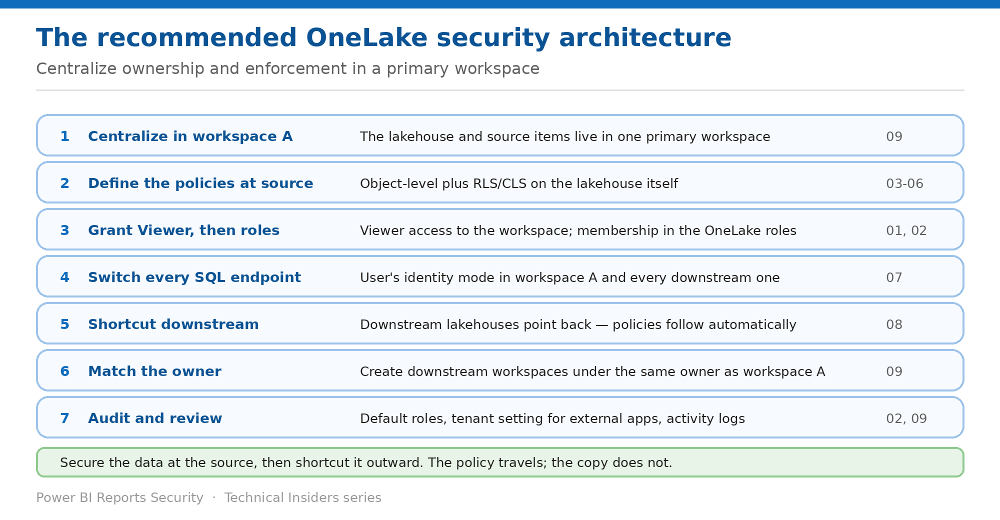

# Adopt the Recommended OneLake Architecture

> Centralize ownership and enforcement in a primary workspace, then shortcut outward.

*Series: Architecture & governance · Layer 4 (1 of 1) · Audience: Architects & Fabric admins · Level 300*

The preceding eight entries each solve one problem. This capstone puts them into Microsoft's **recommended baseline architecture for implementing OneLake security at scale**, and adds the governance controls that surround it.

The core principle: **centralize data ownership and security enforcement in a primary workspace. Manage and secure your data at the source, then share it to downstream workspaces by using shortcuts in OneLake.**

## Scenario — when to use this

Every domain team has its own lakehouse and its own copy of the security model. Nothing agrees, nobody can answer who sees what, and each new consumer means another set of roles to maintain.

Reach for this entry when designing a OneLake estate, and when consolidating one that grew organically.

For more detail on how this option works, see:

- [Microsoft Fabric security white paper — Microsoft Learn](https://learn.microsoft.com/en-us/fabric/security/white-paper-landing-page)
- [Best practices for OneLake security — Microsoft Learn](https://learn.microsoft.com/en-us/fabric/onelake/security/best-practices-secure-data-in-onelake)
- [Data security overview — Microsoft Learn](https://learn.microsoft.com/en-us/fabric/onelake/security/get-started-security)

## What you'll set up

- A single place where each dataset's security is defined.
- Downstream consumption that inherits the policy automatically.
- A governance baseline you can review against.

*Figure 9 — The primary-workspace pattern.*

## The rollout order

| # | Step | What you do | Entries |
| --- | --- | --- | --- |
| 1 | Centralize in workspace A | The lakehouse and source data items live in one primary workspace | 09 |
| 2 | Define the policies at source | Object-level plus RLS/CLS on the lakehouse itself | 03–06 |
| 3 | Grant Viewer, then roles | Viewer on the workspace; membership in the OneLake roles | 01, 02 |
| 4 | Switch every SQL endpoint | User's identity mode in workspace A and downstream | 07 |
| 5 | Shortcut downstream | Downstream lakehouses point back; policies follow | 08 |
| 6 | Match the owner | Create downstream workspaces under the same owner as A | 09 |
| 7 | Audit and review | Default roles, tenant settings, activity logs | 02, 09 |

> **Why this pattern** — It aligns with the long-term direction of OneLake security. **This approach ensures OneLake security policies are consistently enforced, regardless of where users consume the data** — because there is only one definition to enforce.

## Step 1 — Build the primary workspace

1. Create a primary workspace (workspace A) containing the lakehouse or mirrored database and any other source data items.
2. Enable OneLake security on the lakehouse and define the required **object-level and fine-grained (RLS/CLS) policies**.
3. Grant users **Viewer** access to the workspace, and add them to the defined OneLake security roles.
4. Configure **all SQL analytics endpoints in workspace A to run in user's identity mode** so policies are evaluated per user.
5. Remove or narrow the default roles (entry 02).

## Step 2 — Build the downstream workspaces

1. Create downstream workspaces to support data consumption, additional workloads, or domain-specific use cases.
2. In the downstream lakehouses, create **shortcuts that point back to data in workspace A**.
3. Confirm SQL analytics endpoints in the downstream workspaces are also configured to use **user's identity mode**.
4. **Create downstream workspaces and lakehouses using the same owner as workspace A** for the most consistent experience — this gives the data owner the ability to enforce user's identity mode.
5. Verify that policies defined at the source are enforced automatically for downstream consumers.

## Step 3 — Apply least privilege

- **If users only need access to a single lakehouse or data item, use the Share feature** to grant access to only that item.
- **Only assign a user to a workspace role if that user needs to see all items in that workspace.**
- Use OneLake security to restrict access to folders and tables within a lakehouse; for sensitive data, use **RLS or CLS**.
- For write access, choose between workspace roles and the **OneLake security ReadWrite permission** — the latter lets Viewers write to specific folders and tables through Spark notebooks, OneLake file explorer, and OneLake APIs.
- **Write operations through the Lakehouse UX for viewers aren't supported at this time.**
- **If users need to manage access — sharing an item or configuring OneLake security roles — Admin or Member workspace roles are required.**
- Users need the **SubscribeOneLakeEvents** permission to subscribe to events from a Fabric item. Admin, Member and Contributor have it by default; it can be added for a Viewer.

## Step 4 — Close the perimeter

- **Allow apps running outside of Fabric to access data via OneLake** — this tenant setting is in the **OneLake section of the admin portal tenant settings**. Turning it off means users can still access data from internal apps like Spark, Data Engineering and Data Warehouse, but **can't access data from applications running outside of Fabric environments**.
- Turn it **on** only if you have custom applications using ADLS APIs or OneLake file explorer.
- **Data at rest is encrypted by default using Microsoft-managed keys**, is FIPS 140-2 compliant, and can be extended with **customer-managed keys** for Fabric workspaces.
- **Data in transit is always encrypted using at least TLS 1.2**, negotiating to TLS 1.3 whenever possible.
- Configure **private links** where public internet access must be removed.
- **To use service principals, a tenant administrator must enable Service Principal Names for the entire tenant or specific security groups** in Developer settings.

> **Outbound is the weaker link** — **Outbound Fabric communication to customer-owned infrastructure prefers secure protocols but might fall back to older, insecure protocols including TLS 1.0** when newer protocols aren't supported. Verify what your endpoints negotiate.

## Step 5 — Set up auditing

- View OneLake audit logs by following **Track user activities in Fabric**.
- **OneLake operation names correspond to ADLS APIs** such as `CreateFile` or `DeleteFile`.
- **OneLake audit logs don't include read requests, or requests made to OneLake via Fabric workloads** — plan your detection around that gap rather than assuming coverage.
- Use workspace-role assignment via **security groups** so membership review happens in one place.

## End-to-end validation

- **Model:** a Viewer with no role sees no data; with a role, sees exactly the scope.
- **Defaults:** no user remains in DefaultReader unintentionally.
- **Granular:** RLS and CLS behave identically in Spark and in the SQL endpoint after the mode switch.
- **Combination:** no user sits in an unsupported split RLS/CLS pair.
- **Engines:** a nonauthorized external tool is blocked, not partially served.
- **Shortcuts:** downstream consumers see the policy defined in workspace A.
- **Perimeter:** the external-apps tenant setting matches your policy, and the baseline is documented and dated.

## Limitations & gotchas

- **Admin, Member and Contributor override OneLake security** — the pattern depends on consumers being Viewers.
- **Delegated identity mode is the default** for every new SQL analytics endpoint, including downstream ones.
- **Audit logs exclude reads** and Fabric-workload requests.
- **Some scenarios might require alternative approaches due to current network security constraints** — Microsoft says so explicitly about this pattern.
- OneLake security supports a limited item set; plan around items that don't yet support it.

## Review cadence

1. Re-check **default roles** on every newly created item — this is the highest-frequency check.
2. Review workspace role membership quarterly, ideally via security groups.
3. Re-verify **SQL endpoint identity mode** whenever a workspace or item is created downstream.
4. Re-test RLS and CLS in each consuming engine after any Fabric release that touches them.
5. Re-confirm the external-apps tenant setting and private link posture on the same cycle as your wider network review.

## References

- [Best practices for OneLake security — Microsoft Learn](https://learn.microsoft.com/en-us/fabric/onelake/security/best-practices-secure-data-in-onelake)
- [Data security overview — Microsoft Learn](https://learn.microsoft.com/en-us/fabric/onelake/security/get-started-security)
- [OneLake security access control model — Microsoft Learn](https://learn.microsoft.com/en-us/fabric/onelake/security/data-access-control-model)
- [Secure and manage OneLake shortcuts — Microsoft Learn](https://learn.microsoft.com/en-us/fabric/onelake/onelake-shortcut-security)
- [Track user activities in Microsoft Fabric — Microsoft Learn](https://learn.microsoft.com/en-us/fabric/admin/track-user-activities)
- [Microsoft Fabric security white paper — Microsoft Learn](https://learn.microsoft.com/en-us/fabric/security/white-paper-landing-page)
