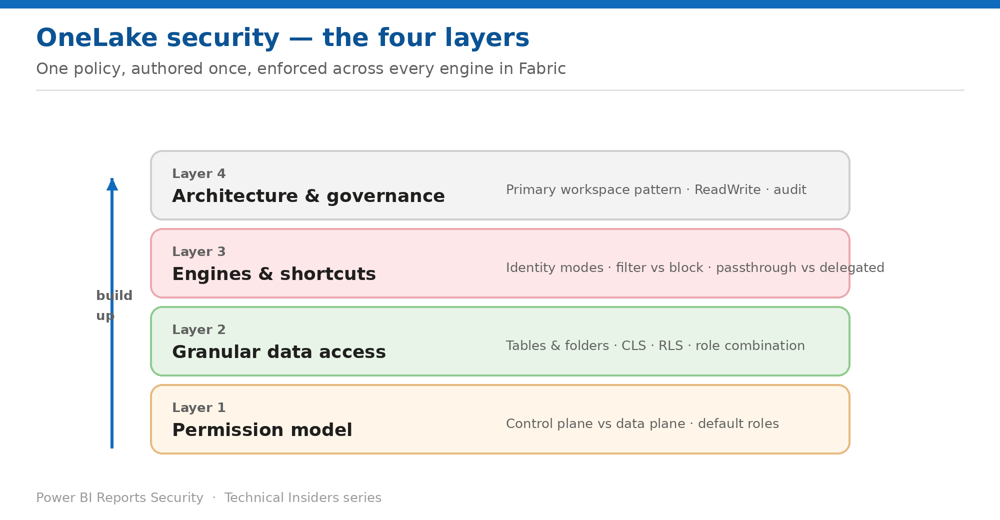

# Security for OneLake

*A 9-part, prescriptive how-to series for the data-plane security model that every Fabric engine inherits.*

Each entry is a self-contained how-to (prerequisites → steps → validation → limitations → rollback) with its own architecture diagram, scoped to semantic models. Start at Layer 1 and work up.

## Contents

### Layer 1 — Permission model

- [Map the OneLake Permission Model](Fabric-OL-Security-01-Model-Permission-Model.md) — Control plane grants management, data plane grants data — and three roles override everything you write.
- [Handle Default Roles Before They Undo Your Work](Fabric-OL-Security-02-Model-Default-Roles.md) — Every new item ships with access already granted — to a membership list nobody is named on.

### Layer 2 — Granular data access

- [Secure Tables and Folders](Fabric-OL-Security-03-Granular-Tables-Folders.md) — Object-level security — and the three conditions a folder must meet to count as a table.
- [Apply Column-Level Security](Fabric-OL-Security-04-Granular-Column-Level-Security.md) — Hide a column once — and watch three engines respond to SELECT * three different ways.
- [Apply Row-Level Security](Fabric-OL-Security-05-Granular-Row-Level-Security.md) — A deliberately small SQL subset — and a failure mode that shows no rows rather than an error.
- [Combine RLS, CLS and Multiple Roles](Fabric-OL-Security-06-Granular-Combining-Roles.md) — Union everywhere, except the one place it intersects — and one combination that isn't supported at all.

### Layer 3 — Engines & shortcuts

- [Make Every Engine Enforce Your Policy](Fabric-OL-Security-07-Engines-Enforcement.md) — Filtered for authorized engines, blocked for everything else — and two modes you must switch by hand.
- [Secure Shortcuts](Fabric-OL-Security-08-Engines-Shortcut-Security.md) — Passthrough or delegated — and the engine combination where neither passes the identity you expect.

### Layer 4 — Architecture & governance

- [Adopt the Recommended OneLake Architecture](Fabric-OL-Security-09-Architecture-Posture.md) — Centralize ownership and enforcement in a primary workspace, then shortcut outward.

---

*See the [series overview](Fabric-OL-Security-00-Series-Overview.md) for the complete entry list and where to start.*
