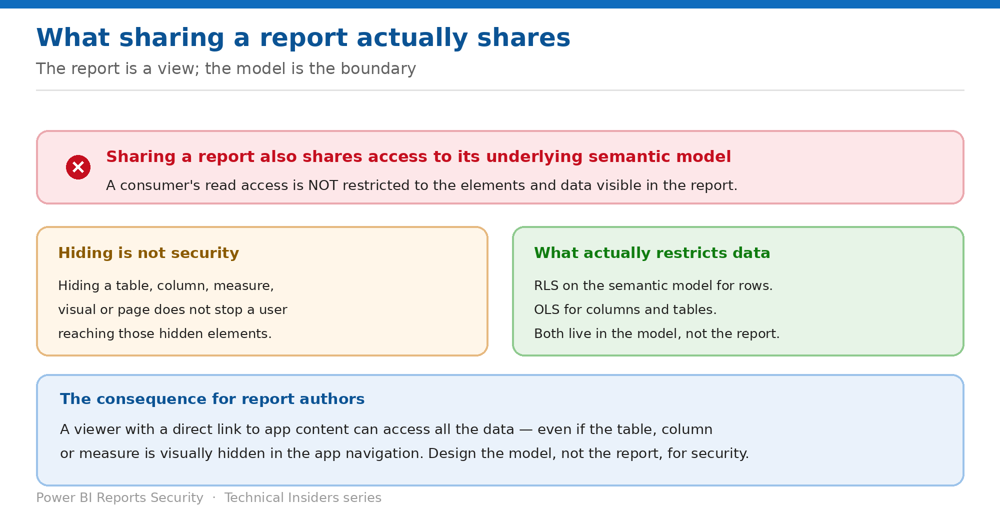

# What Sharing a Report Actually Shares

> The report is a view; the semantic model is the boundary — and hiding is not a security measure.

*Series: Sharing & distribution · Layer 1 (1 of 4) · Audience: Report authors & admins · Level 300*

This entry establishes the fact every other entry depends on: **when you share a report, you also share access to its underlying semantic model**, and a consumer's read access is not restricted to the elements and data visible in the report.

## How to read this series

This is the first of ten entries on securing Power BI reports — sharing and distribution first, then public exposure and export, then classification, then governance. Every entry is written as a **prescriptive, step-by-step runbook**, not a conceptual overview: exact prerequisites, the portal actions, a validation step to prove the control works, the current limitations, and a rollback.

The *why* behind each control is kept deliberately short so the steps stay front and centre. For deeper technical rationale, use the **Microsoft Fabric security white paper** as the companion reference; each entry also links the specific product documentation in its **References** section.

- [Microsoft Fabric security white paper — Microsoft Learn](https://learn.microsoft.com/en-us/fabric/security/white-paper-landing-page)

## Scenario — when to use this

A report shows regional summaries. The underlying model holds individual customer records and a margin column the author hid from view. A consumer opens Analyze in Excel and reads all of it — because hiding a field in a report does nothing to the model.

Reach for this entry before sharing any report built on a model containing more than the report displays — which is most reports.

For more detail on how this option works, see:

- [Microsoft Fabric security white paper — Microsoft Learn](https://learn.microsoft.com/en-us/fabric/security/white-paper-landing-page)
- [Share and collaborate on Power BI reports and dashboards — Microsoft Learn](https://learn.microsoft.com/en-us/power-bi/collaborate-share/service-share-dashboards)

## What you'll set up

- A clear understanding of what a share grants.
- Model-level security in place before distribution.
- An accurate answer to "what can this recipient actually reach?"

*Figure 1 — Access follows the model, not the visuals.*

## Prerequisites

- Access to the report and its underlying semantic model.
- Knowledge of what the model contains beyond what the report displays.
- Ability to check whether RLS or OLS is configured on the model.

## Step 1 — Understand what a share conveys

- **Sharing a report shares access to its underlying semantic model.** By default a consumer's read access **isn't restricted** to the elements and data visible in the report.
- If you have reshare permissions to the underlying model, sharing a report or dashboard **also shares the model**. Colleagues get access to the entire model unless RLS or OLS limits them.
- Report authors can customise experiences — hiding columns, limiting visual actions — but **these customisations don't restrict what data users can access in the model**.

> **Hiding is not a security measure** — Microsoft states it plainly: hiding a table, column, measure, visual or report page **doesn't prevent a report user from accessing these hidden elements**. Hiding is an option to provide a clutter-free experience, not a control.

## Step 2 — Put the real controls in place

1. Define **row-level security (RLS)** on the semantic model to restrict access to rows of data.
2. Define **object-level security (OLS)** to restrict access to columns and tables.
3. Confirm the consuming audience holds the **Viewer** workspace role — RLS and OLS apply only to Viewers.
4. Only then distribute the report.

The companion **Semantic Models** series covers the mechanics of both in detail; this entry establishes only that they are prerequisites to safe report distribution.

## Step 3 — Know the extraction paths a consumer has

Even a read-only consumer is not limited to looking at visuals:

- **Analyze in Excel** connects directly to the model. Nobody can see or download the model itself, but they can access it this way.
- **Manual refresh** is available to everyone with access.
- A user with **Build** can create their own reports on the model in other workspaces.
- An admin can restrict Analyze in Excel **for everyone in a group** — but the restriction applies to that whole group across every workspace it belongs to.

## Validate

- Open **Analyze in Excel** as a test consumer — confirm they see only what RLS and OLS permit.
- Confirm a hidden column is **not** reachable, which proves OLS is doing the work rather than the hiding.
- Confirm a Viewer sees filtered rows while a Contributor does not.
- Confirm the model contains nothing you wouldn't be comfortable sharing with the report's audience.

## Limitations & gotchas

- **Hiding is not security** — the central point of this entry.
- Sharing the report shares the model unless RLS or OLS constrains it.
- Users with a **direct link to app content** can access all the data even if items are hidden in the app navigation.
- Restricting Analyze in Excel is a blunt group-wide instrument, not a per-report control.
- For free users to access shared content, **both the report and the model** must be in Premium capacity.

## Rollback

1. Remove the share via **Manage permissions**, choosing to also remove access to related content.
2. Note that if you don't remove related content, the remaining items may not display properly.
3. Add RLS or OLS to the model before re-sharing.

## References

- [Share and collaborate on Power BI reports and dashboards — Microsoft Learn](https://learn.microsoft.com/en-us/power-bi/collaborate-share/service-share-dashboards)
- [Row-level security (RLS) with Power BI — Microsoft Learn](https://learn.microsoft.com/en-us/fabric/security/service-admin-row-level-security)
- [Object-level security (OLS) with Power BI — Microsoft Learn](https://learn.microsoft.com/en-us/fabric/security/service-admin-object-level-security)
