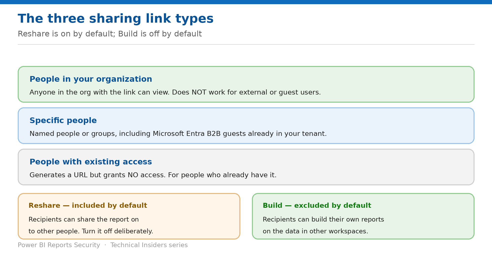

# Share Reports with the Right Link Type

> Three link types and two permission toggles — one of which is on by default.

*Series: Sharing & distribution · Layer 1 (2 of 4) · Audience: Report authors · Level 300*

The **Send link** dialog offers three link types with materially different reach. This entry covers what each grants, the two permission settings attached to them, and the tenant control that restricts the broadest option.

## Scenario — when to use this

You share a report with a colleague. They forward the link to their team, who forward it onward — because the default link type covers everyone in the organisation and reshare is on by default.

Reach for this entry every time you share a report, and as an audit of links already in circulation.

For more detail on how this option works, see:

- [Microsoft Fabric security white paper — Microsoft Learn](https://learn.microsoft.com/en-us/fabric/security/white-paper-landing-page)
- [Share and collaborate on Power BI reports and dashboards — Microsoft Learn](https://learn.microsoft.com/en-us/power-bi/collaborate-share/service-share-dashboards)

## What you'll set up

- The narrowest link type that meets the need.
- Reshare and Build set deliberately rather than by default.
- An understanding of the tenant restriction on org-wide links.

*Figure 2 — Reshare is included by default; Build is excluded by default.*

## Prerequisites

- A **Power BI Pro or PPU** license, unless the content is in Premium capacity.
- **Reshare** permission on the report to create anything other than an existing-access link.
- Recipients need Pro or PPU unless the content is in Premium or Fabric capacity.

## Step 1 — Choose the link type

| Link type | Who it reaches |
| --- | --- |
| People in your organization | Anyone in your organization with the link can view. Does not work for external or guest users. |
| Specific people | Named people or groups. Can include Microsoft Entra B2B guests already in your tenant — not external users who aren't guests. |
| People with existing access | Generates a URL but grants no access at all. For sending a link to someone who already has it. |

> **Pick the narrowest that works** — Use **People in your organization** only when you are comfortable with the link being passed around internally. Use **Specific people** when the audience is known — it is the only type that reaches guests.

## Step 2 — Set the two permissions deliberately

- **Reshare — included by default.** Allows recipients to share the report with others. Turn it off unless onward sharing is intended.
- **Build — excluded by default.** Allows recipients to build their own reports in other workspaces on the underlying data.

Links for **People with existing access** have no additional settings, because they grant no access.

## Step 3 — Know the constraints

- **Users can't use a link that wasn't shared directly with them** — though they may have access via another link or a workspace role.
- If your admin has **disabled shareable links to People in your organization**, you can only share **Specific people** or **People with existing access** links.
- **If you have reshare permission on the report but not on the underlying data**, your links don't give access to that data.
- **Without reshare permission on the report**, you can only share existing-access links.
- **Without a Pro license**, likewise — existing-access links only.

## Step 4 — Manage links over time

1. Open the sharing dialog and select **More options (...) → Manage permissions**.
2. Copy or change existing links, grant or remove direct access, and review pending requests.
3. Use **Advanced** for the full management page, including related content and filters.
4. Watch the link count — **each report can't have more than 1,000 sharing links**. If you hit the limit, remove Specific-people links and grant those users direct access instead.

## Validate

- A recipient of a **Specific people** link can open the report; a colleague they forward it to cannot.
- With Reshare off, the recipient sees no option to share onward.
- With Build off, the recipient cannot create a new report on the model.
- An external non-guest cannot use an organization link.

## Limitations & gotchas

- **Reshare is on by default** — the most common oversharing cause.
- Only **reports** can be shared via links that grant access; dashboards use direct access.
- **Maximum 1,000 sharing links per report.**
- Email notification for direct-access shares goes to **individual users only, not groups**.
- **Microsoft 365 Unified groups can't be used** for direct sharing or email subscriptions.

## Rollback

1. Open **Manage permissions** and delete the link or remove direct access.
2. Removing a link immediately disables it for everyone who held it.
3. Choose to remove related content access as well, or the remaining items may not display correctly.

## References

- [Share and collaborate on Power BI reports and dashboards — Microsoft Learn](https://learn.microsoft.com/en-us/power-bi/collaborate-share/service-share-dashboards)
- [Build permission for shared semantic models — Microsoft Learn](https://learn.microsoft.com/en-us/power-bi/connect-data/service-datasets-build-permissions)
