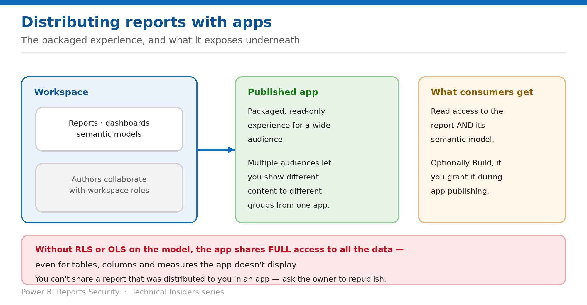

# Distribute Reports with Apps and Audiences

> A packaged read-only experience at scale — and what it exposes underneath.

*Series: Sharing & distribution · Layer 1 (3 of 4) · Audience: Workspace admins · Level 300*

**Apps** are the supported way to distribute polished content to a large audience. This entry covers what app consumers actually receive, how audiences segment content, and the exposure that remains if the model isn't secured.

## Scenario — when to use this

You need to distribute a finance report to two hundred people, some of whom should see only their own division. Sharing individually doesn't scale, and workspace access would give everyone edit rights.

Reach for this pattern for any broad distribution. Note that the app controls *what content is presented*, not *what data is reachable* — that remains a model-level decision.

For more detail on how this option works, see:

- [Microsoft Fabric security white paper — Microsoft Learn](https://learn.microsoft.com/en-us/fabric/security/white-paper-landing-page)
- [Share and collaborate on Power BI reports and dashboards — Microsoft Learn](https://learn.microsoft.com/en-us/power-bi/collaborate-share/service-share-dashboards)

## What you'll set up

- Content packaged into an app for a defined audience.
- Build permission granted only where genuinely needed.
- An understanding of what app consumers can reach beyond the app.

*Figure 3 — Consumers get read access to the report and its model.*

## Prerequisites

- A **Pro or PPU** license to publish the app.
- Consumers need a free license only if the content is in **Premium or Fabric capacity** — and only **P SKUs and F SKUs F64 or larger** let free-license Viewers use apps and shared content. Smaller F SKUs require Pro.
- **Admin or Member** role in the workspace to publish and to grant Build during publishing.
- RLS or OLS already defined on the model if the audience should see different data.

## Step 1 — Package and publish the app

1. Assemble the reports and dashboards in the workspace.
2. Publish the workspace as an app.
3. Define **audiences** so different groups see different content from the same app.
4. Decide, during publishing, whether app users also get **Build permission** on the underlying models.

## Step 2 — Understand what consumers receive

- Recipients get a **consistent, read-only experience** unless you grant Build.
- Sharing a report through an app gives recipients **read access to both the report and its underlying semantic model**.
- **Without RLS or OLS on the model, the report is shared with full access to all the data** — even when tables, columns or measures aren't shown in the report.
- **If users have a direct link to any content in your app, they can access all the data**, even if the item is visually hidden in the app navigation.
- Granting Build during app creation enables consumers to build new solutions on top of the data.

> **The app is presentation, not protection** — An app curates what is *presented*. It does not constrain what is *reachable*. If the audience must not see certain data, that has to be enforced on the model.

## Step 3 — Manage the app over time

1. To change who has access, select **Update app → Audience** and edit the audience membership.
2. To remove someone, hover over the person or group in **Edit Audience** and select the trash icon, then **Update app**.
3. **Also remove their Build permission separately** — removing app access doesn't remove Reshare and Build.
4. Republish the app after any content change.

## Validate

- An audience member sees only the content assigned to their audience.
- A member of another audience sees a different set.
- With RLS in place, two members of the same audience see different rows.
- After removal from the app, the user can no longer open it — and, once Build is also revoked, cannot connect in Excel.

## Limitations & gotchas

- **You can't share a report that was distributed to you in an app** — the owner must add the person and republish.
- **Removing app access doesn't remove Reshare and Build.**
- A direct link to app content bypasses the app navigation entirely.
- Free-license consumption requires **P SKU or F64+**.
- Apps present content; they don't restrict model access.

## Rollback

1. Remove the audience member and **Update app**.
2. Remove Build permission on the underlying models separately.
3. Unpublish the app entirely if distribution should stop.

## References

- [Share and collaborate on Power BI reports and dashboards — Microsoft Learn](https://learn.microsoft.com/en-us/power-bi/collaborate-share/service-share-dashboards)
- [Build permission for shared semantic models — Microsoft Learn](https://learn.microsoft.com/en-us/power-bi/connect-data/service-datasets-build-permissions)
- [Roles in workspaces in Microsoft Fabric — Microsoft Learn](https://learn.microsoft.com/en-us/fabric/fundamentals/roles-workspaces)
