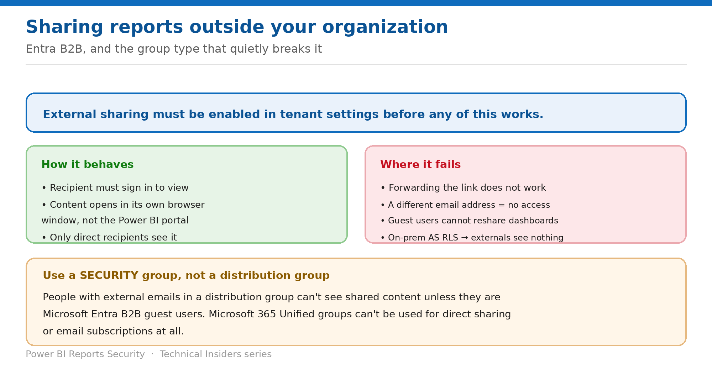

# Share Reports Outside Your Organization

> Microsoft Entra B2B, and the group type that quietly breaks external access.

*Series: Sharing & distribution · Layer 1 (4 of 4) · Audience: Report authors & admins · Level 300*

Sharing beyond your tenant requires an admin to enable it and behaves differently from internal sharing in several ways. This entry covers the setup, the recipient experience, and the failure modes worth knowing before you promise a partner access.

## Scenario — when to use this

A partner needs access to a report. You share it, they receive an email, and nothing works as expected — the link opens a sign-in they can't complete, or they're in a distribution group that silently excludes them.

Reach for this entry before any external share, and as the diagnostic when a partner reports they can't reach content you sent.

For more detail on how this option works, see:

- [Microsoft Fabric security white paper — Microsoft Learn](https://learn.microsoft.com/en-us/fabric/security/white-paper-landing-page)
- [Share and collaborate on Power BI reports and dashboards — Microsoft Learn](https://learn.microsoft.com/en-us/power-bi/collaborate-share/service-share-dashboards)

## What you'll set up

- External sharing enabled and correctly scoped.
- Partners reaching the content they should.
- The right group type used for external audiences.

*Figure 4 — How external sharing behaves, and where it fails.*

## Prerequisites

- Your Power BI admin has **enabled external sharing** in tenant settings.
- External recipients are **Microsoft Entra B2B guest users** in your tenant, or will become so on first access.
- You hold **Reshare** permission on the report.
- RLS is designed with guest identities in mind — see the Semantic Models series entry on B2B guests.

## Step 1 — Share with the right link type

1. Open the report and select **Share**.
2. Choose **Specific people** — this is the only link type that reaches guests.
3. Enter the external recipient's email address.
4. Set **Reshare** and **Build** deliberately.
5. Send the link.

## Step 2 — Set expectations for the recipient

- They receive an **email with a link** to the shared content.
- They must **sign in** to Power BI to see it. If they lack a Pro or PPU license, they can sign up when selecting the link.
- The content opens **in its own browser window, not the usual Power BI portal** — tell them to bookmark it.
- **Only your direct recipients see it.** If you share with one address, only that person has access.
- **Forwarding does not work.** The recipient must sign in with **the same email address** you shared to — any other address gets no access.

## Step 3 — Use the correct group type

> **Security group, not distribution group** — **People with external emails in a distribution group can't see the content you share**, unless they're Microsoft Entra B2B guest users. Use a **security group** when the audience includes external addresses.

- **Microsoft 365 Unified groups can't be used** for direct sharing or email subscriptions at all.
- Email-enabled distribution groups and security groups work for internal multi-user sharing.
- Coworkers on a different domain **registered within the same tenant** are treated as internal.

## Validate

- The external recipient signs in and opens the report.
- A forwarded copy of the link fails for a second external person.
- A guest in a security group can reach the content; the same guest in a distribution group cannot.
- RLS filters the guest's data correctly — test with a real guest account.

## Limitations & gotchas

- **Guest users can't reshare dashboards.**
- **People outside your organization see no data at all if role- or row-level security is implemented on on-premises Analysis Services tabular models.**
- A link sent from the **mobile app** opens in a browser for externals, not the mobile app.
- You can't share with external users who **aren't guests** in your Entra tenant.
- External sharing must be enabled tenant-wide first.

## Rollback

1. Open **Manage permissions** and remove the external user's access.
2. Remove them from any security group granting access.
3. Ask your admin to disable external sharing tenant-wide if it shouldn't be available at all.

## References

- [Share and collaborate on Power BI reports and dashboards — Microsoft Learn](https://learn.microsoft.com/en-us/power-bi/collaborate-share/service-share-dashboards)
- [Row-level security (RLS) with Power BI — Microsoft Learn](https://learn.microsoft.com/en-us/fabric/security/service-admin-row-level-security)
