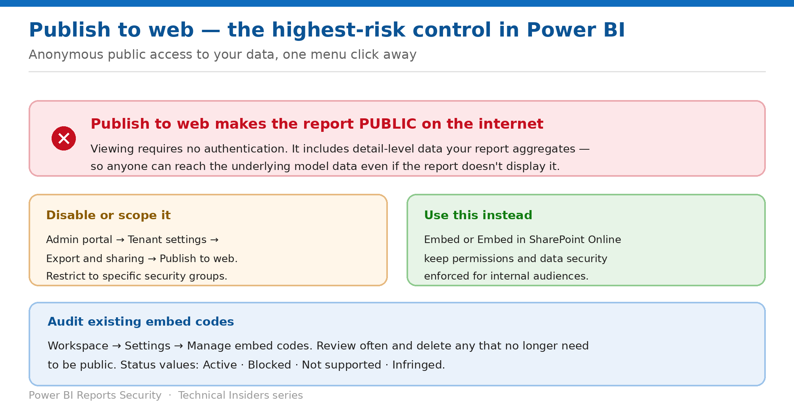

# Control Publish to Web

> Anonymous public access to your data, one menu click away — and how to shut it down.

*Series: Public exposure & export · Layer 2 (1 of 3) · Audience: Fabric administrators · Level 300*

**Publish to web** makes a report publicly accessible on the internet with **no authentication** — including detail-level data the report only aggregates. This entry covers disabling or scoping it, and auditing embed codes that already exist.

## Scenario — when to use this

Someone publishes a report to a blog to share a chart with a customer. The embed code exposes the entire underlying model to anyone on the internet, indefinitely, and nobody notices because it works exactly as the author intended.

Reach for this entry as a tenant administrator today, whether or not you think anyone is using it. Auditing existing embed codes is the highest-value hour available in Power BI governance.

For more detail on how this option works, see:

- [Microsoft Fabric security white paper — Microsoft Learn](https://learn.microsoft.com/en-us/fabric/security/white-paper-landing-page)
- [Publish to web from Power BI — Microsoft Learn](https://learn.microsoft.com/en-us/power-bi/collaborate-share/service-publish-to-web)

## What you'll set up

- The tenant setting deliberately configured.
- Existing embed codes reviewed and removed where inappropriate.
- A safer alternative in place for internal embedding.

*Figure 5 — The highest-risk control in Power BI.*

## Prerequisites

- You are a **Power BI / Fabric administrator** with access to the admin portal.
- You can reach each workspace's **Manage embed codes** page, or can ask workspace admins to.
- You have a communication plan — disabling this breaks any live public embed.

## Step 1 — Understand the exposure

- **Anyone on the internet can view the published report or visual. Viewing requires no authentication.**
- **It includes viewing detail-level data that your reports aggregate** — so anyone can access the underlying model data even if the report doesn't display it.
- Data is **cached for one hour** from retrieval, so it isn't suitable for frequently refreshed data either.
- The report updates with any changes you make, and the link is **immediately active**.

> **Design intent, not a bug** — This feature exists for genuinely public content — published statistics, marketing dashboards. The risk is that it looks like ordinary sharing in the File menu and carries none of the usual protections.

## Step 2 — Set the tenant setting

1. Sign in to the **Power BI admin portal**.
2. Select **Tenant settings**.
3. Under **Export and sharing settings**, locate **Publish to web**.
4. Either disable it, or set it to **Specific security groups** and add only the groups that genuinely need it.
5. Select **Apply**.

## Step 3 — Audit existing embed codes

1. Open each workspace, select the **Settings** gear, and choose **Manage embed codes**.
2. Review every code listed for that workspace.
3. Retrieve a code to see what it exposes, or **Delete** it — deleting disables any links to that report or visual.
4. Confirm the deletion when prompted.

The status column tells you where each code stands:

| Status | Meaning |
| --- | --- |
| Active | The report is available for internet users to view and interact with |
| Blocked | Content violated the Power BI Terms of Service and Microsoft has blocked it |
| Not supported | The model uses row-level security or another unsupported configuration |
| Infringed | The code is outside the tenant policy — typically the setting was changed after the code was created |

> **Review often** — Microsoft's own guidance is to review published embed codes regularly and remove any that no longer need to be public. Build it into your governance cycle rather than treating it as a one-off.

## Validate

- A user outside the permitted security group finds **Publish to web** unavailable.
- A deleted embed code's public URL no longer renders the report.
- Existing codes created before a policy change show **Infringed**.
- Internal embedding still works through the supported options (entry 07).

## Limitations & gotchas

- **Only one embed code per report** can exist.
- **The creator must retain access to the report** for the embed code to keep working, including the required license.
- Reports using **RLS**, **DirectQuery**, any **Live Connection**, or a **shared model in a different workspace** can't be published to web.
- If **private links** block public internet access for the tenant, the Publish to web option is greyed out.
- Data caching means changes and refreshes may take time to appear publicly.

## Rollback

1. Re-enable the tenant setting, scoped to specific security groups.
2. Note that re-enabling does **not** restore deleted embed codes — they must be recreated.
3. Communicate the change to anyone whose public embed you disabled.

## References

- [Publish to web from Power BI — Microsoft Learn](https://learn.microsoft.com/en-us/power-bi/collaborate-share/service-publish-to-web)
- [Share and collaborate on Power BI reports and dashboards — Microsoft Learn](https://learn.microsoft.com/en-us/power-bi/collaborate-share/service-share-dashboards)
