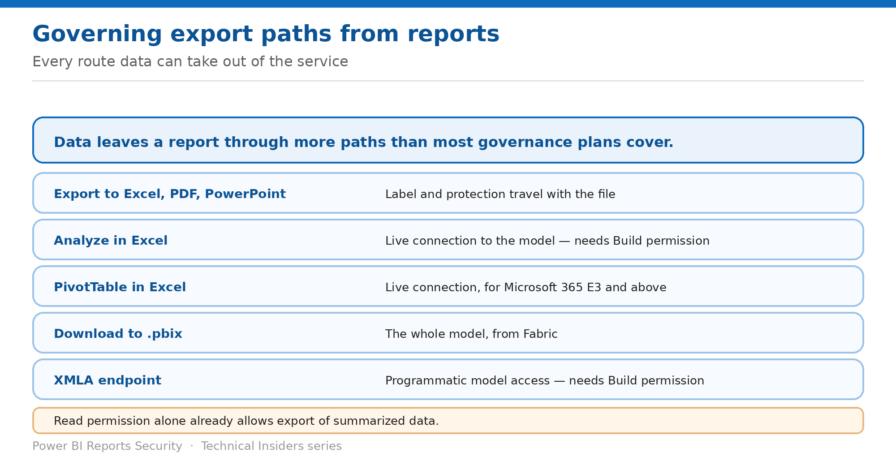

# Govern Export Paths from Reports

> Every route data takes out of the service — and which permission unlocks each one.

*Series: Public exposure & export · Layer 2 (2 of 3) · Audience: Fabric administrators · Level 300*

Data leaves reports through more paths than most governance plans account for. This entry enumerates them, maps each to the permission that enables it, and covers the tenant settings that constrain them.

## Scenario — when to use this

Your access review covers who can open the report. It doesn't cover who can pull the whole model into Excel, download a .pbix, or query it over XMLA — all of which are available to people you consider read-only consumers.

Reach for this entry when defining what "read access" means in your organisation, and before signing off any data-handling control that assumes reports are view-only.

For more detail on how this option works, see:

- [Microsoft Fabric security white paper — Microsoft Learn](https://learn.microsoft.com/en-us/fabric/security/white-paper-landing-page)
- [Build permission for shared semantic models — Microsoft Learn](https://learn.microsoft.com/en-us/power-bi/connect-data/service-datasets-build-permissions)
- [Share and collaborate on Power BI reports and dashboards — Microsoft Learn](https://learn.microsoft.com/en-us/power-bi/collaborate-share/service-share-dashboards)

## What you'll set up

- A complete list of export paths for your reports.
- Each path mapped to the permission that enables it.
- Tenant settings configured to match your policy.

*Figure 6 — Read alone already permits summarized export.*

## Prerequisites

- Administrator access to **Export and sharing settings** in the admin portal.
- Knowledge of which audiences hold **Read** versus **Build** on your models.
- A defined policy on what may leave the service.

## Step 1 — Enumerate the paths

| Path | Permission required |
| --- | --- |
| Export summarized data | Read |
| Export underlying data | Build |
| Analyze in Excel | Build |
| PivotTable in Excel with a live connection | Build, plus Microsoft 365 E3 or above |
| Download to .pbix from Fabric | Model access |
| XMLA endpoint | Build |
| Export to Excel, PDF, PowerPoint | Read |

> **Read is not view-only** — **Users with only Read permission can still export summarized data.** If your policy treats read access as non-extractive, that assumption doesn't hold in Power BI.

## Step 2 — Control Build carefully

- **Build is what unlocks the heavy paths** — underlying data export, Analyze in Excel, and the XMLA endpoint.
- Contributor or higher in a workspace **grants Build automatically** on every model there.
- Removing Build leaves users able to view reports but **no longer able to edit them or export underlying data**.
- Removing app access **doesn't remove Build** — revoke it separately.

## Step 3 — Apply tenant-level constraints

1. Open the **admin portal → Tenant settings → Export and sharing settings**.
2. Review each export-related setting against your policy.
3. Scope permissive settings to **specific security groups** rather than the whole organisation.
4. Note that restricting **Analyze in Excel** applies to everyone in the chosen group, across every workspace that group belongs to — it is not a per-report control.
5. Document which settings you changed and why.

## Validate

- A Read-only user can export **summarized** data but not underlying data.
- A Build holder can use **Analyze in Excel**; after revocation, they cannot.
- The XMLA endpoint refuses a user without Build.
- Tenant settings reflect your documented policy.

## Limitations & gotchas

- **Read already permits summarized export** — plan for it rather than assuming otherwise.
- Restricting Analyze in Excel is **group-wide and workspace-wide**, not granular.
- **Everyone with access can manually refresh** the data.
- Exports from a report **published to web** are disabled — but the public exposure is the larger problem (entry 05).
- Nobody can see or download the model itself, but Analyze in Excel reaches it directly.

## Rollback

1. Re-enable the tenant setting, scoped to a security group if appropriate.
2. Re-grant Build on the specific models where it is genuinely needed.
3. Communicate changes — export restrictions are highly visible to users.

## References

- [Build permission for shared semantic models — Microsoft Learn](https://learn.microsoft.com/en-us/power-bi/connect-data/service-datasets-build-permissions)
- [Share and collaborate on Power BI reports and dashboards — Microsoft Learn](https://learn.microsoft.com/en-us/power-bi/collaborate-share/service-share-dashboards)
- [Information protection in Microsoft Fabric — Microsoft Learn](https://learn.microsoft.com/en-us/fabric/governance/information-protection)
