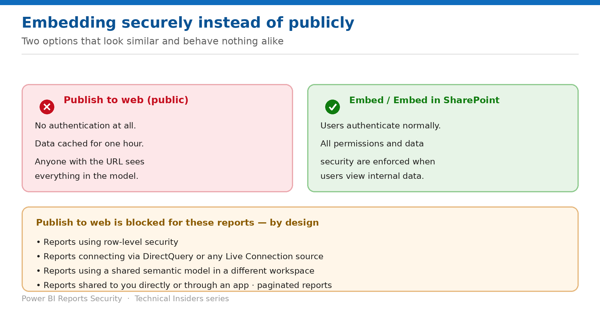

# Embed Reports Securely Instead of Publicly

> Two options that sit side by side in the menu and behave nothing alike.

*Series: Public exposure & export · Layer 2 (3 of 3) · Audience: Report authors & developers · Level 300*

When someone needs a report inside a portal or intranet page, there are two paths: the **secure embed options**, which enforce permissions, and **Publish to web**, which doesn't. This entry covers choosing correctly.

## Scenario — when to use this

A team wants a dashboard on their intranet page. Publish to web is the option they find first, and it works immediately — which is precisely the problem.

Reach for this entry whenever a report needs to appear outside the Power BI portal, and as the answer to give teams who ask for Publish to web.

For more detail on how this option works, see:

- [Microsoft Fabric security white paper — Microsoft Learn](https://learn.microsoft.com/en-us/fabric/security/white-paper-landing-page)
- [Publish to web from Power BI — Microsoft Learn](https://learn.microsoft.com/en-us/power-bi/collaborate-share/service-publish-to-web)

## What you'll set up

- Internal embedding using an option that enforces security.
- Publish to web reserved for genuinely public content, or disabled.
- A documented answer for teams requesting embedding.

*Figure 7 — Authentication enforced, or no authentication at all.*

## Prerequisites

- Edit permission on the report, and the appropriate license.
- For SharePoint embedding, a SharePoint Online site the audience can reach.
- Knowledge of whether the audience is authenticated internal users or the public.

## Step 1 — Choose the right option

- **Embed** and **Embed in SharePoint Online** — Microsoft's guidance is explicit that these options **ensure all permissions and data security are enforced when your users view your internal data**.
- **Publish to web (public)** — no authentication, public to the internet, includes detail-level model data.

> **The decision rule** — If the audience signs in, use **Embed** or **Embed in SharePoint Online**. Publish to web is only appropriate when you positively intend the content and its underlying data to be public.

## Step 2 — Embed for an internal audience

1. Open the report and select **File → Embed report**.
2. Choose **Embed** for a secure portal or website, or **Embed in SharePoint Online**.
3. Copy the resulting URL or embed code into your portal or SharePoint page.
4. Confirm the audience holds the necessary report and model permissions — the embed enforces them rather than bypassing them.

## Step 3 — Know where Publish to web is blocked anyway

Even if the tenant setting is on, Publish to web isn't available for:

- Reports using **row-level security**.
- Reports connecting via **DirectQuery**, or any **Live Connection** source including Analysis Services and Azure Analysis Services.
- Reports using a **shared semantic model stored in a different workspace**.
- **Shared and certified semantic models.**
- Reports **shared to you directly or through an app**, or in a workspace where you aren't an edit member.
- **Paginated reports**, mobile layout views, and multiple-language reports.
- Reports containing **report-level DAX measures**, R and Python visuals, and Q&A visuals.

> **A useful side effect** — Because RLS-protected reports can't be published to web, applying RLS is itself a partial mitigation. It is not a substitute for the tenant setting, but it does close the path for your most sensitive models.

## Validate

- An embedded report in your portal prompts for sign-in and enforces the viewer's permissions.
- A user without report access sees no data through the embed.
- An RLS-protected report offers no Publish to web option.
- The JavaScript API scenario uses the user-owns-data approach — the automatic authentication in the Embed option doesn't work with it.

## Limitations & gotchas

- **The automatic authentication provided with the Embed option doesn't work with the Power BI JavaScript API** — use the user-owns-data embedding approach there.
- Secure embedding requires viewers to have real permissions — it doesn't grant access.
- Publish to web has a **one-hour data cache**, so it is unsuitable for frequently refreshed data regardless of security.
- **Only one embed code per report** exists for Publish to web.

## Rollback

1. Remove the embed from the portal page.
2. For Publish to web, delete the embed code under **Manage embed codes**.
3. Revoke report permissions if the audience should lose access entirely.

## References

- [Publish to web from Power BI — Microsoft Learn](https://learn.microsoft.com/en-us/power-bi/collaborate-share/service-publish-to-web)
- [Share and collaborate on Power BI reports and dashboards — Microsoft Learn](https://learn.microsoft.com/en-us/power-bi/collaborate-share/service-share-dashboards)
