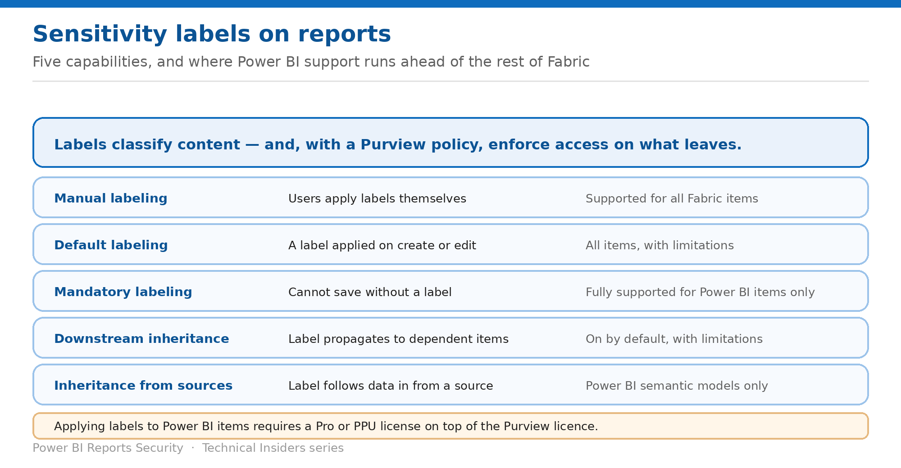

# Apply Sensitivity Labels to Reports

> Manual, default, mandatory, programmatic and inherited labeling — and where Power BI leads.

*Series: Classification · Layer 3 (1 of 2) · Audience: Fabric admins & report authors · Level 300*

**Sensitivity labels** from Microsoft Purview classify Power BI content and, with the right policy, protect it. This entry covers the five labeling capabilities, how they apply to reports, and the licensing that gates them.

## Scenario — when to use this

Compliance asks how your reports are classified. Some carry labels, most don't, and nobody can say which contain regulated data — because labeling was left to individual authors.

Reach for this entry when you need classification coverage across a report estate rather than ad-hoc labels, and before relying on labels as a control (entry 09).

For more detail on how this option works, see:

- [Microsoft Fabric security white paper — Microsoft Learn](https://learn.microsoft.com/en-us/fabric/security/white-paper-landing-page)
- [Information protection in Microsoft Fabric — Microsoft Learn](https://learn.microsoft.com/en-us/fabric/governance/information-protection)

## What you'll set up

- Labels applied consistently across reports.
- Default and mandatory policies reducing reliance on manual labeling.
- An understanding of what labels do — and don't — enforce.

*Figure 8 — Five capabilities and their current support status.*

## Prerequisites

- An appropriate license for **Microsoft Purview Information Protection**.
- A **Power BI Pro or PPU** license, in addition, for any user applying labels to Power BI items.
- Sensitivity labels **defined and published** to the relevant users and groups before you enable them on the tenant.
- Azure Information Protection labels **migrated** to the Purview unified labeling platform if your organisation still uses them.
- Power BI Desktop **December 2020 or later** to work with labels.

## Step 1 — Know the five capabilities

| Capability | What it does | Support |
| --- | --- | --- |
| Manual labeling | Users apply labels themselves | All Fabric items |
| Default labeling | A label is applied on create or edit if none is chosen | All items, with limitations |
| Mandatory labeling | Users can't save an item without a label — and can't remove one | Fully supported for Power BI items only |
| Programmatic labeling | Labels added, changed or deleted via Power BI admin REST APIs | All Fabric items |
| Downstream inheritance | A label propagates to dependent items | All items, with limitations; on by default |

> **Power BI leads the rest of Fabric here** — **Mandatory labeling is currently fully supported for Power BI items only.** For lakehouses, pipelines and warehouses the logic isn't enforced — a user can save without a label unless the experience itself requires one.

## Step 2 — Reduce reliance on manual labeling

1. Enable sensitivity labels on the tenant and specify which users can apply them.
2. Publish each label to those users as part of the label's policy definitions in the **Microsoft Purview compliance portal** — being in the specified-users list is **not sufficient** on its own.
3. Configure a **default label policy** so items get a label when the user doesn't choose one.
4. Configure **mandatory labeling** for Power BI items so content can't be saved unlabeled.
5. Use the **admin REST APIs** to set or remove labels programmatically where bulk remediation is needed.

## Step 3 — Understand inheritance

- **Downstream inheritance** is on by default: Power BI → Power BI, Fabric → Fabric, and Fabric → Power BI are supported. **Power BI item to Fabric item is not.**
- **Inheritance upon creation** — a new item created from an existing one inherits its label. Supported for all Power BI items.
- **Inheritance from data sources** — currently supported for **Power BI semantic models only**. The label then propagates downstream to child items.
- **Inheritance upon update** — labels are re-evaluated when an item is modified, connected to a new labeled source, or given new lineage relationships.
- Autogenerated items from a lakehouse or warehouse take the label of their **parent**, not items further upstream.

## Step 4 — Monitor coverage

- Use the governance experiences in the **OneLake catalog** to identify labeled and unlabeled assets.
- Understand label coverage across Fabric items and discover assets with specific labels.
- Monitor adoption and **prioritise remediation of unlabeled or incorrectly classified content**.

## Validate

- A new report receives the default label automatically.
- A user cannot save a Power BI item without a label where mandatory labeling is on.
- A downstream report inherits the label of the model it depends on.
- The OneLake catalog shows the coverage you expect.

## Limitations & gotchas

- **Being in the specified-users list isn't enough** — the label must also be published to the user in the Purview policy.
- **Mandatory labeling is fully supported for Power BI items only**, and isn't enforced if changes are made via the flyout menu.
- Default labeling doesn't apply when an item is created in a process with no clear create dialog.
- **Power BI item to Fabric item downstream inheritance isn't supported.**
- A protected .pbix can't be opened with a Desktop version earlier than December 2020.
- Manual labeling means users can **change** labels on items — plan for that.

## Rollback

1. Remove or change a label manually, or programmatically via the admin REST APIs.
2. Disable the mandatory or default label policy in the Purview compliance portal.
3. Note that disabling labeling doesn't remove labels already applied.

## References

- [Information protection in Microsoft Fabric — Microsoft Learn](https://learn.microsoft.com/en-us/fabric/governance/information-protection)
