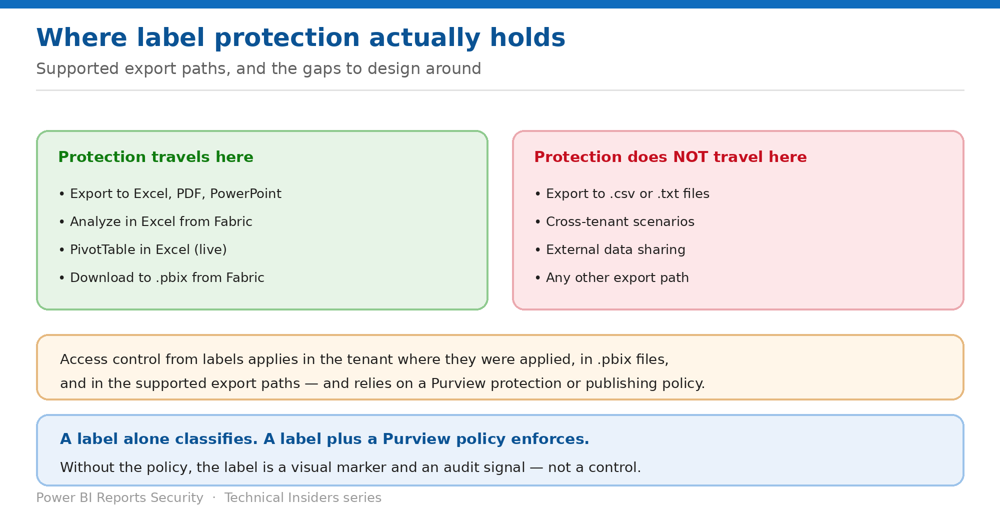

# Make Label Protection Hold on Export

> Which export paths carry protection with the file — and which silently don't.

*Series: Classification · Layer 3 (2 of 2) · Audience: Fabric admins & compliance · Level 300*

A label on its own classifies. A label **associated with a Microsoft Purview policy** enforces access. This entry covers where that enforcement actually holds when data leaves Power BI — and the paths where it doesn't.

## Scenario — when to use this

You've labeled everything and reported full coverage to compliance. Then someone exports to CSV and the file carries no protection at all, because that path was never in scope.

Reach for this entry before treating labels as a data-loss control, and when scoping what your classification programme actually guarantees.

For more detail on how this option works, see:

- [Microsoft Fabric security white paper — Microsoft Learn](https://learn.microsoft.com/en-us/fabric/security/white-paper-landing-page)
- [Information protection in Microsoft Fabric — Microsoft Learn](https://learn.microsoft.com/en-us/fabric/governance/information-protection)

## What you'll set up

- An accurate statement of where label protection holds.
- Compensating controls for the paths it doesn't cover.
- Purview policies in place so labels enforce rather than merely mark.

*Figure 9 — Supported export paths, and the gaps to design around.*

## Prerequisites

- Sensitivity labels applied to your Power BI content (entry 08).
- **Microsoft Purview protection or publishing policies** associated with those labels — without a policy, a label doesn't enforce anything.
- Knowledge of which export paths your users actually use.

## Step 1 — Know where access control applies

Labels apply access control in three situations, each relying on a Purview policy:

- **In the tenant where the labels were applied** — relies on labels associated with **protection policies**. When a user in that tenant accesses a labeled item, the protection policy controls their access.
- **In Power BI Desktop (.pbix) files** — relies on labels associated with **publishing policies**. Opening a protected .pbix depends on the permissions the user has under that policy.
- **In supported export paths** — again via publishing policies, controlling access to the generated file.

> **Everything else is unsupported** — Microsoft states that **access control in all other scenarios is unsupported** — including cross-tenant scenarios such as external data sharing, and other export paths such as **.csv and .txt files**.

## Step 2 — Know the supported export paths

Labels and their access control stay with content leaving Power BI in these paths:

- **Export to Excel, PDF files, and PowerPoint.**
- **Analyze in Excel from Fabric** — which downloads an Excel file with a live connection to the model.
- **PivotTable in Excel** with a live connection to a semantic model, for users with **Microsoft 365 E3 and above**.
- **Download to a Power BI Desktop (.pbix) file** from Fabric.

**Export is currently supported for Power BI items only.** No other Fabric experience uses an export method that transfers the label to the exported output — though a warning is issued if a user exports a labeled item.

## Step 3 — Compensate for the gaps

1. Identify whether your users export to **.csv or .txt** — those files carry no protection.
2. Restrict those export paths through tenant settings where policy requires it (entry 06).
3. Treat **cross-tenant and external data sharing** as outside label enforcement entirely, and control it with sharing settings instead (entry 04).
4. Document precisely which paths your classification programme covers, so compliance claims match reality.

## Validate

- An exported **Excel or PDF** file carries the label and enforces the policy for an unauthorised user.
- A downloaded **.pbix** requires the appropriate permission to open.
- A **.csv** export carries **no** protection — confirming the documented gap in your own tenant.
- A user without rights under the publishing policy cannot open a protected export.

## Limitations & gotchas

- **A label without a Purview policy classifies but does not enforce.**
- **.csv and .txt exports carry no protection.**
- **Cross-tenant scenarios, including external data sharing, are unsupported** for label-based access control.
- Export label inheritance is **Power BI items only** — other Fabric experiences only warn.
- Office apps have their own licensing requirements for viewing and applying labels.

## Rollback

1. Detach the protection or publishing policy from the label to stop enforcement while retaining classification.
2. Remove the label entirely if classification should also stop.
3. Re-test each export path after any policy change.

## References

- [Information protection in Microsoft Fabric — Microsoft Learn](https://learn.microsoft.com/en-us/fabric/governance/information-protection)
- [Build permission for shared semantic models — Microsoft Learn](https://learn.microsoft.com/en-us/power-bi/connect-data/service-datasets-build-permissions)
