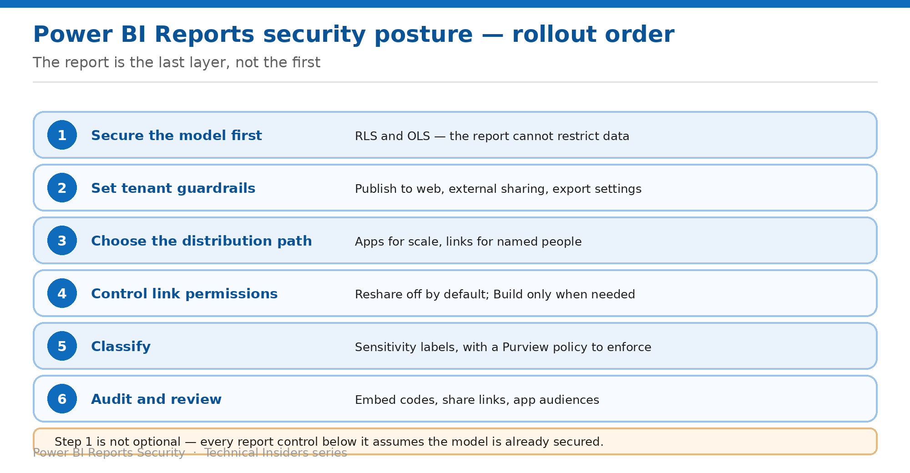

# Assemble a Report Security Posture

> The order to apply these controls in — starting one layer below the report.

*Series: Governance · Layer 4 (1 of 1) · Audience: Fabric admins & architects · Level 300*

The preceding nine entries each solve one problem. This capstone puts them in order and adds the review cadence.

Reports have one sequencing rule above all others: **secure the semantic model first**. Every report-level control assumes the model beneath it is already constrained, because a report cannot restrict data it sits on top of.

## Scenario — when to use this

You're hardening a Power BI estate, or auditing one you inherited. Starting with sharing settings feels natural and leaves the largest exposure untouched.

Reach for this entry when planning a rollout, onboarding a new workspace, or reviewing an existing estate against a target posture.

For more detail on how this option works, see:

- [Microsoft Fabric security white paper — Microsoft Learn](https://learn.microsoft.com/en-us/fabric/security/white-paper-landing-page)
- [Share and collaborate on Power BI reports and dashboards — Microsoft Learn](https://learn.microsoft.com/en-us/power-bi/collaborate-share/service-share-dashboards)
- [Publish to web from Power BI — Microsoft Learn](https://learn.microsoft.com/en-us/power-bi/collaborate-share/service-publish-to-web)

## What you'll set up

- A sequenced rollout plan across all four layers.
- A control map you can review an estate against.
- A review cadence that keeps it accurate.

*Figure 10 — The report is the last layer, not the first.*

## The rollout order

| # | Step | What you do | Entries |
| --- | --- | --- | --- |
| 1 | Secure the model first | RLS and OLS — the report cannot restrict data | 01 |
| 2 | Set tenant guardrails | Publish to web, external sharing, export settings | 04, 05, 06 |
| 3 | Choose the distribution path | Apps for scale, links for named people | 02, 03 |
| 4 | Control link permissions | Reshare off by default; Build only when needed | 02 |
| 5 | Classify | Sensitivity labels, with a Purview policy to enforce | 08, 09 |
| 6 | Audit and review | Embed codes, share links, app audiences | 05, 10 |

> **Step 1 is not optional** — Hiding fields, curating app navigation, and restricting links all operate above the model. If the model exposes data the audience shouldn't see, none of those controls close it.

## Step 1 — Baseline the estate

1. List every workspace containing reports distributed beyond its members.
2. For each, record whether the underlying models have **RLS or OLS** configured.
3. Run **Manage embed codes** in every workspace and record every Publish to web code.
4. List apps and their audiences, and who holds **Build** on the underlying models.
5. Record external shares and the group types used.
6. Record sensitivity label coverage using the OneLake catalog governance experiences.

## Step 2 — Apply the layers in order

1. **Model:** confirm RLS and OLS are in place, and that consuming audiences hold Viewer (01).
2. **Tenant:** scope or disable Publish to web (05); review external sharing (04) and export settings (06).
3. **Distribution:** move broad distribution to apps with audiences (03); use Specific-people links elsewhere (02).
4. **Permissions:** turn Reshare off by default, grant Build only where needed (02).
5. **Classification:** apply default and mandatory labeling, backed by Purview policies (08, 09).
6. **Governance:** schedule the embed-code and share-link review (05).

## Step 3 — Watch the interactions

- **Sharing a report shares the model** — the root of most report-level exposure.
- **Hiding is not security**, in reports or in app navigation.
- **Removing app access doesn't remove Reshare and Build.**
- **Read already permits summarized export.**
- **RLS-protected reports can't be published to web** — a useful side effect, not a substitute for the tenant setting.
- **Labels without a Purview policy don't enforce anything.**
- **.csv and .txt exports carry no label protection.**

## End-to-end validation

- **Model:** a Viewer sees only their permitted rows, including through Analyze in Excel.
- **Tenant:** Publish to web is unavailable or tightly scoped, and no unexpected embed codes exist.
- **Distribution:** app audiences see the right content; links reach only their intended recipients.
- **Permissions:** Reshare is off where intended; Build is held only by those who need it.
- **Classification:** new reports receive a label automatically, and a protected export enforces it.
- **Governance:** the baseline is documented and dated.

## Limitations & gotchas

- **A report cannot restrict data in its model** — the whole series rests on this.
- **Publish to web exposes detail-level data**, not just what the report shows.
- **Guest users can't reshare dashboards**, and distribution groups break external sharing.
- **Maximum 1,000 sharing links per report.**
- **Only one Publish to web embed code per report**, and the creator must retain access for it to work.
- Preview and recently-changed behaviour should be re-verified each publication cycle.

## Review cadence

1. Re-run the **embed code** audit monthly — this is the highest-value recurring check.
2. Review app audiences and share links quarterly.
3. Re-check external shares whenever a partner relationship changes.
4. Re-validate label coverage after any significant content growth.
5. Re-verify tenant settings after each Fabric or Power BI release that touches export and sharing.

## References

- [Share and collaborate on Power BI reports and dashboards — Microsoft Learn](https://learn.microsoft.com/en-us/power-bi/collaborate-share/service-share-dashboards)
- [Publish to web from Power BI — Microsoft Learn](https://learn.microsoft.com/en-us/power-bi/collaborate-share/service-publish-to-web)
- [Information protection in Microsoft Fabric — Microsoft Learn](https://learn.microsoft.com/en-us/fabric/governance/information-protection)
- [Track user activities in Microsoft Fabric — Microsoft Learn](https://learn.microsoft.com/en-us/fabric/admin/track-user-activities)
- [Microsoft Fabric security white paper — Microsoft Learn](https://learn.microsoft.com/en-us/fabric/security/white-paper-landing-page)
