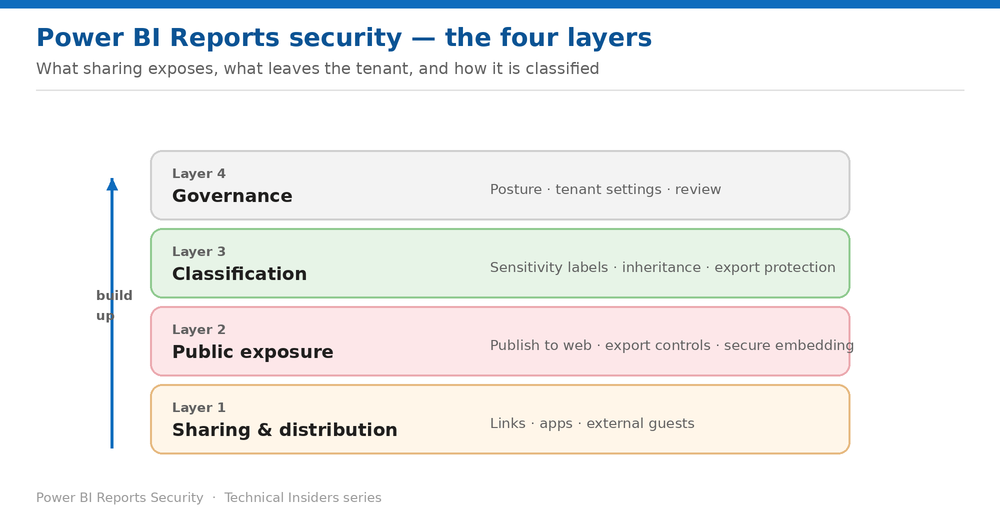

# Security for Power BI Reports

*A 10-part, prescriptive how-to series for sharing, public exposure, export, and classification.*

Each entry is a self-contained how-to (prerequisites → steps → validation → limitations → rollback) with its own architecture diagram, scoped to semantic models. Start at Layer 1 and work up.

## Contents

### Layer 1 — Sharing & distribution

- [What Sharing a Report Actually Shares](Fabric-RPT-Security-01-Sharing-What-You-Share.md) — The report is a view; the semantic model is the boundary — and hiding is not a security measure.
- [Share Reports with the Right Link Type](Fabric-RPT-Security-02-Sharing-Link-Types.md) — Three link types and two permission toggles — one of which is on by default.
- [Distribute Reports with Apps and Audiences](Fabric-RPT-Security-03-Sharing-Apps.md) — A packaged read-only experience at scale — and what it exposes underneath.
- [Share Reports Outside Your Organization](Fabric-RPT-Security-04-Sharing-External-Users.md) — Microsoft Entra B2B, and the group type that quietly breaks external access.

### Layer 2 — Public exposure & export

- [Control Publish to Web](Fabric-RPT-Security-05-Exposure-Publish-To-Web.md) — Anonymous public access to your data, one menu click away — and how to shut it down.
- [Govern Export Paths from Reports](Fabric-RPT-Security-06-Exposure-Export-Paths.md) — Every route data takes out of the service — and which permission unlocks each one.
- [Embed Reports Securely Instead of Publicly](Fabric-RPT-Security-07-Exposure-Secure-Embedding.md) — Two options that sit side by side in the menu and behave nothing alike.

### Layer 3 — Classification

- [Apply Sensitivity Labels to Reports](Fabric-RPT-Security-08-Classification-Sensitivity-Labels.md) — Manual, default, mandatory, programmatic and inherited labeling — and where Power BI leads.
- [Make Label Protection Hold on Export](Fabric-RPT-Security-09-Classification-Label-Protection.md) — Which export paths carry protection with the file — and which silently don't.

### Layer 4 — Governance

- [Assemble a Report Security Posture](Fabric-RPT-Security-10-Governance-Posture.md) — The order to apply these controls in — starting one layer below the report.

---

*See the [series overview](Fabric-RPT-Security-00-Series-Overview.md) for the complete entry list and where to start.*
