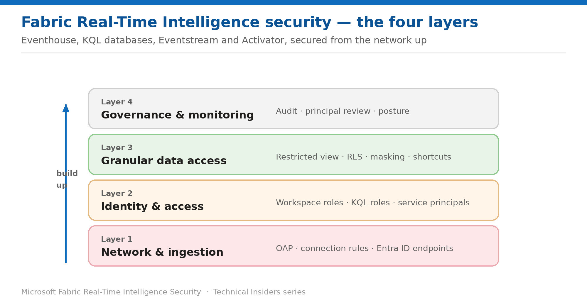

# Security for Fabric Real-Time Intelligence — Series Overview

> A prescriptive, 11-part how-to series for Eventhouse, KQL databases, Eventstream, and Activator.

*Fabric Real-Time Intelligence Technical Insiders · 11-part how-to series · Level 300 · Start here*

Real-Time Intelligence has a security model unlike anything else in Fabric. Alongside the familiar workspace roles, the **KQL engine brings its own role-based system** with its own commands, its own vocabulary, and its own row-level security implementation. Securing an Eventhouse means operating both systems deliberately.

This series covers that surface in **11 prescriptive entries** across four layers. Every entry is a self-contained runbook — **prerequisites → numbered steps → validation → limitations → rollback** — with its own architecture diagram, scoped to **Eventhouse**, **KQL databases**, **Eventstream**, and **Activator**.

This overview is the entry point. Use it to find the layer you need, then work through that layer's entries in order.

*Figure — The four security layers of the series, built from the network up.*

## How to use this series

- **Work from the bottom up.** Network and ingestion first, then who holds which role, then what data those roles can actually see, then how you prove it.
- **Each entry stands alone.** Land on any single entry and act on it without reading the others.
- **Every step is grounded in Microsoft Learn** and scoped to Real-Time Intelligence items rather than Fabric in general.
- **Validate as you go.** Each entry ends with a validation step and a rollback.

## Layer 1 — Network & ingestion

- **01 · Enable Outbound Access Protection for Real-Time Intelligence** — what stays reachable and what stops, including Copilot.
- **02 · Secure Eventstream Ingestion Endpoints** — Entra ID authentication instead of shared SAS keys.

## Layer 2 — Identity & access

- **03 · Understand the Two Permission Systems** — workspace roles govern the item, KQL roles govern the data.
- **04 · Assign KQL Database Security Roles** — the six roles and the management commands that set them.
- **05 · Run Automated Workloads Under Service Principals** — producers that write but cannot read.

## Layer 3 — Granular data access

- **06 · Grant View Access to a Subset of Tables** — three approaches, because the viewer role is database-wide.
- **07 · Filter Rows with Row Level Security** — the policy that replaces table access for everyone.
- **08 · Mask Sensitive Columns in KQL** — same policy, different technique.
- **09 · Control Access Across Follower and Shortcut Databases** — one policy, inherited everywhere.

## Layer 4 — Governance & monitoring

- **10 · Audit Who Has Access to a KQL Database** — principal listings and the cross-tenant blind spot.
- **11 · Assemble a Real-Time Intelligence Security Posture** — rollout order and review cadence (capstone).

## Where to start

If you're standing up a new Eventhouse, start at **entry 11** and read the rollout order — specifically the point about **database structure coming first**. Splitting a database after roles are granted is materially harder than designing it correctly at the outset.

- **New to KQL security?** Entry 03 first — the two-system model explains most of the confusion.
- **Need to restrict some tables?** Entry 06, then 07.
- **Producers with write access you'd rather they didn't have?** Entry 04 — the `ingestors` role exists for exactly this.
- **Preparing for an audit?** Entry 10.

> **A note on currency** — Fabric ships quickly, and parts of this surface — notably Eventhouse outbound access protection — are in **public preview**. Every step here reflects the product and documentation as of publication; verify current behaviour in your own tenant before standardizing on it.
