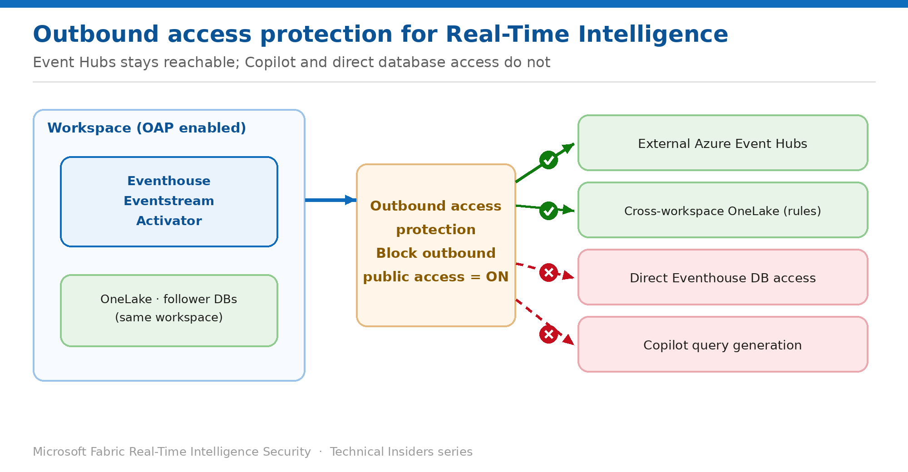

# Enable Outbound Access Protection for Real-Time Intelligence

> Restrict outbound connections from Eventhouse, Eventstream, and Activator — and know what stops.

*Series: Network & ingestion · Layer 1 (1 of 2) · Audience: Fabric admins · Level 300*

This entry shows you how **workspace outbound access protection (OAP)** applies to Real-Time Intelligence items, which outbound scenarios survive it, and which stop working entirely.

The supported and unsupported lists here are short and specific — read them before enabling, because two of the blocked scenarios routinely surprise teams.

## How to read this series

This is the first of eleven entries on securing Fabric Real-Time Intelligence — network and ingestion first, then identity, then granular data access, then governance. Every entry is written as a **prescriptive, step-by-step runbook**, not a conceptual overview: exact prerequisites, the portal actions, the KQL commands where they apply, a validation step to prove the control works, the current limitations, and a rollback.

The *why* behind each control is kept deliberately short so the steps stay front and centre. For deeper technical rationale, use the **Microsoft Fabric security white paper** as the companion reference; each entry also links the specific product documentation in its **References** section.

- [Microsoft Fabric security white paper — Microsoft Learn](https://learn.microsoft.com/en-us/fabric/security/white-paper-landing-page)

## Scenario — when to use this

An Eventhouse ingests continuously and holds the freshest operational data you have. Left unrestricted, items in that workspace can reach external endpoints, which makes real-time data one of the easier things to quietly stream somewhere else.

Reach for this pattern when you need to guarantee Real-Time Intelligence items can only reach approved destinations. Note that this capability is currently in **public preview** for Eventhouse — plan accordingly if you publish standards from it.

For more detail on how this option works, see:

- [Microsoft Fabric security white paper — Microsoft Learn](https://learn.microsoft.com/en-us/fabric/security/white-paper-landing-page)
- [Workspace outbound access protection for Eventhouse (preview) — Microsoft Learn](https://learn.microsoft.com/en-us/fabric/security/workspace-outbound-access-protection-eventhouse)

## What you'll set up

- OAP enabled on the workspace hosting your Real-Time Intelligence items.
- A clear list of which outbound scenarios still work.
- A documented plan for the workflows that stop.

*Figure 1 — Event Hubs stays reachable; direct database access and Copilot do not.*

## Prerequisites

- You hold the **Admin** role on the workspace.
- The workspace is on a **Fabric capacity (F SKU)**.
- A Fabric tenant administrator has enabled the tenant setting **Configure workspace-level outbound network rules**.
- Re-register the **Microsoft.Network** resource provider in the Azure portal.
- You have inventoried which external systems your Eventstreams and Eventhouse currently reach.

## Step 1 — Enable outbound access protection

1. Open the workspace → **Workspace settings → Network security**.
2. Switch **Block outbound public access** to **On**.
3. Allow time for the setting to apply before testing.
4. Re-run a representative Eventstream and an Eventhouse query to confirm behaviour.

> **It applies to the whole workspace** — OAP is enforced **per workspace**. All Real-Time Intelligence items in that workspace share the same outbound rules — you cannot protect one Eventhouse and leave another open in the same workspace.

## Step 2 — Know what still works

Even with OAP enabled, Eventhouse can still reach the following:

| Resource type | Location | Supported items |
| --- | --- | --- |
| External | Azure | Event Hubs |
| Fabric | Same workspace | Eventstream, OneLake, follower databases |
| Fabric | Other workspaces (requires access rules) | OneLake, follower databases |

**Azure Event Hubs remains reachable** — which matters, because it's the most common ingestion path into a protected Eventhouse.

## Step 3 — Know what stops

These scenarios are blocked once OAP is enabled:

- **Accessing Eventhouse databases directly**, other than through OneLake shortcuts.
- **Connecting to external resources other than Event Hubs.**
- **Using Copilot to generate queries or analyze data.**

> **The Copilot one catches people** — Teams that have adopted Copilot for KQL authoring lose it the moment OAP is enabled. That's a workflow change worth communicating in advance rather than letting your analysts discover it mid-investigation.

## Validate

- An Eventstream ingesting from **Azure Event Hubs** continues to work.
- An Eventhouse reading **OneLake in the same workspace** continues to work.
- A connection to an **external resource other than Event Hubs** is blocked.
- **Copilot** no longer generates queries in that workspace.
- Confirm the toggle state under **Workspace settings → Network security**.

## Limitations & gotchas

- **Eventhouse outbound access protection is in public preview** — behaviour may change, and it is not a basis for a permanent published standard yet.
- **All Eventhouse items in the workspace follow the same OAP** — no per-item exceptions.
- **Copilot stops working** for query generation and analysis.
- **Direct database access is blocked** except through OneLake shortcuts.
- Cross-workspace OneLake and follower database access needs explicit access rules.

## Rollback

1. Open **Workspace settings → Network security**.
2. Switch **Block outbound public access** to **Off**.
3. Re-test the workflows that were blocked, including Copilot.

## References

- [Workspace outbound access protection for Eventhouse (preview) — Microsoft Learn](https://learn.microsoft.com/en-us/fabric/security/workspace-outbound-access-protection-eventhouse)
- [Enable workspace outbound access protection — Microsoft Learn](https://learn.microsoft.com/en-us/fabric/security/workspace-outbound-access-protection-set-up)
- [Workspace outbound access protection overview — Microsoft Learn](https://learn.microsoft.com/en-us/fabric/security/workspace-outbound-access-protection-overview)
