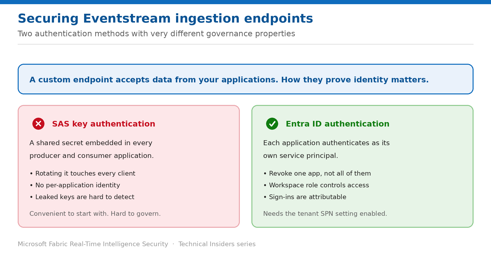

# Secure Eventstream Ingestion Endpoints

> Replace shared SAS keys with Microsoft Entra ID authentication for producers and consumers.

*Series: Network & ingestion · Layer 1 (2 of 2) · Audience: Data engineers & platform teams · Level 300*

An Eventstream **custom endpoint** lets your applications send and fetch data. It supports two authentication methods, and the choice between them determines whether you can revoke one application without disrupting all of them.

## Scenario — when to use this

Your applications push telemetry into Eventstream using a SAS key that was generated once and pasted into every producer. Rotating it means coordinating a change across every client simultaneously, and if it leaks you cannot tell which application was the source.

Reach for this pattern whenever more than one application writes to or reads from an Eventstream, and especially when those applications are owned by different teams.

For more detail on how this option works, see:

- [Microsoft Fabric security white paper — Microsoft Learn](https://learn.microsoft.com/en-us/fabric/security/white-paper-landing-page)
- [Connect to Eventstream using Microsoft Entra ID authentication — Microsoft Learn](https://learn.microsoft.com/en-us/fabric/real-time-intelligence/event-streams/custom-endpoint-entra-id-auth)

## What you'll set up

- A service principal per producing or consuming application.
- Eventstream custom endpoints authenticating with Entra ID rather than SAS keys.
- Per-application revocation without disturbing other clients.

*Figure 2 — Two authentication methods with very different governance properties.*

## Prerequisites

- Your tenant admin has enabled **Service principals can call Fabric public APIs** in the Admin portal.
- You hold **Member or higher** permissions in the workspace — required to assign the service principal its access.
- An **Eventstream** item with a **Custom Endpoint** source or destination.
- The ability to create app registrations in Microsoft Entra.

## Step 1 — Create a service principal for the application

1. Sign in to the **Microsoft Entra admin center**.
2. Go to **Identity → Applications → App registrations**, and select **New registration**.
3. Enter a display name that identifies the specific application — not a generic one shared across systems.
4. Open the app and copy the **client ID** and **tenant ID**.
5. Go to **Certificates & secrets**, add a client secret, and copy the value.

## Step 2 — Grant the application workspace access

1. Open the Fabric workspace and select **Manage access**.
2. Search for the application you registered.
3. Assign **Contributor** or higher.

> **One principal per application** — The value of this pattern comes from granularity. Registering a single service principal and sharing it across every producer recreates the SAS-key problem with extra steps.

## Step 3 — Point the application at the endpoint

1. In Eventstream, add a **Custom Endpoint** as a source (to send) or destination (to fetch).
2. Select **Custom Endpoint → Entra ID Authentication**.
3. Copy the **Event hub namespace** and **Event hub** values — plus the **consumer group** if you're consuming.
4. Configure your application with the client ID, tenant ID, and client secret as environment variables.
5. Build and run the application, then confirm data appears in the Eventstream.

Microsoft publishes Java producer and consumer samples for this flow; the same OAuth pattern applies in any language with an Event Hubs SDK.

## Validate

- The producer application sends data and it appears in the Eventstream.
- The consumer application fetches data successfully.
- **Removing the service principal from workspace access** stops that application — and only that application.
- Other applications with their own principals continue to run.

## Limitations & gotchas

- The tenant setting **Service principals can call Fabric public APIs** must be enabled, or nothing works and the failure is unhelpful.
- You need **Member or higher** in the workspace to grant the principal access — Contributor isn't enough to manage access.
- Client secrets still expire; track expiry per application.
- Consider **managed identity** where the producer is an Azure service such as Logic Apps — it removes the secret entirely.
- SAS key authentication remains available; the two methods can coexist during migration.

## Rollback

1. Switch the custom endpoint back to **SAS Key** authentication if required.
2. Remove the service principal from workspace access.
3. Rotate the SAS key if it was ever shared during the transition.

## References

- [Connect to Eventstream using Microsoft Entra ID authentication — Microsoft Learn](https://learn.microsoft.com/en-us/fabric/real-time-intelligence/event-streams/custom-endpoint-entra-id-auth)
- [Connect Azure Logic Apps to Eventstream using Managed Identity — Microsoft Learn](https://learn.microsoft.com/en-us/fabric/real-time-intelligence/event-streams/connect-using-managed-identity)
