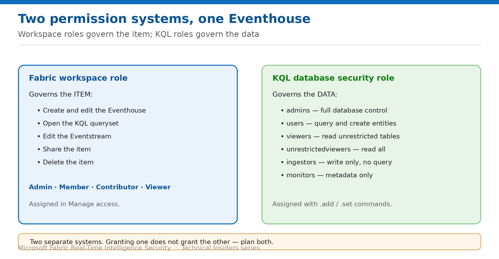

# Understand the Two Permission Systems

> Workspace roles govern the item; KQL security roles govern the data. You need both.

*Series: Identity & access · Layer 2 (1 of 3) · Audience: Fabric admins & data engineers · Level 300*

Almost every confusion about Eventhouse permissions traces back to one fact: **there are two independent permission systems**, and granting access in one does not grant it in the other. This entry sets out which is which, and how they interact.

## Scenario — when to use this

You add someone as a workspace Contributor so they can work with the Eventhouse. They can open it, edit the item, and create querysets — but their queries return nothing, or fail outright. Nothing looks misconfigured, because you've only configured half the model.

Reach for this entry before granting anyone access to an Eventhouse, and whenever a permission behaves in a way the workspace role doesn't explain.

For more detail on how this option works, see:

- [Microsoft Fabric security white paper — Microsoft Learn](https://learn.microsoft.com/en-us/fabric/security/white-paper-landing-page)
- [Manage database security roles — Microsoft Learn](https://learn.microsoft.com/en-us/kusto/management/manage-database-security-roles?view=microsoft-fabric)
- [Roles in workspaces in Microsoft Fabric — Microsoft Learn](https://learn.microsoft.com/en-us/fabric/fundamentals/roles-workspaces)

## What you'll set up

- A clear mental model of which system controls what.
- Both systems configured deliberately for each audience.
- An access model you can explain to an auditor.

*Figure 3 — Two separate systems over one Eventhouse.*

## Prerequisites

- You are a workspace **Admin** or **Member**.
- You hold at least **Database Admin** permissions on the KQL database to run role commands.
- You know which audiences need item access versus data access.

## Step 1 — Know what the workspace role controls

The Fabric workspace role governs the **item**: whether someone can see it, edit it, share it, or delete it.

- Creating and editing the **Eventhouse**, **Eventstream** or **Activator** item.
- Opening a **KQL queryset**.
- Sharing the item with others.
- Deleting the item.

## Step 2 — Know what the KQL role controls

The KQL database security role governs the **data**: what a principal can read, write, or administer inside the database.

- **admins** — view and modify the database and all its entities.
- **users** — view and create database entities; query all data except RestrictedViewAccess tables.
- **viewers** — view tables where RestrictedViewAccess isn't turned on.
- **unrestrictedviewers** — view tables even where RestrictedViewAccess is on.
- **ingestors** — ingest data without access to query.
- **monitors** — view database metadata such as schemas, operations, and permissions.

> **Where they meet** — A person needs the workspace role to *reach* the Eventhouse and the KQL role to *read* it. Missing either produces a failure that looks like the other one.

## Step 3 — Design both together per audience

1. List each audience — analysts, producers, dashboard consumers, automation.
2. Decide the **workspace role** each needs: often Viewer for consumers, Contributor for builders.
3. Decide the **KQL role** each needs: `viewers` for read, `ingestors` for write-only producers, `users` for analysts who create functions.
4. Assign through **Entra security groups** in both systems so membership is managed in one place.
5. Document the pairing so the next person doesn't have to reverse-engineer it.

## Validate

- A user with the workspace role but **no** KQL role can open the Eventhouse and gets no data.
- A user with a KQL role but no workspace role cannot reach the item at all.
- A user with both reads exactly the tables their KQL role permits.
- `.show database <DatabaseName> principals` lists the principals you expect.

## Limitations & gotchas

- **Granting a workspace role does not grant data access** — and vice versa.
- Database Admin permissions are required to run the role management commands.
- The **viewer role is database-wide** — there's no viewer-on-some-tables (see entry 06).
- Role changes in one system don't notify the other; access reviews must cover both.

## Rollback

1. Remove the workspace role in **Manage access**.
2. Remove the KQL role with `.drop database <DatabaseName> <role> ('<principal>')`.
3. Removing only one leaves a partial grant — always do both.

## References

- [Manage database security roles — Microsoft Learn](https://learn.microsoft.com/en-us/kusto/management/manage-database-security-roles?view=microsoft-fabric)
- [Roles in workspaces in Microsoft Fabric — Microsoft Learn](https://learn.microsoft.com/en-us/fabric/fundamentals/roles-workspaces)
