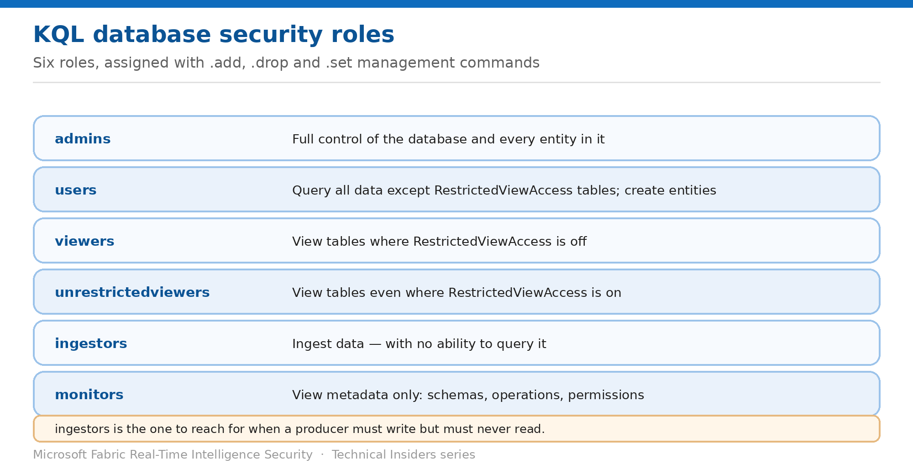

# Assign KQL Database Security Roles

> Six roles, and the management commands that add, drop, and replace them.

*Series: Identity & access · Layer 2 (2 of 3) · Audience: Data engineers & DB admins · Level 300*

This entry covers assigning **KQL database security roles** with management commands — the precise syntax, the difference between `.add` and `.set`, and which role to reach for in each situation.

## Scenario — when to use this

A producer application needs to write telemetry into your Eventhouse. The obvious move is to grant it access to the database — and in doing so you've usually granted it the ability to read everything in there too, which a write-only producer has no business doing.

Reach for this entry whenever you grant anyone or anything access to a KQL database. The role you choose is the entire access decision.

For more detail on how this option works, see:

- [Microsoft Fabric security white paper — Microsoft Learn](https://learn.microsoft.com/en-us/fabric/security/white-paper-landing-page)
- [Manage database security roles — Microsoft Learn](https://learn.microsoft.com/en-us/kusto/management/manage-database-security-roles?view=microsoft-fabric)

## What you'll set up

- The right role assigned per principal, not the most convenient one.
- Assignments made through security groups where possible.
- A repeatable command pattern for granting and revoking.



*Figure 4 — The six database-level roles and what each grants.*

## Prerequisites

- You hold at least **Database Admin** permissions to run these commands.
- You know the fully qualified name of each principal you're granting.
- Entra **security groups** exist for the audiences you're granting to.

## Step 1 — Choose the right role

| Role | Permissions |
| --- | --- |
| admins | View and modify the database and all its entities; create, modify and drop anything. Automatically admins on all database entities. |
| users | View and create database entities. Query all data except tables with RestrictedViewAccess enabled. Become admins of entities they create. |
| viewers | View tables in the database where RestrictedViewAccess isn't turned on. |
| unrestrictedviewers | View tables even where RestrictedViewAccess is on. Requires admins, viewers or users as well. |
| ingestors | Ingest data to the database with no access to query it. |
| monitors | View database metadata such as schemas, operations and permissions. |

> **ingestors is the underused one** — A producer that writes but never reads should hold `ingestors` and nothing else. It's the single most effective least-privilege choice available in a KQL database, and it's routinely skipped in favour of `users`.

## Step 2 — Inspect the current assignments first

Before changing anything, see what's already in place:

```kusto
// All principals and their roles on the database
.show database Samples principals

// Just your own roles
.show database Samples principal roles
```

## Step 3 — Add, drop, or replace principals

The syntax follows a consistent shape: an action, the database, the role, and one or more principals.

```kusto
// Add a user to the users role
.add database Samples users ('aaduser=imikeoein@fabrikam.com')

// Add an application to the viewers role
.add database Samples viewers ('aadapp=4c7e82bd-6adb-46c3-b413-fdd44834c69b;fabrikam.com')

// Remove a group from the admins role
.drop database Samples admins ('aadGroup=SomeGroupEmail@fabrikam.com')
```

`.set` behaves differently — it **adds the principals you list and removes every previous one** in that role:

```kusto
// Replace the entire viewers list
.set database Samples viewers ('aaduser=imikeoein@fabrikam.com', 'aaduser=abbiatkins@fabrikam.com')

// Remove ALL viewers
.set database Samples viewers none
```

> **Reach for .add, not .set** — `.set` silently removes everyone you didn't list. Used against a production database with an incomplete list, it revokes access broadly and without warning. Prefer `.add` and `.drop` for incremental changes, and reserve `.set` for deliberate wholesale replacement.

## Step 4 — Annotate the assignment

The command accepts a **Description** parameter, which appears in the Notes column of `.show` output. Use it — especially for applications and cross-tenant principals, where the display name alone won't tell a future reviewer who or what this is.

- Add `skip-results` if you don't want the updated principal list returned.
- Reference managed identities using the **App** format with the object ID or client ID.

## Validate

- `.show database <DatabaseName> principals` lists the principal with the expected role.
- An `ingestors` principal can write but a query returns an authorization failure.
- A `viewers` principal can read unrestricted tables and nothing else.
- A dropped principal loses access.

## Limitations & gotchas

- **`.set` removes everyone not listed** — the most dangerous command in this entry.
- **You cannot assign the viewer role to only some tables** — see entry 06 for the alternatives.
- `unrestrictedviewers` requires the principal to also hold admins, viewers or users.
- Cross-tenant principals show without a display name or FQN — annotate them (entry 10).
- Deleting a database requires at least **Contributor** ARM permissions.

## Rollback

1. Remove a principal with `.drop database <DatabaseName> <role> ('<principal>')`.
2. If a `.set` removed principals unintentionally, re-add them with `.add` — there is no undo.
3. Re-run `.show database <DatabaseName> principals` to confirm the final state.

## References

- [Manage database security roles — Microsoft Learn](https://learn.microsoft.com/en-us/kusto/management/manage-database-security-roles?view=microsoft-fabric)
- [Manage view access to tables — Microsoft Learn](https://learn.microsoft.com/en-us/kusto/management/manage-table-view-access?view=microsoft-fabric)
