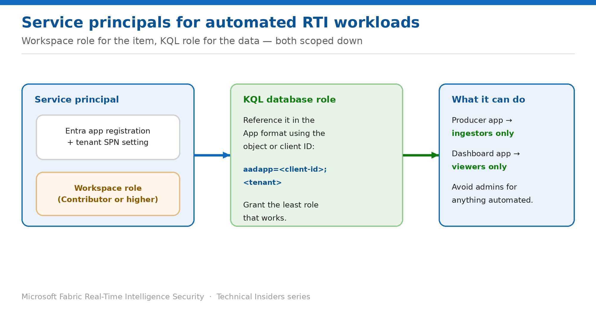

# Run Automated Workloads Under Service Principals

> Producers that write but cannot read, and dashboards that read but cannot write.

*Series: Identity & access · Layer 2 (3 of 3) · Audience: Platform teams · Level 300*

This entry shows you how to run ingestion and query workloads under **service principals** rather than personal accounts, and how to scope each one to exactly the access its job requires.

## Scenario — when to use this

Your ingestion job and your dashboard refresh both run under an engineer's account. When that person changes team, both break — and until then, each runs with the full permissions of a human who can read every table in the database.

Reach for this pattern for anything automated. The two-system model from entry 03 means you scope automation twice: once for the item, once for the data.

For more detail on how this option works, see:

- [Microsoft Fabric security white paper — Microsoft Learn](https://learn.microsoft.com/en-us/fabric/security/white-paper-landing-page)
- [Manage database security roles — Microsoft Learn](https://learn.microsoft.com/en-us/kusto/management/manage-database-security-roles?view=microsoft-fabric)
- [Connect to Eventstream using Microsoft Entra ID authentication — Microsoft Learn](https://learn.microsoft.com/en-us/fabric/real-time-intelligence/event-streams/custom-endpoint-entra-id-auth)

## What you'll set up

- A service principal per automated workload.
- The minimum workspace role and the minimum KQL role for each.
- Automation that survives staffing changes.



*Figure 5 — Workspace role for the item, KQL role for the data, both scoped down.*

## Prerequisites

- A tenant administrator has enabled **Service principals can call Fabric public APIs**.
- You can create Entra app registrations, or have them created for you.
- You hold **Member or higher** in the workspace to assign access.
- You hold **Database Admin** on the KQL database to assign data roles.

## Step 1 — Register the principal and grant the item

1. Register an application in **Microsoft Entra** with a name identifying the specific workload.
2. Record the **client ID**, **tenant ID**, and a client secret or certificate.
3. In the Fabric workspace, open **Manage access**.
4. Add the application — ideally via an Entra **security group** — with the lowest workspace role that works.

## Step 2 — Grant the minimum data role

Reference the application using the **App** format, with either the object ID or the client (application) ID:

```kusto
// A producer that must write but never read
.add database TelemetryDB ingestors ('aadapp=<client-id>;<tenant>') 'Ingestion job - owned by Platform team'

// A dashboard service that must read but never write
.add database TelemetryDB viewers ('aadapp=<client-id>;<tenant>') 'Dashboard refresh - owned by BI team'
```

- **Producers → `ingestors`.** Write access with no query capability.
- **Dashboards and read APIs → `viewers`.** Query access to unrestricted tables.
- **Avoid `admins`** for anything automated — it grants the ability to drop entities.

> **Use the Description parameter** — Applications appear in `.show` output by object ID with little context. The description is where you record what the principal is and who owns it — the only thing that makes a future access review tractable.

## Step 3 — Test in the real execution context

1. Run the workload under the service principal, not interactively under your own account.
2. Confirm it succeeds at its intended operation.
3. Confirm it **fails** at operations it shouldn't perform — a producer attempting a query, for example.
4. Record the secret or certificate expiry date and set a rotation reminder.

## Validate

- The ingestion job writes successfully under the principal.
- The same principal attempting a query receives an authorization failure — proving `ingestors` is scoped correctly.
- The dashboard principal reads successfully but cannot ingest.
- `.show database <DatabaseName> principals` shows both with descriptions.
- Removing the principal from the workspace stops the workload.

## Limitations & gotchas

- The tenant SPN setting must be enabled first, or nothing works.
- You need **Member or higher** to manage workspace access — Contributor isn't sufficient.
- Secrets expire; certificates are preferable for long-lived automation.
- Service principals are **not** subject to interactive MFA — govern them with Conditional Access for workload identities.
- A principal needs **both** systems configured; granting only the workspace role produces a job that runs and returns nothing.

## Rollback

1. Remove the KQL role with `.drop database <DatabaseName> <role> ('aadapp=...')`.
2. Remove the principal from **Manage access** in the workspace.
3. Rotate or delete the client secret if the principal is being decommissioned.

## References

- [Manage database security roles — Microsoft Learn](https://learn.microsoft.com/en-us/kusto/management/manage-database-security-roles?view=microsoft-fabric)
- [Connect to Eventstream using Microsoft Entra ID authentication — Microsoft Learn](https://learn.microsoft.com/en-us/fabric/real-time-intelligence/event-streams/custom-endpoint-entra-id-auth)
