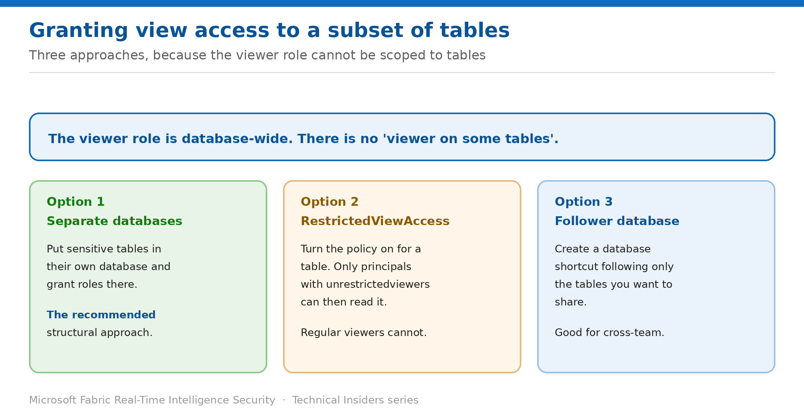

# Grant View Access to a Subset of Tables

> Three approaches, because the viewer role cannot be scoped to individual tables.

*Series: Granular data access · Layer 3 (1 of 4) · Audience: Data engineers & DB admins · Level 300*

The `viewers` role is **database-wide**. Assigning it gives view access to every table in the database. This entry covers the three supported ways to give someone access to only part of a database.

## Scenario — when to use this

An analytics team needs three tables from a KQL database that holds thirty, two of which contain personal data they must not see. Granting `viewers` exposes all thirty. There is no viewer-on-some-tables role to reach for.

Reach for this entry whenever access needs to be narrower than a whole database — which, in practice, is most of the time in a shared Eventhouse.

For more detail on how this option works, see:

- [Microsoft Fabric security white paper — Microsoft Learn](https://learn.microsoft.com/en-us/fabric/security/white-paper-landing-page)
- [Manage view access to tables — Microsoft Learn](https://learn.microsoft.com/en-us/kusto/management/manage-table-view-access?view=microsoft-fabric)

## What you'll set up

- A structure that supports the access boundaries you actually need.
- Sensitive tables reachable only by the principals you intend.
- A choice made deliberately between the three approaches.

*Figure 6 — Separate databases, RestrictedViewAccess, or a follower database.*

## Prerequisites

- You hold **Database Admin** permissions.
- You know which tables are sensitive and which audiences need them.
- Ideally you're making this decision **before** the database is heavily populated — restructuring later is significant work.

## Option 1 — Separate databases (recommended)

Microsoft's recommendation is structural: **separate tables into different databases based on access privileges**.

1. Create a distinct database for the sensitive data.
2. Move or route the sensitive tables into it.
3. Assign security roles per database, granting each audience only where appropriate.
4. Point Eventstream destinations at the correct database going forward.

> **Do this early** — This is the cleanest model and the hardest to retrofit. If you're designing a new Eventhouse, decide your database boundaries before ingestion starts rather than after.

## Option 2 — Restricted View Access policy

Turn the policy on for specific tables. Only principals holding **unrestrictedViewer** can then access them; principals with the regular `viewer` role cannot.

1. Enable the **RestrictedViewAccess** policy on each sensitive table.
2. Grant `unrestrictedviewers` to the principals who legitimately need those tables.
3. Confirm the principal also holds `admins`, `viewers` or `users`, which `unrestrictedviewers` requires alongside it.
4. Leave other principals on the regular `viewers` role.

> **It blocks RLS** — A table with a restricted view access policy configured **cannot** have a row level security policy enabled. Choose one or the other per table — see entry 07.

## Option 3 — Follower database

Create a database shortcut in Fabric and follow **only the tables** you want to share with a specific principal or set of principals.

1. Create the database shortcut following the relevant tables.
2. Grant the target audience roles on the follower database rather than the source.
3. Verify the audience sees only the followed tables.

This works well for cross-team sharing, where the consuming team should never hold roles on your production database at all.

## Validate

- A `viewers` principal cannot see a table with RestrictedViewAccess enabled.
- An `unrestrictedviewers` principal can.
- A follower database exposes only the followed tables.
- Separate databases show only their own tables to their own role holders.

## Limitations & gotchas

- **The viewer role cannot be scoped to tables** — this is the constraint the whole entry exists to work around.
- **RestrictedViewAccess and RLS are mutually exclusive** on the same table.
- `unrestrictedviewers` must be paired with admins, viewers or users.
- Follower databases inherit the source's RLS policy (entry 09).
- Restructuring databases after ingestion is under way is materially harder than designing it correctly.

## Rollback

1. Disable the RestrictedViewAccess policy on the table to return it to regular viewer access.
2. Drop the follower database to remove that sharing path.
3. Merging separated databases is not a simple reversal — plan the structure carefully up front.

## References

- [Manage view access to tables — Microsoft Learn](https://learn.microsoft.com/en-us/kusto/management/manage-table-view-access?view=microsoft-fabric)
- [Manage database security roles — Microsoft Learn](https://learn.microsoft.com/en-us/kusto/management/manage-database-security-roles?view=microsoft-fabric)
