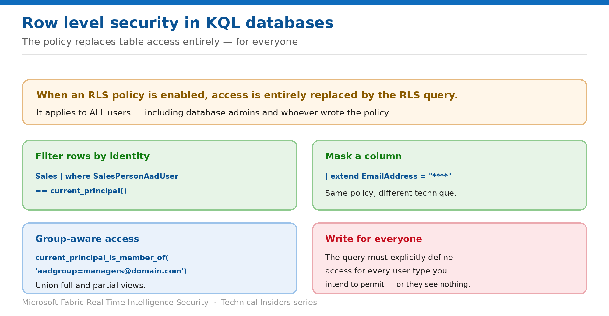

# Filter Rows with Row Level Security

> A policy that replaces table access entirely — for every user, including admins.

*Series: Granular data access · Layer 3 (2 of 4) · Audience: Data engineers & DB admins · Level 300*

**Row Level Security** in a KQL database restricts which rows a principal can read, based on group membership or execution context. This entry covers the syntax, the patterns that matter, and the behaviour that makes RLS here different from most implementations.

## Scenario — when to use this

One telemetry table serves every region, but each team should see only their own rows. Maintaining a filtered copy per audience means duplicated ingestion and inevitable drift.

Reach for this pattern when the restriction is about *which rows* rather than which tables — and be aware that once enabled, the policy governs everyone, including you.

For more detail on how this option works, see:

- [Microsoft Fabric security white paper — Microsoft Learn](https://learn.microsoft.com/en-us/fabric/security/white-paper-landing-page)
- [Row level security policy — Microsoft Learn](https://learn.microsoft.com/en-us/kusto/management/row-level-security-policy?view=microsoft-fabric)

## What you'll set up

- An RLS policy filtering rows per principal or group.
- Explicit access defined for every audience that should see data.
- Validation that the policy behaves correctly for each of them.



*Figure 7 — Write the policy for every audience, or they see nothing.*

## Prerequisites

- You hold **Database Admin** permissions.
- The table is **not** an external table — RLS can't be configured on those.
- The table has **no** restricted view access policy configured.
- You know the column that identifies the row owner, region, or tenant.

## Step 1 — Understand what enabling RLS does

This is the single most important behaviour to internalise before writing a policy:

- When an RLS policy is enabled, **access is entirely replaced by the RLS query** defined on the table.
- The restriction applies to **all users — including database admins and the person who created the policy**.
- The RLS query must **explicitly include definitions for every type of user** you want to give access to.

> **Forget someone and they get nothing** — There is no implicit fallback. If your policy defines access for the sales team and nobody else, then admins, service principals and every other audience see an empty table. Enumerate every audience deliberately.

## Step 2 — Write the policy

The simplest form filters rows to the current principal:

```kusto
Sales
| where SalesPersonAadUser == current_principal()
```

A lookup table maps principals to a broader scope such as country:

```kusto
let UserToCountryMapping = datatable(User:string, Country:string)
[
  "john@domain.com", "USA",
  "anna@domain.com", "France"
];
Sales
| where Country in ((UserToCountryMapping
    | where User == current_principal_details()["UserPrincipalName"]
    | project Country))
```

Group membership handles the common "managers see everything" requirement:

```kusto
let IsManager = current_principal_is_member_of('aadgroup=sales_managers@domain.com');
let AllData = Sales | where IsManager;
let PartialData = Sales
    | where not(IsManager) and (SalesPersonAadUser == current_principal())
    | extend EmailAddress = "****";
union AllData, PartialData
```

- `current_principal()` — the identity running the query.
- `current_principal_details()` — richer attributes including UserPrincipalName.
- `current_principal_is_member_of()` — group membership checks.

## Step 3 — Enable the policy

Define the logic in a function, then bind it to the table. A parameterised function lets you apply the same logic across many tables:

```kusto
.create-or-alter function RLSForCustomersTables(TableName: string) {
    table(TableName) | ...
}

.alter table Customers1 policy row_level_security enable "RLSForCustomersTables('Customers1')"
.alter table Customers2 policy row_level_security enable "RLSForCustomersTables('Customers2')"
```

To return an error rather than an empty table for unauthorised users, use `assert()`:

```kusto
.create-or-alter function RLSForCustomersTables() {
    MyTable
    | where assert(current_principal_is_member_of('aadgroup=mygroup@mycompany.com') == true,
                   "You don't have access")
}
```

## Validate

- A member of each defined audience sees exactly their intended rows.
- A principal outside every definition sees an empty table — or your assert error.
- A **database admin** is also filtered, confirming the policy applies universally.
- Query performance remains acceptable under the added filter.

## Limitations & gotchas

- **RLS applies to everyone, including admins and its creator.**
- **Cannot be configured on external tables.**
- **Cannot be enabled** if the table is referenced by an update policy that doesn't use a managed identity.
- **Cannot be enabled** if the table is referenced by a continuous export not using the impersonate authentication method.
- **Cannot be enabled** if the table has a restricted view access policy.
- **The RLS query can't reference other RLS-enabled tables**, or tables in other databases.
- There's **no performance impact on ingestion**; query impact depends on policy complexity.

## Rollback

1. Disable the policy on the table with the `row_level_security` policy command.
2. Verify affected audiences regain the access they had before.
3. Retain the function if you plan to re-enable it later.

## References

- [Row level security policy — Microsoft Learn](https://learn.microsoft.com/en-us/kusto/management/row-level-security-policy?view=microsoft-fabric)
- [Manage view access to tables — Microsoft Learn](https://learn.microsoft.com/en-us/kusto/management/manage-table-view-access?view=microsoft-fabric)
