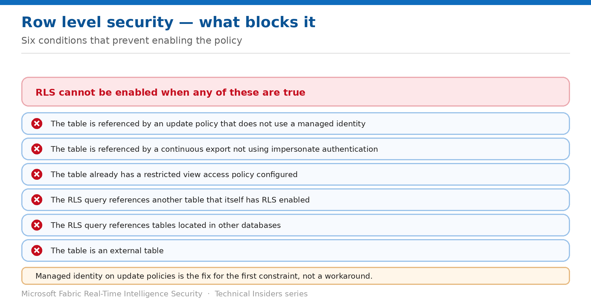

# Mask Sensitive Columns in KQL

> Anonymize values inside the same RLS policy that filters rows.

*Series: Granular data access · Layer 3 (3 of 4) · Audience: Data engineers & DB admins · Level 300*

KQL has no separate masking feature. Instead, masking is done **inside the row level security policy** — the same mechanism from entry 07, applied to columns rather than rows. This entry covers the patterns and the constraints that block them.

## Scenario — when to use this

Support staff need to query production telemetry to troubleshoot, but the table contains personal identifiers they have no business reading in full. Denying access blocks legitimate work; granting it breaches your compliance obligations.

Reach for this pattern when the requirement is to let people work with the data while removing or obscuring specific values — troubleshooting access, call-centre lookups, or developer access to production.

For more detail on how this option works, see:

- [Microsoft Fabric security white paper — Microsoft Learn](https://learn.microsoft.com/en-us/fabric/security/white-paper-landing-page)
- [Row level security policy — Microsoft Learn](https://learn.microsoft.com/en-us/kusto/management/row-level-security-policy?view=microsoft-fabric)

## What you'll set up

- Sensitive columns masked for the audiences that shouldn't see them.
- Full values retained for the audiences that should.
- A policy that satisfies compliance without blocking legitimate work.



*Figure 8 — Six conditions that prevent enabling an RLS policy.*

## Prerequisites

- You hold **Database Admin** permissions.
- The table meets every RLS precondition (see the limitations section).
- You know which columns are sensitive and which audiences may see them in full.

## Step 1 — Mask with extend

Masking is an `extend` that overwrites the column with a constant, applied within the RLS policy:

```kusto
Sales
| where SalesPersonAadUser == current_principal()
| extend EmailAddress = "****"
```

The row filter and the mask coexist in one policy — the principal sees their own rows, with the email column obscured.

## Step 2 — Vary the mask by audience

Union a full view and a masked view, selected by group membership:

```kusto
let IsManager = current_principal_is_member_of('aadgroup=sales_managers@domain.com');
let AllData = Sales | where IsManager;
let PartialData = Sales
    | where not(IsManager) and (SalesPersonAadUser == current_principal())
    | extend EmailAddress = "****";
union AllData, PartialData
```

Extend the same structure across several groups, each with its own filtering and masking rules:

```kusto
Customers
| where (current_principal_is_member_of('aadgroup=group1@domain.com') and <filter for group1>)
   or  (current_principal_is_member_of('aadgroup=group2@domain.com') and <filter for group2>)
   or  (current_principal_is_member_of('aadgroup=group3@domain.com') and <filter for group3>)
```

## Step 3 — Apply the common use cases

Microsoft documents several patterns this mechanism is designed for:

- A **call centre** agent identifying callers by the last four digits of an identifier, with the rest masked.
- **Developers troubleshooting production** without seeing personally identifiable information, staying within compliance.
- A **hospital** where nurses see rows only for their own patients.
- A **bank** restricting financial rows by business division or role.
- A **multitenant application** storing many tenants in one tableset, with logical separation enforced per tenant.

## Validate

- A restricted principal sees the masked value, not the real one.
- A privileged principal sees the full value.
- The masked column returns the placeholder rather than being absent — confirm downstream queries handle that.
- A database admin is also subject to the mask unless explicitly exempted in the policy.

## Limitations & gotchas

- There is **no dedicated masking feature** — masking lives inside the RLS policy, so every RLS constraint applies.
- **Cannot be configured on external tables.**
- **Blocked** if the table is referenced by an update policy that doesn't use a managed identity.
- **Blocked** if referenced by a continuous export not using impersonate authentication.
- **Blocked** if the table has a restricted view access policy.
- The policy **can't reference other RLS-enabled tables** or tables in other databases.
- Masking replaces the value in the result — it does not encrypt or remove it from storage.

## Rollback

1. Edit the policy function to remove the `extend` that masks the column.
2. Or disable the row level security policy entirely to restore unmasked access.
3. Re-test each audience afterwards.

## References

- [Row level security policy — Microsoft Learn](https://learn.microsoft.com/en-us/kusto/management/row-level-security-policy?view=microsoft-fabric)
- [Manage view access to tables — Microsoft Learn](https://learn.microsoft.com/en-us/kusto/management/manage-table-view-access?view=microsoft-fabric)
